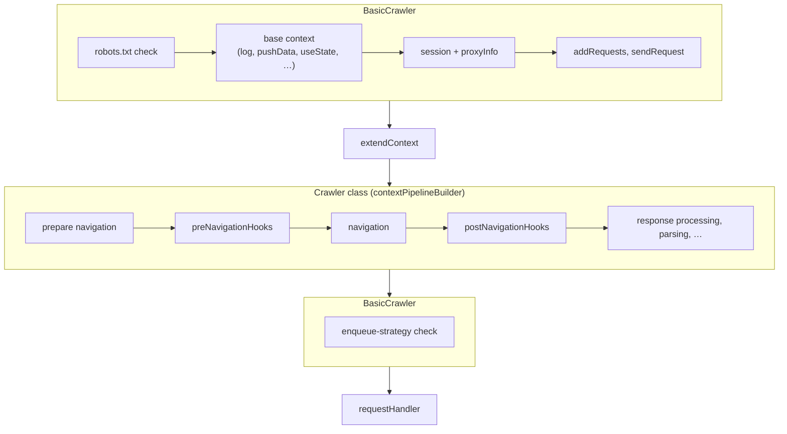

import ApiLink from '@site/src/components/ApiLink';
import CodeBlock from '@theme/CodeBlock';

import ExtendContextSource from '!!raw-loader!./extend-context.ts';
import CustomCrawlerSource from '!!raw-loader!./custom-crawler.ts';

The object your request handler receives (`request`, `session`, `page`, `$` and the rest) is built step by step. Every crawler runs each request through a chain of middlewares, the <ApiLink to="basic-crawler/class/ContextPipeline">`ContextPipeline`</ApiLink>. One step resolves the session, another opens a page, another parses the response. The pipeline is the one place where the context gets shaped.

If you ever need to check in the source code what a crawler does with a request, its pipeline is where to look. The built-in crawlers add all of their steps there, and the methods behind those steps are private, so a subclass changes them only by composing onto the pipeline. There are two ways to add your own step. The `extendContext` option adds members to one crawler instance. A crawler subclass with its own pipeline packages the behavior for reuse.

## Extending the context with `extendContext`

When you need a helper or some shared state in your handlers, pass <ApiLink to="basic-crawler/interface/BasicCrawlerOptions#extendContext">`extendContext`</ApiLink> when creating the crawler. It receives the context built so far and returns an object whose members get added to it:

<CodeBlock className="language-typescript">{ExtendContextSource}</CodeBlock>

The returned members are typed. `saveUrl` above is known to the `requestHandler`, the navigation hooks and the error handlers, and a typo in any of them is a compile-time error.

`extendContext` runs before navigation, so the members it returns are visible to `preNavigationHooks`, `postNavigationHooks` and the `requestHandler` alike. For the same reason its own input has no `page`, `response`, `$` or `body` yet. Anything that needs those belongs in a `postNavigationHook` or the request handler.

Storage writes made from `extendContext` go through the same [storage transaction](./result-storage#transactional-storage) as the rest of the request, so a failed request rolls them back.

## How the pipeline works

A <ApiLink to="basic-crawler/class/ContextPipeline">`ContextPipeline<TBase, TFinal>`</ApiLink> is an immutable chain of middlewares. `ContextPipeline.create<TBase>()` returns an empty one. `compose(middleware)` returns a new pipeline whose output type is this pipeline's output type plus the members the middleware returns. `chain(other)` appends another pipeline whose base type matches this one's output.

A middleware is a function `(context, onCleanup) => extension`. The pipeline copies the returned `extension` onto the context object it received, so later middlewares and the request handler see one object with all the members. Property descriptors are copied as they are, so a getter in the extension stays a getter on the context.

Each request goes through the `BasicCrawler` steps, then `extendContext`, then the steps the crawler class adds through `contextPipelineBuilder`, and finally a `BasicCrawler` check of the enqueue strategy:



For `CheerioCrawler` the middle part makes the HTTP request and parses the body into `$`. For `PlaywrightCrawler` it opens a page and navigates it. The enqueue-strategy check skips requests that no longer match `strategy` after a redirect.

### Cleanup

A middleware registers teardown for anything it sets up (a page, a connection, a timer) with the `onCleanup` callback, next to the code it undoes. `FileDownload` does this. Its middleware sends the HTTP request and registers a cleanup that cancels the response body if the request handler never read it, which releases the connection.

Cleanups run after the request handler finishes, whether it succeeded or threw, in reverse registration order. They also run after `errorHandler` and `failedRequestHandler`, so an error handler still sees the page or connection a middleware opened. By then the request's storage writes have been committed or rolled back, so a write made in a cleanup applies immediately and is never rolled back.

Each cleanup receives the failure as its argument. A middleware failure arrives wrapped in a <ApiLink to="basic-crawler/class/ContextPipelineInitializationError">`ContextPipelineInitializationError`</ApiLink>, a request handler failure in a <ApiLink to="basic-crawler/class/RequestHandlerError">`RequestHandlerError`</ApiLink>, with the original error in `cause`. A skipped request (see below) counts as a failure here. On success the argument is `undefined`.

`extendContext`, the navigation hooks and the request handler have no `onCleanup` to call. They use <ApiLink to="basic-crawler/interface/CrawlingContext#registerDeferredCleanup">`context.registerDeferredCleanup()`</ApiLink> instead. It joins the same cleanup sequence, with two differences. It receives no error argument, and if it throws, the crawler logs the error at debug level and carries on. In `AdaptivePlaywrightCrawler` it also runs once per request handler attempt, so a storage write made there can land more than once. Push results from the request handler instead.

## Error handling

A middleware that throws fails the current attempt, the same way a throwing request handler does. The remaining middlewares and the request handler do not run. The error goes to `errorHandler` and, once the retries run out, to `failedRequestHandler`.

Because the failure may have happened before the context was fully built, `errorHandler` and `failedRequestHandler` type everything the crawler class and `extendContext` add as optional, so check for `page` or `$` before using it. `request`, `log` and the storage helpers are always present. `session` is typed as present but is missing when fetching the session itself failed.

A cleanup must not throw. If one does, the remaining cleanups are skipped and the crawler stops, and `crawler.run()` rejects with the error the cleanup threw. Catch and log inside the cleanup if a failure there is tolerable.

### Skipping a request without failing it

Not every request a middleware refuses to process is an error. Calling <ApiLink to="basic-crawler/interface/RestrictedCrawlingContext#skipRequest">`context.skipRequest(message?)`</ApiLink> ends the request as skipped. The crawler marks it as handled, does not retry it, does not call `failedRequestHandler` and logs no error. <ApiLink to="basic-crawler/interface/BasicCrawlerOptions#onSkippedRequest">`onSkippedRequest`</ApiLink> fires with the `'manual'` reason and the message you passed. It works from a middleware, `extendContext`, a navigation hook, the request handler and `errorHandler`. In `failedRequestHandler` it has no effect.

Storage writes made for the request before the skip are rolled back, the same as on failure.

See the [Skipping requests](../examples/skip-request) example.

## Writing a custom crawler

When the behavior should be reusable, with its own options, its own context type and its own setup and teardown, put it in a crawler class:

<CodeBlock className="language-typescript">{CustomCrawlerSource}</CodeBlock>

`TimedCrawler` is a `BasicCrawler` subclass with a single middleware. The middleware runs after `extendContext`, so `elapsedMillis` counts from there, not from when the request was fetched.

The subclass passes `BasicCrawler` a <ApiLink to="basic-crawler/interface/BasicCrawlerOptions#contextPipelineBuilder">`contextPipelineBuilder`</ApiLink>, a function that builds the crawler-specific part of the pipeline. `BasicCrawler` runs it after `extendContext`, as in the diagram above. The option is required whenever the `Context` type parameter is narrower than the default `CrawlingContext`, since without a pipeline nothing would produce the extra members the type promises.

To add typed members on top of an existing crawler, extend a class that takes a `Context` type parameter (`HttpCrawler`, `BrowserCrawler`), override `buildContextPipeline()` and compose onto the parent's pipeline. In simplified form, `DOMCrawler` extends `HttpCrawler` like this:

```typescript
protected override buildContextPipeline() {
    return super
        .buildContextPipeline()
        .compose(this.#parseContent.bind(this))
        .compose(this.#addHelpers.bind(this));
}
```

`PlaywrightCrawler` and `PuppeteerCrawler` compose onto `BrowserCrawler.buildContextPipeline()` the same way, but there the result runs right after the page opens and before navigation, because `BrowserCrawler` adds the navigation steps after it. A step added this way has `page` but no `response`. Use a `postNavigationHook` for anything that needs the loaded page.

### Best practices

- **Hide the `contextPipelineBuilder` crawler option unless the class is meant to be subclassed.** `CheerioCrawler`, `FileDownload` and the sample above omit it from their options and supply the builder themselves. `HttpCrawler` still accepts it, and a builder passed there replaces its whole pipeline, the HTTP request included. To extend `HttpCrawler`, override `buildContextPipeline()` instead, as shown above.
- **Pass the extension type parameters through.** The crawler does not need to be generic over its `Context`, but it should take `ContextExtension` and `ExtendedContext` and forward them to the base class, as `TimedCrawler` does. That is what lets users of your crawler pass `extendContext` and still get a typed handler.
- **Keep the step methods private, not protected.** Overriding a step in a subclass and composing onto the pipeline are two ways to change the same thing. Allow only the pipeline, so there is one place to look. (Passing a method to `compose` detaches it from `this`, so pass `this.#step.bind(this)` or an arrow function.)
- **Return new members, don't mutate.** Build the extension as an object and return it. The returned type is what makes the next middleware and the handler type-check.

If you are migrating from the `CrawlerExtension` class and `crawler.use()` of earlier versions, both were removed in v4 in favor of the mechanisms above. See the [upgrading guide](../upgrading/upgrading-to-v4).
