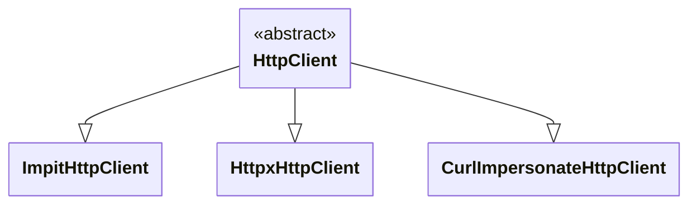

import ApiLink from '@site/src/components/ApiLink';
import Tabs from '@theme/Tabs';
import TabItem from '@theme/TabItem';
import RunnableCodeBlock from '@site/src/components/RunnableCodeBlock';

import ParselHttpxExample from '!!raw-loader!roa-loader!./code_examples/http_clients/parsel_httpx_example.py';
import ParselCurlImpersonateExample from '!!raw-loader!roa-loader!./code_examples/http_clients/parsel_curl_impersonate_example.py';
import ParselImpitExample from '!!raw-loader!roa-loader!./code_examples/http_clients/parsel_impit_example.py';

HTTP clients are utilized by HTTP-based crawlers (e.g., <ApiLink to="class/ParselCrawler">`ParselCrawler`</ApiLink> and <ApiLink to="class/BeautifulSoupCrawler">`BeautifulSoupCrawler`</ApiLink>) to communicate with web servers. They use external HTTP libraries for communication rather than a browser. Examples of such libraries include [httpx](https://pypi.org/project/httpx/), [aiohttp](https://pypi.org/project/aiohttp/), [curl-cffi](https://pypi.org/project/curl-cffi/), and [impit](https://apify.github.io/impit/). After retrieving page content, an HTML parsing library is typically used to facilitate data extraction. Examples of such libraries include [beautifulsoup](https://pypi.org/project/beautifulsoup4/), [parsel](https://pypi.org/project/parsel/), [selectolax](https://pypi.org/project/selectolax/), and [pyquery](https://pypi.org/project/pyquery/). These crawlers are faster than browser-based crawlers but cannot execute client-side JavaScript.



## Switching between HTTP clients

Crawlee currently provides three main HTTP clients: <ApiLink to="class/ImpitHttpClient">`ImpitHttpClient`</ApiLink>, which uses the `impit` library, <ApiLink to="class/HttpxHttpClient">`HttpxHttpClient`</ApiLink>, which uses the `httpx` library with `browserforge` for custom HTTP headers and fingerprints, and <ApiLink to="class/CurlImpersonateHttpClient">`CurlImpersonateHttpClient`</ApiLink>, which uses the `curl-cffi` library. You can switch between them by setting the `http_client` parameter when initializing a crawler class. The default HTTP client is <ApiLink to="class/ImpitHttpClient">`ImpitHttpClient`</ApiLink>. For more details on anti-blocking features, see our [avoid getting blocked guide](./avoid-blocking).

Below are examples of how to configure the HTTP client for the <ApiLink to="class/ParselCrawler">`ParselCrawler`</ApiLink>:

<Tabs>
    <TabItem value="ParselHttpxExample" label="ParselCrawler with HTTPX">
        <RunnableCodeBlock className="language-python" language="python">
            {ParselHttpxExample}
        </RunnableCodeBlock>
    </TabItem>
    <TabItem value="ParselCurlImpersonateExample" label="ParselCrawler with curl-cffi">
        <RunnableCodeBlock className="language-python" language="python">
            {ParselCurlImpersonateExample}
        </RunnableCodeBlock>
    </TabItem>
    <TabItem value="ParselImpitExample" label="ParselCrawler with impit">
        <RunnableCodeBlock className="language-python" language="python">
            {ParselImpitExample}
        </RunnableCodeBlock>
    </TabItem>
</Tabs>

## Installation requirements

Since <ApiLink to="class/ImpitHttpClient">`ImpitHttpClient`</ApiLink> is the default HTTP client, it's included with the base Crawlee installation and requires no additional packages.

For <ApiLink to="class/CurlImpersonateHttpClient">`CurlImpersonateHttpClient`</ApiLink>, you need to install Crawlee with the `curl-impersonate` extra:

```sh
python -m pip install 'crawlee[curl-impersonate]'
```

For <ApiLink to="class/HttpxHttpClient">`HttpxHttpClient`</ApiLink>, you need to install Crawlee with the `httpx` extra:

```sh
python -m pip install 'crawlee[httpx]'
```

Alternatively, you can install all available extras to get access to all HTTP clients and features:

```sh
python -m pip install 'crawlee[all]'
```

## Creating custom HTTP clients

Crawlee provides an abstract base class, <ApiLink to="class/HttpClient">`HttpClient`</ApiLink>, which defines the interface that all HTTP clients must implement. This allows you to create custom HTTP clients tailored to your specific requirements.

HTTP clients are responsible for several key operations:

- sending HTTP requests and receiving responses,
- managing cookies and sessions,
- handling headers and authentication,
- managing proxy configurations,
- connection pooling with timeout management.

To create a custom HTTP client, you need to inherit from the <ApiLink to="class/HttpClient">`HttpClient`</ApiLink> base class and implement all required abstract methods. Your implementation must be async-compatible and include proper cleanup and resource management to work seamlessly with Crawlee's concurrent processing model.

## Conclusion

This guide introduced you to the HTTP clients available in Crawlee and demonstrated how to switch between them, including their installation requirements and usage examples. You also learned about the responsibilities of HTTP clients and how to implement your own custom HTTP client by inheriting from the <ApiLink to="class/HttpClient">`HttpClient`</ApiLink> base class.

If you have questions or need assistance, feel free to reach out on our [GitHub](https://github.com/apify/crawlee-python) or join our [Discord community](https://discord.com/invite/jyEM2PRvMU). Happy scraping!
