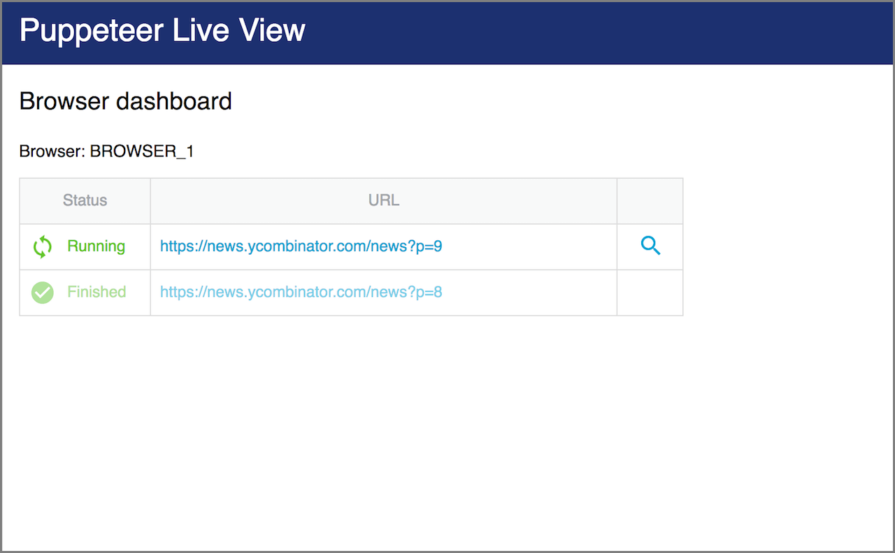
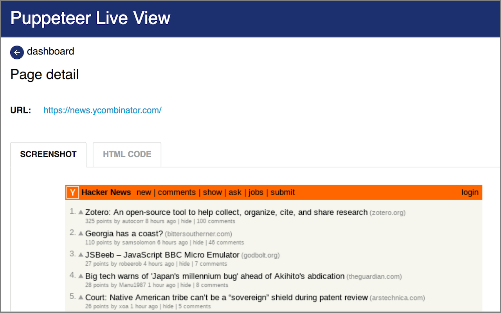

Apify SDK enables real-time view of launched Puppeteer browser instances and their open tabs,
including screenshots of pages and snapshots of HTML.
This is useful for debugging your crawlers that run in headless mode.

The live view dashboard is run on a web server that is started on a port specified
by the `APIFY_CONTAINER_PORT` environment variable (typically 4321).
To enable live view, pass the `liveView: true` option to
[`Apify.launchPuppeteer()`](../api/apify#module_Apify.launchPuppeteer):

```js
const browser = Apify.launchPuppeteer({ liveView: true });
```

or to [`PuppeteerCrawler`](../api/puppeteercrawler#new_PuppeteerCrawler_new) constructor as follows:

```js
const crawler = new PuppeteerCrawler({
    launchPuppeteerOptions: { liveView: true },
    // other options
})
```

To simplify debugging, you may also want to add the
`{ slowMo: 300 }` option to slow down all browser operation.
See <a href="https://pptr.dev/#?product=Puppeteer&show=api-puppeteerlaunchoptions" target="_blank">Puppeteer documentation</a> for details.

Once live view is enabled, you can open `http://localhost:4321` and you will see a page like this:



Click on the magnifying glass icon to view page detail, showing page screenshot and raw HTML:



For more information, read the <a href="https://kb.apify.com/actor/debugging-your-actors-with-live-view" target="_blank">Debugging your actors with Live View</a>
article in Apify Knowledge Base.
