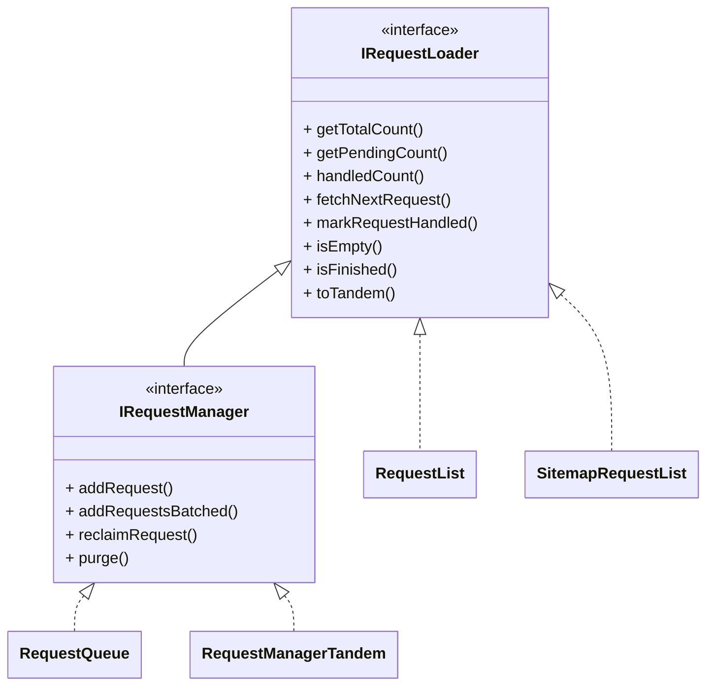

import ApiLink from '@site/src/components/ApiLink';

import Tabs from '@theme/Tabs';
import TabItem from '@theme/TabItem';
import CodeBlock from '@theme/CodeBlock';

import RlBasicSource from '!!raw-loader!./request_loaders_rl_basic.ts';
import SitemapBasicSource from '!!raw-loader!./request_loaders_sitemap_basic.ts';
import RlTandemExplicitSource from '!!raw-loader!./request_loaders_rl_tandem_explicit.ts';
import RlTandemHelperSource from '!!raw-loader!./request_loaders_rl_tandem_helper.ts';
import SitemapTandemExplicitSource from '!!raw-loader!./request_loaders_sitemap_tandem_explicit.ts';
import SitemapTandemHelperSource from '!!raw-loader!./request_loaders_sitemap_tandem_helper.ts';

Request loaders extend the functionality of the <ApiLink to="core/class/RequestQueue">`RequestQueue`</ApiLink>, providing additional tools for managing URLs and requests. If you are new to Crawlee and unfamiliar with the <ApiLink to="core/class/RequestQueue">`RequestQueue`</ApiLink>, consider starting with the [Request storage](./request-storage) guide first. Request loaders define how requests are fetched and stored, enabling various use cases such as reading URLs from a static list, a sitemap, an external API, or combining multiple sources together.

## Overview

The request loader abstractions are built around two interfaces and a couple of helpers:

- <ApiLink to="core/interface/IRequestLoader">`IRequestLoader`</ApiLink>: The base interface for reading requests in a crawl.
- <ApiLink to="core/interface/IRequestManager">`IRequestManager`</ApiLink>: Extends `IRequestLoader` with write capabilities (adding and reclaiming requests).
- <ApiLink to="core/class/RequestManagerTandem">`RequestManagerTandem`</ApiLink>: Combines a read-only `IRequestLoader` with a writable `IRequestManager`.

And the concrete request loader implementations:

- <ApiLink to="core/class/RequestList">`RequestList`</ApiLink>: A lightweight implementation for managing a static list of URLs.
- <ApiLink to="core/class/SitemapRequestList">`SitemapRequestList`</ApiLink>: A specialized loader that reads URLs from XML and plain-text sitemaps following the [Sitemaps protocol](https://www.sitemaps.org/protocol.html), with filtering capabilities.

Below is a class diagram that illustrates the relationships between these components and the <ApiLink to="core/class/RequestQueue">`RequestQueue`</ApiLink>:

:::info Crawler usage

A crawler reads its requests from a single <ApiLink to="core/interface/IRequestManager">`IRequestManager`</ApiLink>, passed via the `requestManager` option. A <ApiLink to="core/class/RequestQueue">`RequestQueue`</ApiLink> is itself a request manager, so it can be passed directly. A read-only loader (such as <ApiLink to="core/class/RequestList">`RequestList`</ApiLink>) cannot — combine it with a queue into a tandem first, see the [Request manager tandem](#request-manager-tandem) section below.

:::

## Request loaders

The <ApiLink to="core/interface/IRequestLoader">`IRequestLoader`</ApiLink> interface defines the foundation for fetching requests during a crawl. It provides methods for basic operations like retrieving the next request, marking requests as handled, and checking whether the loader is empty or finished. It is intentionally **read-only** — it does not allow adding new requests. Concrete implementations such as <ApiLink to="core/class/RequestList">`RequestList`</ApiLink> build on this interface to handle specific scenarios. You can create your own custom loader that reads from an external file, web endpoint, database, or any other data source.

### Request list

The <ApiLink to="core/class/RequestList">`RequestList`</ApiLink> manages a static list of URLs to crawl. The list is created for a single crawler run and, unlike a queue, cannot have requests added to or removed from it after initialization. It can hold a large number of URLs (even millions) with significantly lower overhead than enqueueing them one by one.

Here is a basic example of working with the <ApiLink to="core/class/RequestList">`RequestList`</ApiLink>:

<CodeBlock language="typescript">
    {RlBasicSource}
</CodeBlock>

### Sitemap request list

The <ApiLink to="core/class/SitemapRequestList">`SitemapRequestList`</ApiLink> is a specialized request loader that reads URLs from sitemaps following the [Sitemaps protocol](https://www.sitemaps.org/protocol.html). It supports both XML and plain-text sitemap formats and is particularly useful when you want to crawl a website systematically by following its sitemap structure. Loading happens in the background, so crawling can start before the sitemap is fully parsed.

:::note

The `SitemapRequestList` is designed specifically for sitemaps that follow the standard Sitemaps protocol. HTML pages containing links are not supported by this loader — those should be handled by regular crawlers using the `enqueueLinks` functionality.

:::

The loader supports filtering URLs using glob patterns and regular expressions, allowing you to include or exclude specific types of URLs.

<CodeBlock language="typescript">
    {SitemapBasicSource}
</CodeBlock>

## Request managers

The <ApiLink to="core/interface/IRequestManager">`IRequestManager`</ApiLink> interface extends `IRequestLoader` with **write** capabilities. In addition to reading requests, a request manager can add new requests and reclaim failed ones. This is essential for dynamic crawling, where new URLs emerge during the crawl, or when requests fail and need to be retried. The <ApiLink to="core/class/RequestQueue">`RequestQueue`</ApiLink> is the primary built-in request manager — see the [Request storage](./request-storage) guide for details.

## Request manager tandem

The <ApiLink to="core/class/RequestManagerTandem">`RequestManagerTandem`</ApiLink> class combines the read-only capabilities of an `IRequestLoader` (like <ApiLink to="core/class/RequestList">`RequestList`</ApiLink>) with the read-write capabilities of an `IRequestManager` (like <ApiLink to="core/class/RequestQueue">`RequestQueue`</ApiLink>). This is useful when you need to load initial requests from a static source (such as a file, sitemap, or database) and also dynamically add or retry requests during the crawl.

Under the hood, the tandem checks whether the read-only loader still has pending requests. If so, each request from the loader is transferred to the manager (the queue) before being processed. Any newly added or reclaimed requests go directly to the manager side. Because every request passes through the queue, deduplication and retries are handled consistently and a single URL is not crawled multiple times.

The easiest way to build a tandem is the <ApiLink to="core/interface/IRequestLoader#toTandem">`toTandem()`</ApiLink> helper available on the loaders. Called without arguments, it pairs the loader with the default <ApiLink to="core/class/RequestQueue">`RequestQueue`</ApiLink>; you can also pass a specific request manager to use instead.

### Request list with request queue

This setup is useful when you have a static list of URLs to crawl, but also need to handle dynamic requests discovered during the crawl. Requests from the <ApiLink to="core/class/RequestList">`RequestList`</ApiLink> are processed first by being enqueued into the <ApiLink to="core/class/RequestQueue">`RequestQueue`</ApiLink>, which handles persistence and retries.

<Tabs groupId="request_manager_tandem">
    <TabItem value="request_manager_tandem_helper" label="Using toTandem helper" default>
        <CodeBlock language="typescript">
            {RlTandemHelperSource}
        </CodeBlock>
    </TabItem>
    <TabItem value="request_manager_tandem_explicit" label="Explicit usage">
        <CodeBlock language="typescript">
            {RlTandemExplicitSource}
        </CodeBlock>
    </TabItem>
</Tabs>

### Sitemap request list with request queue

Similarly, you can combine a <ApiLink to="core/class/SitemapRequestList">`SitemapRequestList`</ApiLink> with a <ApiLink to="core/class/RequestQueue">`RequestQueue`</ApiLink>. This is particularly useful when you want to crawl URLs from a sitemap while also handling dynamic requests discovered during the crawl. URLs from the sitemap are processed first by being enqueued into the queue, which handles persistence and retries.

<Tabs groupId="sitemap_request_manager_tandem">
    <TabItem value="sitemap_request_manager_tandem_helper" label="Using toTandem helper" default>
        <CodeBlock language="typescript">
            {SitemapTandemHelperSource}
        </CodeBlock>
    </TabItem>
    <TabItem value="sitemap_request_manager_tandem_explicit" label="Explicit usage">
        <CodeBlock language="typescript">
            {SitemapTandemExplicitSource}
        </CodeBlock>
    </TabItem>
</Tabs>

## Conclusion

This guide introduced the request loader abstractions: the read-only <ApiLink to="core/interface/IRequestLoader">`IRequestLoader`</ApiLink>, the writable <ApiLink to="core/interface/IRequestManager">`IRequestManager`</ApiLink>, and the <ApiLink to="core/class/RequestManagerTandem">`RequestManagerTandem`</ApiLink> that combines them, along with the <ApiLink to="core/class/RequestList">`RequestList`</ApiLink> and <ApiLink to="core/class/SitemapRequestList">`SitemapRequestList`</ApiLink> implementations. You also saw how to pair a loader with a queue using the `toTandem()` helper to handle both static and dynamically discovered requests.

If you have questions or need assistance, feel free to reach out on our [GitHub](https://github.com/apify/crawlee) or join our [Discord community](https://discord.com/invite/jyEM2PRvMU). Happy scraping!
