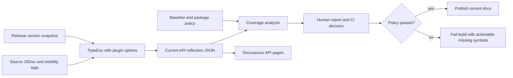

# API Documentation Coverage - Plan

## Goal Capsule

- **Objective:** Improve the rendered Crawlee JavaScript API reference so supported public symbols have useful plain-text descriptions, while making the coverage metric reflect the API users actually consume.
- **Authority:** GitHub issue #3884, the current TypeDoc/Docusaurus pipeline, and the repository's existing JSDoc conventions.
- **Execution profile:** Deep documentation and tooling change across the Yarn monorepo. Runtime behavior and package API signatures must remain unchanged.
- **Stop conditions:** The current API build reports a reproducible package-level coverage baseline, the priority public APIs are documented, coverage cannot regress silently, and the docs build succeeds with representative descriptions rendered.
- **Tail ownership:** Release automation owns historical API snapshots and deployment. This plan targets the current/4.0 documentation pipeline and does not rewrite the already-versioned 3.17 API artifact.

---

## Product Contract

### Summary

Improve Crawlee's rendered API documentation by documenting source-owned public APIs and enforcing a trustworthy coverage baseline. The change preserves all supported exports, excludes external and intentionally hidden reflections from the denominator, and adds no runtime behavior.

### Problem Frame

The API reference often renders a symbol name and type without a plain-text description. This is especially visible for `MemoryStorage` members and the shared storage interfaces. The result is difficult to scan for developers and provides weak context for LLM-based users.

The current API reference is generated by `@apify/docusaurus-plugin-typedoc-api`. Its default TypeDoc setup excludes external, internal, private, and protected symbols, but `website/docusaurus.config.js` overrides `excludeExternals` to `false`. The issue's coverage chart therefore mixes Crawlee-owned API with dependency declarations and inherited reflections. A raw percentage is not a reliable completion contract until the counted surface is defined.

The repository has no API-documentation coverage checker. The docs build runs in CI, but it does not fail when a public symbol loses its description or when a new undocumented public symbol reduces coverage.

### Actors

- A1. **API consumers and LLM agents:** Read the generated API reference to understand exported classes, functions, interfaces, options, properties, and methods.
- A2. **Crawlee maintainers:** Add or update public API comments and review coverage reports.
- A3. **Release automation:** Generates versioned API snapshots and deploys the current documentation site.

### Requirements

#### Documentation quality

- R1. Add meaningful plain-text descriptions to supported, source-owned public API symbols in all configured Crawlee packages, prioritizing the lowest-coverage shared and foundational packages first.
- R2. Describe behavior and semantics rather than repeating a symbol name or TypeScript type.
- R3. Add parameter, return-value, default, deprecation, throws, and example tags when they communicate behavior that a summary alone cannot express.
- R4. Use existing project conventions such as `@apilink`, `@inheritDoc`, `@default`, `@deprecated`, and `@ignore` consistently.

#### Coverage model and reporting

- R5. Define coverage from the TypeDoc reflection model used to render the current API reference, requiring a non-empty summary or inherited summary as the plain-text description signal.
- R6. Exclude external declarations from the primary package coverage metric and report them separately only when they affect the rendered surface.
- R7. Exclude symbols intentionally marked internal, private, protected, or ignored from the supported-public denominator instead of using documentation comments to inflate coverage.
- R8. Report package name, total counted symbols, documented symbols, percentage, missing symbol kind, source path, and ownership classification in a stable machine-readable and human-readable form.
- R9. Preserve package-level visibility into shared or inherited symbols so maintainers can identify whether a low score belongs to a base package or a consuming package.

#### Regression prevention

- R10. Add a committed baseline or threshold policy that prevents coverage from falling below the approved post-change baseline.
- R11. Fail the documentation quality check when a supported public symbol is added without a description or when an existing package regresses beyond the allowed policy.
- R12. Keep the coverage check coupled to the generated current TypeDoc JSON so it measures the same reflection surface that the site renders.

#### Versioning and compatibility

- R13. Keep package exports, TypeScript declarations, runtime behavior, and public symbol names unchanged.
- R14. Apply the fix to current/4.0 documentation generation. Do not manually edit `website/versioned_docs/version-3.17/api-typedoc.json` as part of this change.
- R15. Ensure the release snapshot workflow continues to generate versioned API artifacts from the same source and does not inherit a path or configuration that only works in local development.

### Key Flows

- F1. **API reader flow:** A user opens a current API page, selects a class/interface/member, and sees a useful plain-text description alongside its type and tags.
- F2. **Contributor flow:** A maintainer adds or changes an exported symbol, runs the coverage check, receives an actionable package/source report, and adds the required JSDoc before merging.
- F3. **Documentation build flow:** CI generates the current TypeDoc JSON, analyzes the exact generated reflection graph, rejects a coverage regression, and only then publishes the site.
- F4. **Release snapshot flow:** Release automation snapshots current docs and API JSON for a version without modifying historical snapshots during ordinary API documentation work.

### Acceptance Examples

- AE1. The current API page for `MemoryStorage` shows descriptions for its supported public storage methods and observable configuration/state properties instead of only names and types.
- AE2. The shared storage interfaces expose descriptions for their collection, record, request, pagination, and option fields that explain their semantics.
- AE3. The coverage report does not count external Stagehand, Cheerio, Node, or TypeScript declarations as Crawlee-owned undocumented API.
- AE4. A fixture reflection graph containing a missing supported member produces a report naming its package, symbol, kind, source, and missing description, and the quality check fails when that member crosses the configured policy.
- AE5. A fixture reflection graph containing only external, internal, private, protected, or ignored members outside the supported denominator does not fail the coverage check.
- AE6. The documentation build succeeds with the coverage check enabled and renders current API descriptions without changing package exports or generated declaration signatures.

### Scope Boundaries

#### In scope

- Plain-text JSDoc coverage for supported public API in the 15 packages configured by the TypeDoc plugin.
- Coverage analysis based on the current generated TypeDoc JSON.
- TypeDoc filtering configuration needed to make the primary metric truthful.
- A baseline/threshold policy and documentation-build enforcement.
- Current API documentation build and release-snapshot compatibility.

#### Deferred for later

- A complete rewrite of every historical API snapshot from versions 3.10 through 3.17.
- A new API documentation theme or redesign of TypeDoc cards.
- Automatically generating descriptions from symbol names or TypeScript types.
- Replacing the TypeDoc/Docusaurus plugin.
- Localized API descriptions.

#### Outside this product's identity

- Runtime behavior changes.
- Type-signature changes, export removals, or API renames.
- A separate prose guide for every API member; conceptual guides remain in `docs/`.

#### Deferred to Follow-Up Work

- A dedicated API-doc authoring guide for contributors beyond the coverage report's output and existing JSDoc conventions.
- A historical backfill of v3.17 after a separate decision on whether archived API pages should be regenerated.
- A public coverage dashboard or trend storage outside CI artifacts.

---

## Planning Contract

### Key Technical Decisions

- KTD1. **Use the generated TypeDoc reflection graph as the coverage source.** (session-settled: user-approved — chosen over a source-only TypeScript AST scan: it measures the same API surface that the Docusaurus plugin renders.) The analyzer must consume the plugin's current generated JSON rather than infer public API from `export` syntax alone. This preserves TypeDoc's handling of re-exports, inherited members, overload signatures, and visibility tags.
- KTD2. **Restore external filtering for the primary metric and current API pages.** (session-settled: user-approved — chosen over counting dependency declarations: the plugin already defaults to `excludeExternals: true`, and external symbols are not Crawlee-owned documentation work.) Keep external type references usable in signatures where TypeDoc supports them, and report any rendering regression during docs verification.
- KTD3. **Require a real summary, not just any comment tag.** Count a symbol as documented when its TypeDoc reflection or inherited signature has a non-empty summary. A deprecation or `@see` tag alone can render a fallback message but does not explain the API's behavior.
- KTD4. **Document source symbols instead of editing generated JSON.** Generated API JSON remains a release/build artifact. Source comments are the durable input; the coverage report maps missing reflections back to source paths for contributor action.
- KTD5. **Use a post-generation baseline ratchet.** (session-settled: user-approved — chosen over requiring immediate 100% coverage: the current gap is broad, while a baseline prevents regressions and allows package-by-package improvement.) The policy must require at least the approved post-change package coverage, preserve any explicitly accepted existing gaps, and fail when a newly introduced supported reflection is undocumented.
- KTD6. **Use TypeDoc visibility tags to define supported API boundaries.** `@internal`, `@ignore`, and language visibility modifiers remain legitimate exclusions only for symbols that are intentionally not supported. The implementation must not add exclusion tags merely to improve the score.
- KTD7. **Target current/4.0 docs, not historical v3.17 artifacts.** (session-settled: user-approved — chosen over rewriting archived generated output: release snapshots are versioned artifacts and the issue is assigned to the 4.0 milestone.) The release snapshot workflow remains a compatibility check, not an in-scope bulk rewrite.

### High-Level Technical Design

The coverage check follows the same generated-data boundary as the API site:

The analyzer should treat the reflection graph as a tree, identify package ownership from the plugin's package grouping and source references, ignore reflections outside the supported denominator, and recognize summaries on declarations or callable signatures. It should emit stable rows keyed by package, relative source path, qualified symbol name, and reflection kind so the report can be compared across builds without depending on reflection IDs that may change. The baseline should distinguish known accepted missing rows from newly introduced missing rows.

### Assumptions

- The plugin's current generated JSON is available under Docusaurus's generated-files directory after the API plugin loads; the exact path should be resolved against the installed plugin version during implementation rather than hard-coded from a local cache.
- The configured API package list remains the source of truth for package ordering and package inclusion.
- Existing `@internal` and `@ignore` annotations reflect intentional API boundaries. Any suspicious exclusion discovered during the documentation pass is deferred for maintainer review rather than silently changed.
- The post-build hook can run the analyzer after TypeDoc JSON generation and before the documentation build is treated as successful.

### Sequencing

1. Establish and test the coverage model against the committed v3.17 JSON and synthetic reflection fixtures.
2. Align TypeDoc filtering and wire the analyzer into the current docs build without changing source comments yet.
3. Add source documentation in dependency order: shared types and storage, core, browser infrastructure, then crawler adapters and utilities.
4. Record the post-change baseline and enforce it in CI and local docs builds.
5. Verify current-page rendering and release snapshot compatibility.

### System-Wide Impact

- **API consumers:** More descriptions appear in current API pages, improving discoverability without changing imports or types.
- **Package maintainers:** Public comments become part of the review surface, and new undocumented exports can fail the docs quality check.
- **Release automation:** Current API generation and versioned snapshot generation both depend on the TypeDoc configuration remaining portable.
- **CI:** Documentation builds gain a quality gate. This is separate from runtime package tests and should produce a focused failure report.
- **Generated artifacts:** Historical `website/versioned_docs/version-3.17/api-typedoc.json` remains unchanged unless a separate release-docs operation intentionally regenerates it.

### Alternative Approaches Considered

- **Count every TypeDoc reflection:** Rejected because `excludeExternals: false` pulls dependency declarations into Crawlee's denominator and makes package percentages misleading.
- **Scan TypeScript source exports directly:** Rejected as the primary mechanism because it cannot faithfully model re-exports, inherited members, overload signatures, TypeDoc visibility tags, or the final rendered reflection graph.
- **Hide every undocumented symbol:** Rejected because it would make the API appear healthier by removing useful public surface and could conceal supported APIs from users.
- **Add generic generated descriptions:** Rejected because names and types do not communicate behavior, defaults, side effects, or compatibility semantics.
- **Only add comments to the screenshot's `MemoryStorage` fields:** Rejected because it fixes one visible page without addressing the shared types, filtering distortion, or future regressions shown by the issue's package-wide chart.

### Risks & Dependencies

| Risk | Mitigation |
|---|---|
| Changing `excludeExternals` removes useful dependency API pages or breaks links. | Compare representative current API pages and TypeDoc links before and after; keep external references in signatures where supported and report any unacceptable loss. |
| Coverage policy counts inherited or overloaded reflections inconsistently. | Base the analyzer on stable package/source/name/kind keys, test declaration and signature comments, and publish both displayed-package and source-owner context where needed. |
| Documentation work becomes an unreviewable mass edit. | Deliver in package-priority units, keep summaries behavior-focused, and ratchet from the approved post-change baseline instead of claiming immediate 100%. |
| Existing public members are intentionally undocumented implementation details. | Review missing-symbol reports against `@internal`, `@ignore`, private/protected modifiers, and package entry points; do not add exclusion tags without ownership evidence. |
| The generated JSON location differs between local builds and CI. | Discover the installed plugin's generated-files contract during implementation and make the checker accept an explicit input path for fixtures and release verification. |
| Historical snapshots drift unexpectedly. | Keep versioned artifacts out of the source-comment diff, run the release snapshot path separately, and require generated-file changes to be intentional. |
| Comments contain broken `@apilink` targets or malformed tags. | Run the existing docs build with broken-link failure enabled and include representative API-page checks in verification. |

### Sources & Research

- GitHub issue #3884: `https://github.com/apify/crawlee/issues/3884`.
- `website/docusaurus.config.js`: the configured TypeDoc plugin, 15 package entry points, and the current `excludeExternals: false` override.
- `website/package.json`: the Docusaurus build and post-build pipeline.
- `.github/workflows/docs.yml`: production docs build and deployment path.
- `.github/workflows/test-ci.yml`: pull-request docs build path.
- `.github/workflows/release.yml`: versioned docs and API snapshot generation through `api:version`.
- `packages/types/src/storages.ts`: shared public storage contracts with sparse member descriptions.
- `packages/memory-storage/src/memory-storage.ts`: the issue's representative class with documented options but undocumented public fields and methods.
- `packages/browser-pool/src/abstract-classes/browser-controller.ts`: existing JSDoc style and public browser-controller members.
- `@apify/docusaurus-plugin-typedoc-api` 5.1.16 source: the plugin defaults to excluding external, internal, private, and protected reflections, generates current JSON under Docusaurus generated files, and persists versioned JSON separately.
- TypeDoc input options: `excludeExternals`, `excludeInternal`, `excludePrivate`, `excludeProtected`, and `excludeNotDocumentedKinds`. The plan does not use `excludeNotDocumented` as a substitute for writing documentation.

---

## Implementation Units

### U1. Build the TypeDoc coverage analyzer

- **Goal:** Create a dependency-light analyzer that reads generated TypeDoc JSON and produces deterministic package-level coverage plus actionable missing-symbol records.
- **Requirements:** R5-R9, R12.
- **Dependencies:** None.
- **Files:**
  - `website/tools/api-coverage.mjs` (create; analyzer library and CLI entry point)
  - `test/api-documentation-coverage.test.ts` (create)
  - `package.json` (modify only if a root-level local coverage entry point is needed)
- **Approach:**
  1. Traverse TypeDoc project, module, namespace, declaration, signature, and reference reflections without counting container nodes as API symbols.
  2. Use the configured package groups and source references to classify package display and source ownership.
  3. Treat a non-empty summary on a declaration, callable signature, or inherited reflection as documented; do not treat a tag-only comment as a plain-text description.
  4. Apply the supported-denominator rules for external, internal, private, protected, ignored, and intentionally excluded reflections.
  5. Emit stable machine-readable data and a concise human report sorted by package, source path, kind, and symbol name.
- **Patterns to follow:** TypeDoc JSON structure in `website/versioned_docs/version-3.17/api-typedoc.json`; TypeDoc plugin grouping in `@apify/docusaurus-plugin-typedoc-api`; root Vitest conventions in `vitest.config.mts`.
- **Test scenarios:**
  - A fixture with documented and undocumented class, interface, property, method, enum, type-alias, and function reflections reports correct totals by package and kind.
  - A method whose description exists only on its signature is counted as documented.
  - A reflection with only `@deprecated` or `@see` block tags is reported as missing a plain-text description.
  - External, internal, private, protected, and ignored fixtures are excluded from the supported denominator and appear only in optional diagnostic output.
  - Repeated inherited reflections produce deterministic package/source ownership rows without using unstable reflection IDs as keys.
  - A malformed or missing input file fails with an actionable error that identifies the expected TypeDoc JSON input.
- **Verification:** The analyzer produces reproducible counts and missing-symbol records for the committed API JSON and all fixture tests pass without requiring the Docusaurus runtime.

### U2. Align TypeDoc filtering and integrate the check into the docs build

- **Goal:** Make current rendered API pages and the primary coverage metric use the same supported public surface, then fail the docs build on policy violations.
- **Requirements:** R6-R8, R10-R12, R15.
- **Dependencies:** U1.
- **Files:**
  - `website/docusaurus.config.js` (modify)
  - `website/tools/api-coverage.mjs` (modify with the build-check entry point)
  - `website/package.json` (modify scripts)
  - `website/tools/joinLlmsFiles.mjs` (modify only if post-build ordering requires a dedicated hook)
  - `.github/workflows/docs.yml` (modify if the build hook is not sufficient for deployment)
  - `.github/workflows/test-ci.yml` (modify if PR docs verification needs an explicit coverage step)
  - `test/api-documentation-coverage.test.ts` (extend integration-facing policy tests)
- **Approach:**
  1. Restore `excludeExternals: true` or make the equivalent explicit while preserving the plugin's existing internal/private/protected filtering defaults.
  2. Locate the current generated TypeDoc JSON under Docusaurus's `generatedFilesDir` after the plugin generates it and pass it to the analyzer; support an explicit input path for tests and release verification.
  3. Add the quality check to the existing post-build lifecycle before the LLM-file join completes, so a missing generated JSON or policy violation fails the build rather than silently skipping coverage.
  4. Keep the existing LLM-file join and deployment steps intact; do not make coverage depend on the generated HTML directory.
  5. Add a local entry point that maintainers can run against a supplied generated JSON without starting the site.
- **Execution note:** Verify the generated-file path and external-link behavior during the first implementation pass before changing the baseline policy. This is the highest-risk integration seam.
- **Patterns to follow:** Docusaurus plugin lifecycle in `@apify/docusaurus-plugin-typedoc-api` 5.1.16; `website/package.json` post-build convention; CI docs build steps in `.github/workflows/docs.yml` and `.github/workflows/test-ci.yml`.
- **Test scenarios:**
  - A docs-build fixture or generated-data fixture proves the checker runs after TypeDoc JSON generation and before the build is accepted.
  - A package with an undocumented supported reflection causes a non-zero coverage-check result and prints the missing source location.
  - A package containing only excluded external or internal reflections does not fail the build.
  - The current generated JSON can be passed through an explicit path, while a missing generated path produces a clear setup error rather than silently skipping coverage.
  - Representative current API links still resolve after external filtering is restored.
- **Verification:** A current docs build runs the analyzer automatically, fails on a deliberate fixture-policy regression, and succeeds on the approved baseline without requiring edits to versioned API JSON.

### U3. Document shared types and memory storage

- **Goal:** Raise the lowest-coverage foundational APIs and improve the exact storage pages highlighted by the issue.
- **Requirements:** R1-R4, AE1, AE2.
- **Dependencies:** U1 and U2.
- **Files:**
  - `packages/types/src/storages.ts` (modify)
  - `packages/types/src/browser.ts` (modify)
  - `packages/types/src/utility-types.ts` (modify where exported aliases lack context)
  - `packages/memory-storage/src/memory-storage.ts` (modify)
  - `packages/memory-storage/src/resource-clients/common/base-client.ts` (modify if exported reflections remain in scope)
  - `packages/memory-storage/src/resource-clients/dataset.ts` (modify)
  - `packages/memory-storage/src/resource-clients/dataset-collection.ts` (modify)
  - `packages/memory-storage/src/resource-clients/key-value-store.ts` (modify)
  - `packages/memory-storage/src/resource-clients/key-value-store-collection.ts` (modify)
  - `packages/memory-storage/src/resource-clients/request-queue.ts` (modify)
  - `packages/memory-storage/src/resource-clients/request-queue-collection.ts` (modify)
  - `test/api-documentation-coverage.test.ts` (extend fixture expectations for representative symbols)
- **Approach:**
  1. Add interface-level summaries for dataset, key-value store, request queue, pagination, record, option, result, and status contracts.
  2. Add member descriptions that explain units, optionality, lifecycle, ordering, defaults, and whether a value is a local-storage implementation detail.
  3. Add method summaries and parameter/return tags to `MemoryStorage` and resource clients, using inherited interface docs only where the implementation behavior is identical.
  4. Mark only confirmed non-public implementation reflections with existing visibility conventions; do not hide fields solely because they are inconvenient to describe.
- **Patterns to follow:** Existing documented `QueueOperationInfo`, `PaginatedList`, `MemoryStorageOptions`, `@default` tags, and `@apilink` references in the same files.
- **Test scenarios:**
  - The coverage fixture or generated report recognizes descriptions on the shared storage interfaces and `MemoryStorage` methods.
  - The current API page contains distinct descriptions for local directory, persistence, metadata, dataset, key-value-store, and request-queue behavior.
  - Option defaults in comments match the implementation's environment-variable and fallback behavior.
  - No package export or declaration signature changes occur in the generated TypeScript output.
- **Verification:** The shared types and memory-storage packages exceed their approved post-change floors, and representative API pages show descriptions instead of type-only cards.

### U4. Document core public contracts and base crawler APIs

- **Goal:** Add behavior-focused descriptions to the shared core APIs whose documentation is inherited by multiple crawler packages.
- **Requirements:** R1-R4, R9, R10.
- **Dependencies:** U3.
- **Files:**
  - `packages/core/src/autoscaling/` (modify exported public contracts and members)
  - `packages/core/src/configuration.ts` (modify)
  - `packages/core/src/crawlers/` (modify exported crawler contexts, statistics, and error contracts)
  - `packages/core/src/enqueue_links/` (modify exported options, patterns, and results)
  - `packages/core/src/http_clients/` (modify exported request/response contracts)
  - `packages/core/src/proxy_configuration.ts` (modify)
  - `packages/core/src/request.ts` (modify)
  - `packages/core/src/router.ts` (modify)
  - `packages/core/src/serialization.ts` (modify exported APIs)
  - `packages/core/src/session_pool/` (modify exported options, states, and classes)
  - `packages/core/src/storages/` (modify exported storage/request contracts)
  - `packages/core/src/validators.ts` (modify exported validator surface where it remains documented)
  - `test/api-documentation-coverage.test.ts` (extend core representative expectations)
- **Approach:**
  1. Prioritize shared interfaces and option objects before leaf crawler packages so inherited documentation improves multiple package pages.
  2. Describe lifecycle, retry, persistence, request-state, routing, proxy, session, and storage semantics that cannot be inferred from types.
  3. Use `@inheritDoc` only where the child API has identical semantics; write a distinct summary where the child changes behavior or constraints.
  4. Preserve intentional `@ignore`, `@internal`, deprecation, and private/protected boundaries.
- **Patterns to follow:** Existing detailed comments in `packages/core/src/configuration.ts`, `packages/core/src/request.ts`, `packages/core/src/router.ts`, crawler context comments in `packages/basic-crawler/src/internals/basic-crawler.ts`, and `@inheritDoc` usage in `packages/impit-client/src/index.ts`.
- **Test scenarios:**
  - Core shared contracts produce summaries in the coverage report and in at least one consuming crawler page.
  - Inherited documentation is counted once as a real description and does not require duplicate copy that can drift.
  - Deprecated or ignored options retain their existing TypeDoc treatment and do not become newly supported API by accident.
  - Public comments do not introduce broken `@apilink` targets or malformed tags.
- **Verification:** Core coverage improves against the approved baseline, and shared descriptions are visible through the browser/http/basic crawler inheritance chain.

### U5. Document browser infrastructure, crawler adapters, and utility packages

- **Goal:** Complete the source-owned public documentation pass across browser management, crawler variants, Stagehand, Impit, and utilities after shared contracts are covered.
- **Requirements:** R1-R4, R9-R11, AE3.
- **Dependencies:** U4.
- **Files:**
  - `packages/browser-pool/src/` (modify supported public controllers, plugins, hooks, options, and enums)
  - `packages/browser-crawler/src/` (modify public crawler/context contracts)
  - `packages/basic-crawler/src/` (modify remaining supported public contracts and members)
  - `packages/http-crawler/src/` (modify public HTTP and file-download contracts)
  - `packages/cheerio-crawler/src/` (modify public Cheerio contracts)
  - `packages/jsdom-crawler/src/` (modify public JSDOM contracts)
  - `packages/linkedom-crawler/src/` (modify public LinkeDOM contracts)
  - `packages/playwright-crawler/src/` (modify public Playwright contracts and utilities)
  - `packages/puppeteer-crawler/src/` (modify public Puppeteer contracts and utilities)
  - `packages/stagehand-crawler/src/` (modify Crawlee-owned Stagehand contracts; do not document external Stagehand declarations as Crawlee-owned)
  - `packages/impit-client/src/` (modify public client and exported constants)
  - `packages/utils/src/` (modify supported utility contracts and exported functions)
  - `test/api-documentation-coverage.test.ts` (extend package representative expectations)
- **Approach:**
  1. Use the coverage report to drive missing-symbol order and keep the diff limited to source-owned supported reflections.
  2. Add summaries for crawler-specific options, contexts, handlers, navigation, browser lifecycle, utility inputs, and result semantics.
  3. Reuse shared base descriptions through inheritance where valid, and avoid duplicating comments for dependency-owned browser, Cheerio, Node, or Stagehand members.
  4. Review exported implementation helpers before documenting them; mark or retain visibility only according to their supported API status.
- **Patterns to follow:** Existing crawler-specific options and handler documentation, `@ignore` annotations in click-element utilities, `@internal` annotations in launcher/helpers, and Stagehand examples in `packages/stagehand-crawler/src/index.ts`.
- **Test scenarios:**
  - The coverage report identifies no unexpected source-owned undocumented symbols in the package priority set after the pass.
  - External dependency reflections remain outside the primary metric and are not changed by source comments in Crawlee packages.
  - Browser, HTTP, parser, Stagehand, Impit, and utility descriptions render without broken links or empty comment blocks.
  - New or changed `@deprecated`, `@internal`, and `@ignore` tags match the intended supported API boundary.
- **Verification:** All configured packages meet their approved coverage floors, the global ratchet passes, and the current docs build renders representative pages for each package family.

### U6. Establish the baseline, CI gate, and release compatibility checks

- **Goal:** Make the improvement durable by recording the post-documentation baseline and enforcing it in pull-request and deployment documentation builds.
- **Requirements:** R8-R15, AE4-AE6.
- **Dependencies:** U2-U5.
- **Files:**
  - `website/tools/api-coverage-baseline.json` (create)
  - `website/tools/api-coverage.mjs` (modify policy loading and comparison)
  - `website/package.json` (modify scripts)
  - `.github/workflows/test-ci.yml` (modify)
  - `.github/workflows/docs.yml` (modify)
  - `.github/workflows/release.yml` (modify only if the release snapshot needs an explicit compatibility assertion)
  - `test/api-documentation-coverage.test.ts` (extend baseline and regression cases)
- **Approach:**
  1. Record the approved post-change package counts, minimum ratios, and accepted missing-symbol keys after U3-U5, with policy metadata explaining exclusions.
  2. Require each package to meet its minimum documented count/ratio and reject any missing supported reflection that is not already present in the accepted baseline set.
  3. Make policy failures print the missing-symbol report and the baseline comparison, not only a percentage.
  4. Run the same check in pull-request docs builds and the production docs build; keep release snapshot generation compatible with the current plugin command.
  5. Avoid committing generated current-build JSON or changing historical versioned JSON as part of the policy file.
- **Test scenarios:**
  - A baseline-equal report passes.
  - A report with one fewer documented supported symbol fails and names the affected package and symbol.
  - A report with a new documented symbol and a larger denominator passes when the package remains at or above policy.
  - A report with only excluded external/internal/private/protected symbols changes no policy result.
  - The release snapshot input remains valid and historical API files are not modified by the ordinary current-docs check.
- **Verification:** Pull-request docs CI and production docs CI both enforce coverage; a deliberate regression is rejected; the release snapshot path remains valid; the final report is reproducible from generated TypeDoc data.

---

## Verification Contract

| Check | Applies to | Pass signal |
|---|---|---|
| `yarn test` | U1-U6 | Coverage analyzer fixtures and existing repository tests pass. |
| `yarn tsc-check-tests` | U1-U6 | Coverage tests type-check under the repository's required test check. |
| `yarn lint` | U1-U6 | Source comments, analyzer scripts, and test files meet repository lint rules. |
| `yarn format:check` | U1-U6 | Changed TypeScript, JavaScript, JSON, and workflow files are formatted. |
| `cd website && yarn build` | U2-U6 | TypeDoc generation, coverage enforcement, Docusaurus rendering, and LLM post-build processing succeed together. |
| Generated current API report | U1-U6 | Report contains package totals, documented counts, percentages, exclusions, and actionable missing rows. |
| Representative API-page review | U3-U5 | `MemoryStorage`, shared storage types, core crawler contracts, browser infrastructure, and one package from each crawler family render non-empty descriptions. |
| Release snapshot compatibility | U2 and U6 | The versioning workflow can still generate API package and TypeDoc snapshots without changing historical artifacts in the ordinary current-docs path. |

No runtime behavior test is required for the JSDoc-only changes. The generated API reflection, docs build, coverage fixtures, TypeScript test check, and representative rendered pages are the proof surface.

---

## Definition of Done

- The current API docs render useful plain-text descriptions for the documented source-owned public symbols, including the issue's `MemoryStorage` and shared storage examples.
- TypeDoc filtering no longer makes external dependency declarations part of the primary Crawlee coverage denominator.
- The analyzer measures the generated TypeDoc reflection graph and produces deterministic, actionable reports.
- A committed package-aware baseline prevents coverage regressions and requires new supported public symbols to be documented.
- Existing visibility and deprecation boundaries remain intentional and are not manipulated solely to improve percentages.
- Current docs CI and production docs CI enforce the same policy.
- Release snapshot generation remains compatible, and `website/versioned_docs/version-3.17/api-typedoc.json` is not manually rewritten by this work.
- All verification gates in the Verification Contract pass.
- Abandoned analyzer variants, temporary generated files, and debugging artifacts are removed before completion.
