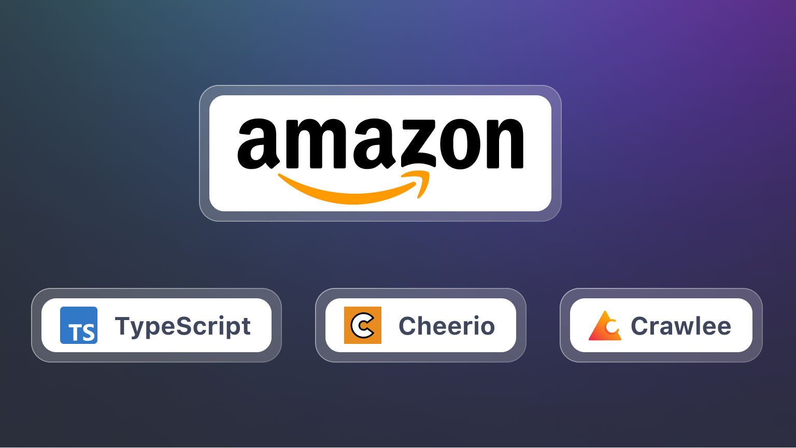
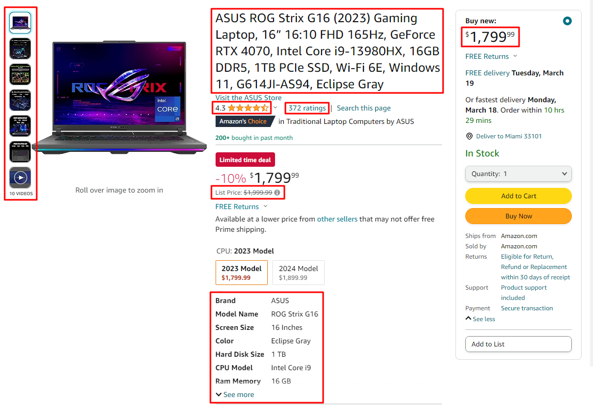
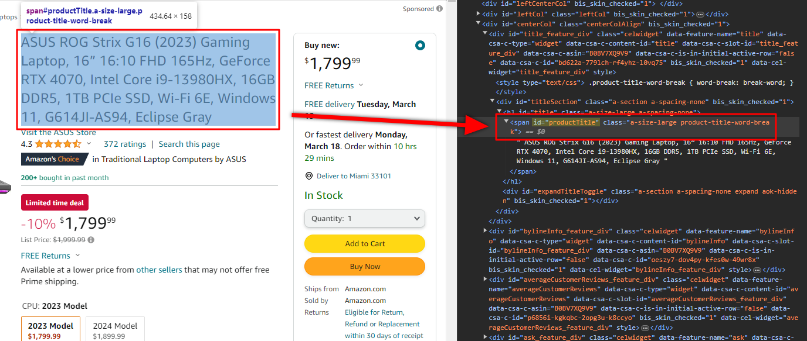

## Introduction

Amazon is one of the largest and most complex websites, which means scraping it is pretty challenging. Thankfully, the Crawlee library makes things a little easier, with utilities like JSON file outputs, automatic scaling, and request queue management.

In this guide, we'll be extracting information from Amazon product pages using the power of [TypeScript](https://www.typescriptlang.org) in combination with the [Cheerio](https://cheerio.js.org) and [Crawlee](https://crawlee.dev) libraries. We'll explore how to retrieve and extract detailed product data such as titles, prices, image URLs, and more from Amazon's vast marketplace. We'll also discuss handling potential blocking issues that may arise during the scraping process.



<!--truncate-->

## Prerequisites

You'll find the journey smoother if you have a decent grasp of the TypeScript language and a fundamental understanding of [HTML](https://developer.mozilla.org/en-US/docs/Web/HTML) structure. A familiarity with Cheerio and Crawlee is advised but optional. This guide is built to introduce these tools and their use cases in an approachable manner.

Crawlee is open-source with nearly 12,000 stars on GitHub. You can check out the [source code here](https://github.com/apify/crawlee). Feel free to play with Crawlee with the inbuilt templates that they offer.

## Writing the scraper

To begin with, let's identify the product fields that we're interested in scraping:

-   Product Title
-   Price
-   List Price
-   Review Rating
-   Review Count
-   Image URLs
-   Product Overview Attributes



For now, our focus will be solely on the scraping part. In a later section, we'll shift our attention to Crawlee, our crawling tool. Let's begin!

### Scraping the individual data points

Our first step will be to utilize [browser DevTools](https://developer.mozilla.org/en-US/docs/Learn/Common_questions/Tools_and_setup/What_are_browser_developer_tools) to inspect the layout and discover the [CSS selectors](https://developer.mozilla.org/en-US/docs/Learn/CSS/Building_blocks/Selectors) for the data points we aim to scrape. (by default on [Chrome](https://developer.chrome.com/docs/devtools), press `Ctrl + Shift + C`)

For example, let's take a look at how we find the selector for the product title:


The product title selector we've deduced is `span#productTitle`. This selector targets all `span` elements with the id of `productTitle`. Luckily, there's only one such element on the page - exactly what we're after.

We can find the selectors for the remaining data points using the same principle combined with a sprinkle of trial and error. Next, let's write a function that uses a [Cheerio object](https://cheerio.js.org/docs/api/interfaces/CheerioAPI) of the product page as input and outputs our extracted data in a structured format.

Initially, we'll focus on scraping simple data points. We'll leave the more complex ones, like image URLs and product attributes overview, for later.

```typescript
import { CheerioAPI } from 'cheerio';

type ProductDetails = {
    title: string;
    price: string;
    listPrice: string;
    reviewRating: string;
    reviewCount: string;
};

/**
 * CSS selectors for the product details. Feel free to figure out different variations of these selectors.
 */
const SELECTORS = {
    TITLE: 'span#productTitle',
    PRICE: 'span.priceToPay',
    LIST_PRICE: 'span.basisPrice .a-offscreen',
    REVIEW_RATING: '#acrPopover a > span',
    REVIEW_COUNT: '#acrCustomerReviewText',
} as const;

/**
 * Scrapes the product details from the given Cheerio object.
 */
export const extractProductDetails = ($: CheerioAPI): ProductDetails => {
    const title = $(SELECTORS.TITLE).text().trim();

    const price = $(SELECTORS.PRICE).first().text();
    const listPrice = $(SELECTORS.LIST_PRICE).first().text();
    const reviewRating = $(SELECTORS.REVIEW_RATING).first().text();
    const reviewCount = $(SELECTORS.REVIEW_COUNT).first().text();

    return { title, price, listPrice, reviewRating, reviewCount };
};
```

## Improving the scraper

At this point, our scraper extracts all fields as strings, which isn't ideal for numerical fields like prices and review counts - we'd rather have those as numbers.

Simple casting from string to numbers will only work for some fields. In some cases, such as processing the price fields, we must clean the string and remove unnecessary characters before conversion. To address this, write a utility function parsing a number from a string. We'll also have another function to find the first element matching our selector and return it parsed as a number.

```typescript
/**
 * Parses a number from a string by removing all non-numeric characters.
 * - Keeps the decimal point.
 */
const parseNumberValue = (rawString: string): number => {
    return Number(rawString.replace(/[^\d.]+/g, ''));
};

/**
 * Parses a number value from the first element matching the given selector.
 */
export const parseNumberFromSelector = ($: CheerioAPI, selector: string): number => {
    const rawValue = $(selector).first().text();
    return parseNumberValue(rawValue);
};
```

With the function above: `parseNumberValue`, we can now update and simplify the main scraping function `extractProductDetails`.

```typescript
import { CheerioAPI } from 'cheerio';
import { parseNumberFromSelector } from './utils.js';

type ProductDetails = {
    title: string;
    price: number;        //
    listPrice: number;    // updated to numbers
    reviewRating: number; //
    reviewCount: number;  //
};

...

/**
 * Scrapes the product details from the given Cheerio object.
 */
export const extractProductDetails = ($: CheerioAPI): ProductDetails => {
    const title = $(SELECTORS.TITLE).text().trim();

    const price = parseNumberFromSelector($, SELECTORS.PRICE);
    const listPrice = parseNumberFromSelector($, SELECTORS.LIST_PRICE);
    const reviewRating = parseNumberFromSelector($, SELECTORS.REVIEW_RATING);
    const reviewCount = parseNumberFromSelector($, SELECTORS.REVIEW_COUNT);

    return { title, price, listPrice, reviewRating, reviewCount };
};
```

### Scraping the advanced data points

As we progress in our scraping journey, it's time to focus on the more complex data fields, like image URLs and product attributes overview. To extract data from these fields, we must utilize the `map` function to iterate over all matching elements and fetch data from each. Let's start with image URLs.

```typescript
const SELECTORS = {
    ...
    IMAGES: '#altImages .item img',
} as const;

/**
 * Extracts the product image URLs from the given Cheerio object.
 * - We have to iterate over the image elements and extract the `src` attribute.
 */
const extractImageUrls = ($: CheerioAPI): string[] => {
    const imageUrls = $(SELECTORS.IMAGES)
        .map((_, imageEl) => $(imageEl).attr('src'))
        .get(); // `get()` - Retrieve all elements matched by the Cheerio object, as an array. Removes `undefined` values.

    return imageUrls;
};
```

Extracting images is relatively simple yet still deserves a separate function for clarity. We'll now parse the product attributes overview.

```typescript
type ProductAttribute = {
    label: string;
    value: string;
};

const SELECTORS = {
    ...
    PRODUCT_ATTRIBUTE_ROWS: '#productOverview_feature_div tr',
    ATTRIBUTES_LABEL: 'td:nth-of-type(1) span',
    ATTRIBUTES_VALUE: 'td:nth-of-type(2) span',
} as const;

/**
 * Extracts the product attributes from the given Cheerio object.
 * - We have to iterate over the attribute rows and extract both label and value for each row.
 */
const extractProductAttributes = ($: CheerioAPI): ProductAttribute[] => {
    const attributeRowEls = $(SELECTORS.PRODUCT_ATTRIBUTE_ROWS).get();

    const attributeRows = attributeRowEls.map((rowEl) => {
        const label = $(rowEl).find(SELECTORS.ATTRIBUTES_LABEL).text();
        const value = $(rowEl).find(SELECTORS.ATTRIBUTES_VALUE).text();

        return { label, value };
    });

    return attributeRows;
};
```

We've now effectively crafted our scraping functions. Here's the complete `scraper.ts` file:

```typescript
import { CheerioAPI } from 'cheerio';
import { parseNumberFromSelector } from './utils.js';

type ProductAttribute = {
    label: string;
    value: string;
};

type ProductDetails = {
    title: string;
    price: number;
    listPrice: number;
    reviewRating: number;
    reviewCount: number;
    imageUrls: string[];
    attributes: ProductAttribute[];
};

/**
 * CSS selectors for the product details. Feel free to figure out different variations of these selectors.
 */
const SELECTORS = {
    TITLE: 'span#productTitle',
    PRICE: 'span.priceToPay',
    LIST_PRICE: 'span.basisPrice .a-offscreen',
    REVIEW_RATING: '#acrPopover a > span',
    REVIEW_COUNT: '#acrCustomerReviewText',
    IMAGES: '#altImages .item img',

    PRODUCT_ATTRIBUTE_ROWS: '#productOverview_feature_div tr',
    ATTRIBUTES_LABEL: 'td:nth-of-type(1) span',
    ATTRIBUTES_VALUE: 'td:nth-of-type(2) span',
} as const;

/**
 * Extracts the product image URLs from the given Cheerio object.
 * - We have to iterate over the image elements and extract the `src` attribute.
 */
const extractImageUrls = ($: CheerioAPI): string[] => {
    const imageUrls = $(SELECTORS.IMAGES)
        .map((_, imageEl) => $(imageEl).attr('src'))
        .get(); // `get()` - Retrieve all elements matched by the Cheerio object, as an array. Removes `undefined` values.

    return imageUrls;
};

/**
 * Extracts the product attributes from the given Cheerio object.
 * - We have to iterate over the attribute rows and extract both label and value for each row.
 */
const extractProductAttributes = ($: CheerioAPI): ProductAttribute[] => {
    const attributeRowEls = $(SELECTORS.PRODUCT_ATTRIBUTE_ROWS).get();

    const attributeRows = attributeRowEls.map((rowEl) => {
        const label = $(rowEl).find(SELECTORS.ATTRIBUTES_LABEL).text();
        const value = $(rowEl).find(SELECTORS.ATTRIBUTES_VALUE).text();

        return { label, value };
    });

    return attributeRows;
};

/**
 * Scrapes the product details from the given Cheerio object.
 */
export const extractProductDetails = ($: CheerioAPI): ProductDetails => {
    const title = $(SELECTORS.TITLE).text().trim();

    const price = parseNumberFromSelector($, SELECTORS.PRICE);
    const listPrice = parseNumberFromSelector($, SELECTORS.LIST_PRICE);
    const reviewRating = parseNumberFromSelector($, SELECTORS.REVIEW_RATING);
    const reviewCount = parseNumberFromSelector($, SELECTORS.REVIEW_COUNT);

    const imageUrls = extractImageUrls($);
    const attributes = extractProductAttributes($);

    return { title, price, listPrice, reviewRating, reviewCount, imageUrls, attributes };
};
```

Next up is the task of making the scraping part functional. Let's implement the crawling part using Crawlee.

## Crawling the product pages

We'll utilize the features that Crawlee offers to crawl the product pages. As we mentioned at the beginning, it considerably simplifies web scraping with JSON file outputs, automatic scaling, and request queue management.

Our next stepping stone is to wrap our scraping logic within Crawlee, thereby implementing the crawling part of our process.

```typescript
import { CheerioCrawler, CheerioCrawlingContext, log } from 'crawlee';
import { extractProductDetails } from './scraper.js';

/**
 * Performs the logic of the crawler. It is called for each URL to crawl.
 * - Passed to the crawler using the `requestHandler` option.
 */
const requestHandler = async (context: CheerioCrawlingContext) => {
    const { $, request } = context;
    const { url } = request;

    log.info(`Scraping product page`, { url });
    const extractedProduct = extractProductDetails($);

    log.info(`Scraped product details for "${extractedProduct.title}", saving...`, { url });
    crawler.pushData(extractedProduct);
};

/**
 * The crawler instance. Crawlee provides a few different crawlers, but we'll use CheerioCrawler, as it's very fast and simple to use.
 * - Alternatively, we could use a full browser crawler like `PlaywrightCrawler` to imitate a real browser.
 */
const crawler = new CheerioCrawler({ requestHandler });

await crawler.run(['https://www.amazon.com/dp/B0BV7XQ9V9']);
```

The code now successfully extracts the product details from the given URLs. We've integrated our scraping function into Crawlee, and it's ready to scrape. Here's an example of the extracted data:

```json
{
    "title": "ASUS ROG Strix G16 (2023) Gaming Laptop, 16” 16:10 FHD 165Hz, GeForce RTX 4070, Intel Core i9-13980HX, 16GB DDR5, 1TB PCIe SSD, Wi-Fi 6E, Windows 11, G614JI-AS94, Eclipse Gray",
    "price": 1799.99,
    "listPrice": 1999.99,
    "reviewRating": 4.3,
    "reviewCount": 372,
    "imageUrls": [
        "https://m.media-amazon.com/images/I/41EWnXeuMzL._AC_US40_.jpg",
        "https://m.media-amazon.com/images/I/51gAOHZbtUL._AC_US40_.jpg",
        "https://m.media-amazon.com/images/I/51WLw+9ItgL._AC_US40_.jpg",
        "https://m.media-amazon.com/images/I/41D-FN8qjLL._AC_US40_.jpg",
        "https://m.media-amazon.com/images/I/41X+oNPvdkL._AC_US40_.jpg",
        "https://m.media-amazon.com/images/I/41X6TCWz69L._AC_US40_.jpg",
        "https://m.media-amazon.com/images/I/31rphsiD0lL.SS40_BG85,85,85_BR-120_PKdp-play-icon-overlay__.jpg"
    ],
    "attributes": [
        {
            "label": "Brand",
            "value": "ASUS"
        },
        {
            "label": "Model Name",
            "value": "ROG Strix G16"
        },
        {
            "label": "Screen Size",
            "value": "16 Inches"
        },
        {
            "label": "Color",
            "value": "Eclipse Gray"
        },
        {
            "label": "Hard Disk Size",
            "value": "1 TB"
        },
        {
            "label": "CPU Model",
            "value": "Intel Core i9"
        },
        {
            "label": "Ram Memory Installed Size",
            "value": "16 GB"
        },
        {
            "label": "Operating System",
            "value": "Windows 11 Home"
        },
        {
            "label": "Special Feature",
            "value": "Anti Glare Coating"
        },
        {
            "label": "Graphics Card Description",
            "value": "Dedicated"
        }
    ]
}
```

## How to avoid getting blocked when scraping Amazon

With a giant website like Amazon, one is bound to face some issues with blocking. Let's discuss how to handle them.

Amazon frequently presents annoying CAPTCHAs or warning screens that may detect or block your scraper. We can counter this inconvenience by implementing a mechanism to detect and handle these blocks. As soon as we stumble upon one, we retry the request.

```typescript
import { CheerioAPI } from 'cheerio';

const CAPTCHA_SELECTOR = '[action="/errors/validateCaptcha"]';

/**
 * Handles the captcha blocking. Throws an error if a captcha is displayed.
 * - Crawlee automatically retries any requests that throw an error.
 * - Status code blocking (e.g. Amazon's `503`) is handled automatically by Crawlee.
 */
export const handleCaptchaBlocking = ($: CheerioAPI) => {
    const isCaptchaDisplayed = $(CAPTCHA_SELECTOR).length > 0;
    if (isCaptchaDisplayed) throw new Error('Captcha is displayed! Retrying...');
};
```

Make a small tweak in the request handler to use `handleCaptchaBlocking`:

```typescript
import { handleCaptchaBlocking } from './blocking-detection.js';

const requestHandler = async (context: CheerioCrawlingContext) => {
    const { request, $ } = context;
    const { url } = request;

    handleCaptchaBlocking($); // Alternatively, we can put this into the crawler's `postNavigationHooks`

    log.info(`Scraping product page`, { url });
    ...
};
```

While Crawlee's browser-like user-agent headers prevent blocking to a certain extent, this is only partially effective for a site as vast as Amazon.

### Using proxies

The use of proxies marks another significant tactic in evading blocking. You'll be pleased to know that Crawlee excels in this domain, supporting both [custom proxies](https://crawlee.dev/docs/guides/proxy-management) and [Apify proxies](https://apify.com/proxy).

Here's an example of how to use Apify's [residential proxies](https://docs.apify.com/platform/proxy/residential-proxy), which are highly effective in preventing blocking:

```typescript
import { ProxyConfiguration } from 'apify';

const proxyConfiguration = new ProxyConfiguration({
    groups: ['RESIDENTIAL'],
    countryCode: 'US', // Optionally, you can specify the proxy country code.
    // This is useful for sites like Amazon, which display different content based on the user's location.
});

const crawler = new CheerioCrawler({ requestHandler, proxyConfiguration });

...
```

### Using headless browsers to scrape Amazon

For more advanced scraping, you can use a headless browser like [Playwright](https://crawlee.dev/docs/examples/playwright-crawler) to scrape Amazon. This method is more effective in preventing blocking and can handle websites with complex JavaScript interactions.

To use Playwright with Crawlee, we can replace the `CheerioCrawler` with `PlaywrightCrawler`:

```typescript
import { PlaywrightCrawler } from 'crawlee';

const crawler = new PlaywrightCrawler({ requestHandler, proxyConfiguration });

...
```

And update our Cheerio-dependent code to work within Playwright:

```typescript
import { PlaywrightCrawlingContext } from 'crawlee';

const requestHandler = async (context: PlaywrightCrawlingContext) => {
    const { request, parseWithCheerio } = context;
    const { url } = request;

    const $ = await parseWithCheerio(); // Get the Cheerio object for the page.

    ...
};
```

## Conclusion and next steps

You've now journeyed through the basic and advanced terrains of web scraping Amazon product pages using the capabilities of TypeScript, Cheerio, and Crawlee. It can seem like a lot to digest but don't worry! With more practice, each step will become more familiar and intuitive - until you become a web scraping ninja. So go ahead and start experimenting. For more extensive web scraping abilities, check out pre-built scrapers from Apify, like [Amazon Web Scraper](https://apify.com/junglee/amazon-crawler)!
