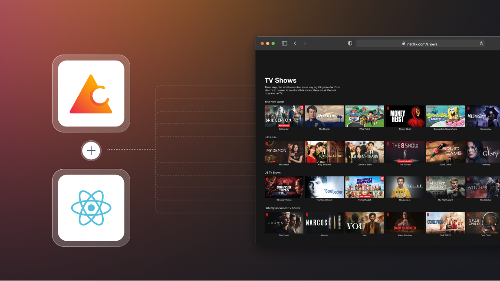
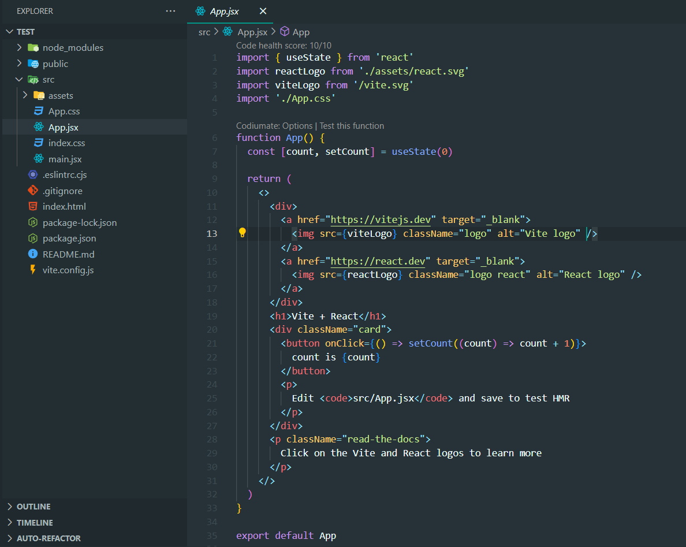
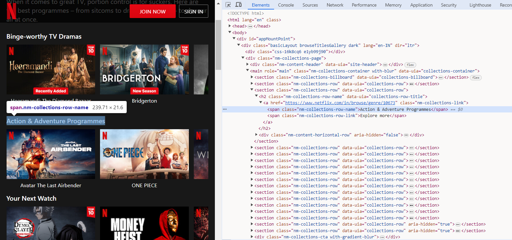
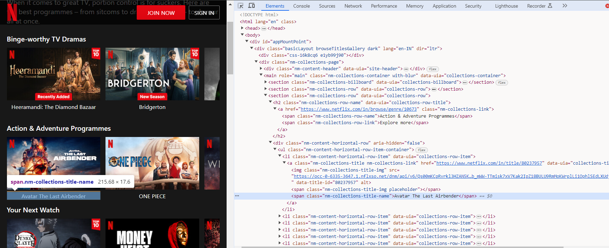
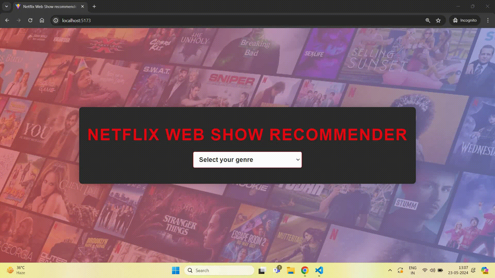

# Building a Netflix web show recommender with Crawlee and React

In this blog, we'll guide you through the process of using Vite and Crawlee to build a website that recommends Netflix shows based on their categories and genres. To do that, we will first scrape the shows and categories from Netflix using Crawlee, and then visualize the scraped data in a React app built with Vite. By the end of this guide, you'll have a functional web show recommender that can provide Netflix show suggestions.

:::note
One of our community members wrote this blog as a contribution to Crawlee Blog. If you want to contribute blogs like these to Crawlee Blog, please reach out to us on our [discord channel](https://apify.com/discord).
:::



<!-- truncate -->

Let’s get started!

## Prerequisites

To use Crawlee, you need to have Node.js 16 or newer.

:::tip
If you like the posts on the Crawlee blog so far, please consider [giving Crawlee a star on GitHub](https://github.com/apify/crawlee), it helps us to reach and help more developers.
:::

You can install the latest version of Node.js from the [official website](https://nodejs.org/en/). This great [Node.js installation guide](https://blog.apify.com/how-to-install-nodejs/) gives you tips to avoid issues later on. 

## Creating a React app

First, we will create a React app (for the front end) using Vite. Run this command in the terminal to create it:

```
npx create-vite@latest
```

You can check out the [Vite Docs](https://vitejs.dev/guide/) for more details on how to create a React app.

Once the React app is created, open it in VS Code.



This will be the structure of your React app.

Run `npm run dev` command in the terminal to run the app.


This will be the output displayed.

## Adding Scraper code

As per our project requirements, we will scrape the genres and the titles of the shows available on Netflix.

Let’s start building the scraper code.

### Installation

Run this command to install `crawlee`:

```
npm install crawlee
```

Crawlee utilizes Cheerio for [HTML parsing and scraping](https://crawlee.dev/blog/scrapy-vs-crawlee#html-parsing-and-scraping) of static websites. While faster and [less resource-intensive](https://crawlee.dev/docs/guides/scaling-crawlers), it can only scrape websites that do not require JavaScript rendering, making it unsuitable for SPAs (single page applications).

In this tutorial we can extract data from the HTML structure, so we will go with Cheerio but for extracting data from SPAs or JavaScript-rendered websites, Crawlee also supports headless browser libraries like [Playwright](https://playwright.dev/) and [Puppeteer](https://pptr.dev/)

After installing the libraries, it’s time to create the scraper code.

Create a file in `src` directory and name it `scraper.js`. The entire scraper code will be created in this file.

### Scraping genres and shows

To scrape the genres and shows, we will utilize the [browser DevTools](https://developer.mozilla.org/en-US/docs/Learn/Common`questions/Tools`and`setup/What`are`browser`developer`tools) to identify the tags and CSS selectors targeting the genre elements on the Netflix website.

We can capture the HTML structure and call `$(element)` to query the element's subtree.



Here, we can observe that the name of the genre is captured by a `span` tag with `nm-collections-row-name` class. So we can use the `span.nm-collections-row-name` selector to capture this and similar elements.



Similarly, we can observe that the title of the show is captured by the `span` tag having `nm-collections-title-name` class. So we can use the `span.nm-collections-title-name` selector to capture this and similar elements.

```js
// Use parseWithCheerio for efficient HTML parsing
const $ = await parseWithCheerio();

// Extract genre and shows directly from the HTML structure
const data = $('[data-uia="collections-row"]')
  .map((_, el) => {
    const genre = $(el)
      .find('[data-uia="collections-row-title"]')
      .text()
      .trim();
    const items = $(el)
      .find('[data-uia="collections-title"]')
      .map((_, itemEl) => $(itemEl).text().trim())
      .get();
    return { genre, items };
  })
  .get();

const genres = data.map((d) => d.genre);
const shows = data.map((d) => d.items);
```

In the code snippet given above, we are using `parseWithCheerio` to parse the HTML content of the current page and extract `genres` and `shows` information from the HTML structure using Cheerio.

This will give the `genres` and `shows` array having list of genres and shows stored in it respectively.
### Storing data

Now we have all the data that we want for our project and it’s time to store or save the scraped data. To store the data, Crawlee comes with a `pushData()` method.

The [pushData()](https://crawlee.dev/docs/introduction/saving-data) method creates a storage folder in the project directory and stores the scraped data in JSON format.

```js
await pushData({
      genres: genres,
      shows: shows,
    });
```  

This will save the `genres` and `shows` arrays as values in the `genres` and `shows` keys.

Here’s the full code that we will use in our project:

```js
import { CheerioCrawler, log, Dataset } from "crawlee";

const crawler = new CheerioCrawler({
  requestHandler: async ({ request, parseWithCheerio, pushData }) => {
    log.info(`Processing: ${request.url}`);

    // Use parseWithCheerio for efficient HTML parsing
    const $ = await parseWithCheerio();

    // Extract genre and shows directly from the HTML structure
    const data = $('[data-uia="collections-row"]')
      .map((_, el) => {
        const genre = $(el)
          .find('[data-uia="collections-row-title"]')
          .text()
          .trim();
        const items = $(el)
          .find('[data-uia="collections-title"]')
          .map((_, itemEl) => $(itemEl).text().trim())
          .get();
        return { genre, items };
      })
      .get();

    // Prepare data for pushing
    const genres = data.map((d) => d.genre);
    const shows = data.map((d) => d.items);

    await pushData({
      genres: genres,
      shows: shows,
    });
  },

  // Limit crawls for efficiency
  maxRequestsPerCrawl: 20,
});

await crawler.run(["https://www.netflix.com/in/browse/genre/1191605"]);
await Dataset.exportToJSON("results");

```

Now, we will run Crawlee to scrape the website. Before running Crawlee, we need to tweak the `package.json` file. We will add the `start` script targeting the `scraper.js` file to run Crawlee.

Add the following code in `'scripts'` object:

```
"start": "node src/scraper.js"
```

and save it. Now run this command to run Crawlee to scrape the data:

```sh
npm start
```

After running this command, you will see a `storage` folder with the `key_value_stores/default/results.json` file. The scraped data will be stored in JSON format in this file.

Now we can use this JSON data and display it in the `App.jsx` component to create the project.

In the `App.jsx` component, we will import `jsonData` from the `results.json` file:

```js
import { useState } from "react";
import "./App.css";
import jsonData from "../storage/key_value_stores/default/results.json";

function HeaderAndSelector({ handleChange }) {
  return (
    <>
      <h1 className="header">Netflix Web Show Recommender</h1>
      <div className="genre-selector">
        <select onChange={handleChange} className="select-genre">
          <option value="">Select your genre</option>
          {jsonData[0].genres.map((genres, key) => {
            return (
              <option key={key} value={key}>
                {genres}
              </option>
            );
          })}
        </select>
      </div>
    </>
  );
}

function App() {
  const [count, setCount] = useState(null);

  const handleChange = (event) => {
    const value = event.target.value;
    if (value) setCount(parseInt(value));
  };

  // Validate count to ensure it is within the bounds of the jsonData.shows array
  const isValidCount = count !== null && count <= jsonData[0].shows.length;

  return (
    <div className="app-container">
      <HeaderAndSelector handleChange={handleChange} />
      <div className="shows-container">
        {isValidCount && (
          <>
            <div className="shows-list">
              <ul>
                {jsonData[0].shows[count].slice(0, 20).map((show, index) => (
                  <li key={index} className="show-item">
                    {show}
                  </li>
                ))}
              </ul>
            </div>
            <div className="shows-list">
              <ul>
                {jsonData[0].shows[count].slice(20).map((show, index) => (
                  <li key={index} className="show-item">
                    {show}
                  </li>
                ))}
              </ul>
            </div>
          </>
        )}
      </div>
    </div>
  );
}

export default App;
```

In this code snippet, the `genre` array is used to display the list of genres. User can select their desired genre and based upon that a list of web shows available on Netflix will be displayed using the `shows` array.

Make sure to update CSS on the `App.css` file from here: [https://github.com/ayush2390/web-show-recommender/blob/main/src/App.css](https://github.com/ayush2390/web-show-recommender/blob/main/src/App.css)

and download and save this image file in main project folder: [Download Image](https://raw.githubusercontent.com/ayush2390/web-show-recommender/main/Netflix.png)

Our project is ready!

## Result

Now, to run your project on localhost, run this command:

```
npm run dev
```

This command will run your project on localhost. Here is a demo of the project:



Project link - [https://github.com/ayush2390/web-show-recommender](https://github.com/ayush2390/web-show-recommender)

In this project, we used Crawlee to scrape Netflix; similarly, Crawlee can be used to scrape single application pages (SPAs) and JavaScript-rendered websites. The best part is all of this can be done while coding in JavaScript/TypeScript and using a single library.

If you want to learn more about Crawlee, go through the [documentation](https://crawlee.dev/docs/quick-start) and this step-by-step [Crawlee web scraping tutorial](https://blog.apify.com/crawlee-web-scraping-tutorial/) from Apify.