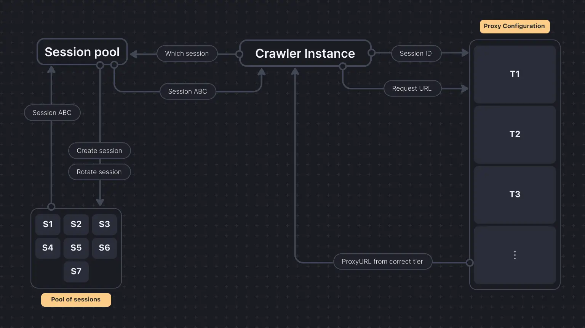

Hello Crawlee community,

We are back with another blog, this time explaining how Crawlee rotates proxies and prevents crawlers from getting blocked.

Proxies vary in quality, speed, reliability, and cost. There are a [few types of proxies](https://blog.apify.com/types-of-proxies/), such as datacenter and residential proxies. Datacenter proxies are cheaper but, on the other hand, more prone to getting blocked, and vice versa with residential proxies.

It is hard for developers to decide which proxy to use while scraping data. We might get blocked if we use [datacenter proxies](https://blog.apify.com/datacenter-proxies-when-to-use-them-and-how-to-make-the-most-of-them/) for low-cost scraping, but residential proxies are sometimes too expensive for bigger projects. Developers need a system that can manage both costs and avoid getting blocked. To manage this, we recently introduced tiered proxies in Crawlee. Let’s take a look at it.

:::note

If you like reading this blog, we would be really happy if you gave [Crawlee a star on GitHub!](https://github.com/apify/crawlee/)

:::

## What are tiered proxies?

Tiered proxies are a method of organizing and using different types of proxies based on their quality, speed, reliability, and cost. Tiered proxies allow you to rotate between a mix of proxy types to optimize your scraping activities.

You categorize your proxies into different tiers based on their quality. For example:

-   **High-tier proxies**: Fast, reliable, and expensive. Best for critical tasks where you need high performance.
-   **Mid-tier proxies**: Moderate speed and reliability. A good balance between cost and performance.
-   **Low-tier proxies**: Slow and less reliable but cheap. Useful for less critical tasks or high-volume scraping.

## Features:

-   **Tracking errors**: The system monitors errors (e.g. failed requests, retries) for each domain.
-   **Adjusting tiers**: Higher-tier proxies are used if a domain shows more errors. Conversely, if a domain performs well with a high-tier proxy, the system will occasionally test lower-tier proxies. If successful, it continues using the lower tier, optimizing costs.
-   **Forgetting old errors**: Old errors are given less weight over time, allowing the system to adjust tiers dynamically as proxies' performance changes.

### Working

The `tieredProxyUrls` option in Crawlee's `ProxyConfigurationOptions` allows you to define a list of proxy URLs organized into tiers. Each tier represents a different level of quality, speed, and reliability.

### Structure

**Tiered Array**: Each element in the array is an object containing proxy URLs for that tier.

### Usage

**Fallback Mechanism**: Crawlee starts with the first tier of proxies. If proxies in the current tier fail, it will switch to the next tier.


```js
import { CheerioCrawler, ProxyConfiguration } from 'crawlee';

const proxyConfiguration = new ProxyConfiguration({
    tieredProxyUrls: [
        ['http://tier1-proxy1.example.com', 'http://tier1-proxy2.example.com'],
        ['http://tier2-proxy1.example.com', 'http://tier2-proxy2.example.com'],
        ['http://tier2-proxy1.example.com', 'http://tier3-proxy2.example.com'],
    ],
});

const crawler = new CheerioCrawler({
    proxyConfiguration,
    requestHandler: async ({ request, response }) => {
        // Handle the request
    },
});

await crawler.addRequests([
    { url: 'https://example.com/critical' },
    { url: 'https://example.com/important' },
    { url: 'https://example.com/regular' },
]);

await crawler.run();
```

## How tiered proxies use Session Pool under the hood

A session pool is a way to manage multiple [sessions](https://crawlee.dev/api/core/class/Session) on a website so you can distribute your requests across them, reducing the chances of being detected and blocked. You can imagine each session like a different human user with its own IP address.

When you use tiered proxies, each proxy tier works with the [session pool](https://crawlee.dev/api/core/class/SessionPool) to enhance request distribution and manage errors effectively.



For each request, the crawler instance asks the `ProxyConfiguration` which proxy it should use. ' ProxyConfiguration` also keeps track of the requests domains, and if it sees more requests being retried or, say, more errors, it returns higher proxy tiers.

In each request, we must pass `sessionId` and the request URL to the proxy configuration to get the needed proxy URL from one of the tiers.

Choosing which session to pass is where SessionPool comes in. Session pool automatically creates a pool of sessions, rotates them, and uses one of them without getting blocked and mimicking human-like behavior.

## Conclusion: using proxies efficiently

This inbuilt feature is similar to what Scrapy's `scrapy-rotating-proxies` plugin offers to its users. The tiered proxy configuration dynamically adjusts proxy usage based on real-time performance data, optimizing cost and performance. The session pool ensures requests are distributed across multiple sessions, mimicking human behavior and reducing detection risk.

We hope this gives you a better understanding of how Crawlee manages proxies and sessions to make your scraping tasks more effective.

As always, we welcome your feedback. [Join our developer community on Discord](https://apify.com/discord) to ask any questions about Crawlee or tell us how you use it.
