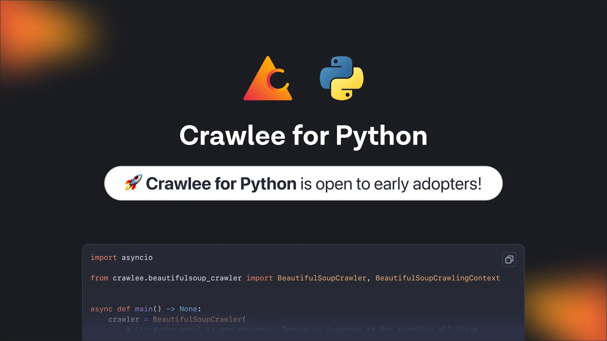
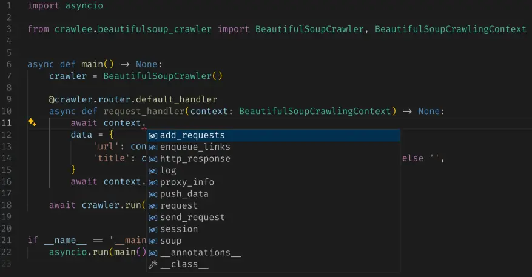

:::danger Testimonial from early adopters
Crawlee for Python development team did a great job in building the product, it makes things faster for a Python developer. - [Maksym Bohomolov](https://apify.com/mantisus)
:::

We launched Crawlee in [August 2022](https://blog.apify.com/announcing-crawlee-the-web-scraping-and-browser-automation-library/) and got an amazing response from the JavaScript community. With many early adopters in its initial days, we got valuable feedback, which gave Crawlee a strong base for its success. 

Today, [Crawlee built-in TypeScript](https://github.com/apify/crawlee) has nearly **13,000 stars on GitHub**, with 90 open-source contributors worldwide building the best web scraping and automation library.

Since the launch, the feedback we’ve received most often [[1]](https://discord.com/channels/801163717915574323/999250964554981446/1138826582581059585)[[2]](https://discord.com/channels/801163717915574323/801163719198638092/1137702376267059290)[[3]](https://discord.com/channels/801163717915574323/1090592836044476426/1103977818221719584) has been to build Crawlee in Python so that the Python community can use all the features the JavaScript community does.

With all these requests in mind and to simplify the life of Python web scraping developers, **we’re launching [Crawlee for Python](https://github.com/apify/crawlee-python) today.**

The new library is still in **beta**, and we are looking for **early adopters**.



Crawlee for Python has some amazing initial features, such as a unified interface for HTTP and headless browser crawling, automatic retries, and much more.

<!--truncate-->

## Why use Crawlee instead of a random HTTP library with an HTML parser?

- Unified interface for HTTP & headless browser crawling.
    - HTTP - HTTPX with BeautifulSoup, 
    - Headless browser - Playwright.
- Automatic parallel crawling based on available system resources.
- Written in Python with type hints - enhances DX (IDE autocompletion) and reduces bugs (static type checking).
- Automatic retries on errors or when you’re getting blocked.
- Integrated proxy rotation and session management.
- Configurable request routing - direct URLs to the appropriate handlers.
- Persistent queue for URLs to crawl.
- Pluggable storage of both tabular data and files.

## Understanding the why behind the features of Crawlee

### Out-of-the-box support for headless browser crawling (Playwright).

While libraries like Scrapy require additional installation of middleware, i.e, [`scrapy-playwright`](https://github.com/scrapy-plugins/scrapy-playwright) and still doesn’t work with Windows, Crawlee for Python supports a unified interface for HTTP & headless browsers.

Using a headless browser to download web pages and extract data, `PlaywrightCrawler` is ideal for crawling websites that require JavaScript execution. 

For websites that don’t require JavaScript, consider using the `BeautifulSoupCrawler,` which utilizes raw HTTP requests and will be much faster.

```python
import asyncio

from crawlee.playwright_crawler import PlaywrightCrawler, PlaywrightCrawlingContext


async def main() -> None:
    # Create a crawler instance
    crawler = PlaywrightCrawler(
        # headless=False,
        # browser_type='firefox',
    )

    @crawler.router.default_handler
    async def request_handler(context: PlaywrightCrawlingContext) -> None:
        data = {
            "request_url": context.request.url,
            "page_url": context.page.url,
            "page_title": await context.page.title(),
            "page_content": (await context.page.content())[:10000],
        }
        await context.push_data(data)

    await crawler.run(["https://crawlee.dev"])


if __name__ == "__main__":
    asyncio.run(main())
```

The above example uses Crawlee’s built-in `PlaywrightCrawler` to crawl the [https://crawlee.dev/](https://crawlee.dev/) website title and its content. 

### Small learning curve

In other libraries like Scrapy, when you run a command to create a new project, you get many files. Then you need to learn about the architecture, including various components (spiders, middlewares, pipelines, etc.). [The learning curve is very steep](https://crawlee.dev/blog/scrapy-vs-crawlee#language-and-development-environments).

While building Crawlee, we made sure that the learning curve and the setup would be as fast as possible. 

With [ready-made templates](https://github.com/apify/crawlee-python/tree/master/templates), and having only a single file to add the code, it's very easy to start building a scraper, you might need to learn a little about request handlers and storage, but that’s all.

### Complete type hint coverage

We know how much developers like their code to be high-quality, readable, and maintainable. 

That's why the whole code base of Crawlee is fully type-hinted. 

Thanks to that, you should have better autocompletion in your IDE, enhancing developer experience while developing your scrapers using Crawlee. 

Type hinting should also reduce the number of bugs thanks to static type checking.



### Based on Asyncio

Crawlee is fully asynchronous and based on [Asyncio](https://docs.python.org/3/library/asyncio.html). For scraping frameworks, where many IO-bounds operations occur, this should be crucial to achieving high performance. 

Also, thanks to Asyncio, integration with other applications or the rest of your system should be easy.

How is this different from the Scrapy framework, which is also asynchronous? 

Scrapy relies on the "legacy" Twisted framework. Integrating Scrapy with modern Asyncio-based applications can be challenging, often requiring more effort and debugging [[1]](https://stackoverflow.com/questions/49201915/debugging-scrapy-project-in-visual-studio-code).

## Power of open source community and early adopters giveaway

Crawlee for Python is fully open-sourced and the codebase is available on the [GitHub repository of Crawlee for Python](https://github.com/apify/crawlee-python). 

We have already started receiving initial and very [valuable contributions from the Python community](https://github.com/apify/crawlee-python/pull/226). 

:::danger Early adopters also said

“Crawlee for Python development team did a great job in building the product, it makes things faster for a Python developer.” ~ [Maksym Bohomolov](https://apify.com/mantisus)
:::

There’s still room for improvement. Feel free to open issues, make pull requests, and [star the repository](https://github.com/apify/crawlee-python/) to spread the work to other developers. 

**We will award the first 10 pieces of feedback** that add value and are accepted by our team with an exclusive Crawlee for Python swag (The first Crawlee for Python swag ever). Check out the [GitHub issue here](https://github.com/apify/crawlee-python/issues/269/).

With such contributions, we’re excited and looking forward to building an amazing library for the Python community. 

[Join our Discord community](https://apify.com/discord) with nearly 8,000 web scraping developers, where our team would be happy to help you with any problems or discuss any use case for Crawlee for Python.