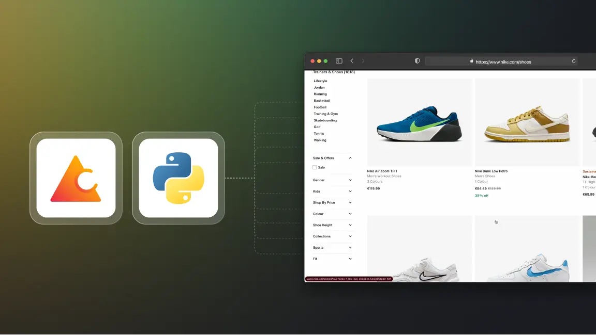

# How to scrape infinite scrolling webpages with Python

Hello, Crawlee Devs, and welcome back to another tutorial on the Crawlee Blog. This tutorial will teach you how to scrape infinite-scrolling websites using Crawlee for Python.

For context, infinite-scrolling pages are a modern alternative to classic pagination. When users scroll to the bottom of the webpage instead of choosing the next page, the page automatically loads more data, and users can scroll more.

As a big sneakerhead, I'll take the Nike shoes infinite-scrolling [website](https://www.nike.com/) as an example, and we'll scrape thousands of sneakers from it.



Crawlee for Python has some amazing initial features, such as a unified interface for HTTP and headless browser crawling, automatic retries, and much more.

<!--truncate-->

## Prerequisites and bootstrapping the project

Let's start the tutorial by installing Crawlee for Python with this command:

```bash
pipx run crawlee create nike-crawler
```

:::note

Before going ahead if you like reading this blog, we would be really happy if you gave [Crawlee for Python a star on GitHub!](https://github.com/apify/crawlee-python/)

:::

We will scrape using headless browsers. Select `PlaywrightCrawler` in the terminal when Crawlee for Python asks for it.

After installation, Crawlee for Python will create boilerplate code for you. Redirect into the project folder and then run this command for all the dependencies installation:

```bash
poetry install
```

## How to scrape infinite scrolling webpages

1.  Handling accept cookie dialog

2.  Adding request of all shoes links

3.  Extract data from product details

4.  Accept Cookies context manager

5.  Handling infinite scroll on the listing page

6.  Exporting data to CSV format


### Handling accept cookie dialog

After all the necessary installations, we'll start looking into the files and configuring them accordingly.

When you look into the folder, you'll see many files, but for now, let's focus on `main.py` and `routes.py`.

In `main.py`, let's change the target location to the Nike website. Then, just to see how scraping will happen, we'll add `headless = False` to the `PlaywrightCrawler` parameters. Let's also increase the maximum requests per crawl option to 100 to see the power of parallel scraping in Crawlee for Python.

The final code will look like this:

```python
from crawlee.playwright_crawler import PlaywrightCrawler

from .routes import router


async def main() -> None:
    """The crawler entry point."""
    crawler = PlaywrightCrawler(
        headless=False,
        request_handler=router,
        max_requests_per_crawl=100,
    )

    await crawler.run(
        [
            'https://nike.com/,
        ]
    )
```

Now coming to `routes.py`, let's remove:

```python
await context.enqueue_links()
```
As we don't want to scrape the whole website.

Now, if you run the crawler using the command:

```bash
poetry run python -m nike-crawler
```
As the cookie dialog is blocking us from crawling more than one page's worth of shoes, let's get it out of our way.

We can handle the cookie dialog by going to Chrome dev tools and looking at the `test_id` of the "accept cookies" button, which is `dialog-accept-button`.

Now, let's remove the `context.push_data` call that was left there from the project template and add the code to accept the dialog in routes.py. The updated code will look like this:

```python
from crawlee.router import Router
from crawlee.playwright_crawler import PlaywrightCrawlingContext

router = Router[PlaywrightCrawlingContext]()

@router.default_handler
async def default_handler(context: PlaywrightCrawlingContext) -> None:
    """Default request handler."""

    # Wait for the popup to be visible to ensure it has loaded on the page.
    await context.page.get_by_test_id('dialog-accept-button').click()
```

### Adding request of all shoes links

Now, if you hover over the top bar and see all the sections, i.e., man, woman, and kids, you'll notice the “All shoes” section. As we want to scrape all the sneakers, this section interests us. Let's use `get_by_test_id` with the filter of `has_text='All shoes'` and add all the links with the text “All shoes” to the request handler. Let's add this code to the existing `routes.py` file:

```python
    shoe_listing_links = (
        await context.page.get_by_test_id('link').filter(has_text='All shoes').all()
    )
    await context.add_requests(
        [
            Request.from_url(url, label='listing')
            for link in shoe_listing_links
            if (url := await link.get_attribute('href'))
        ]
    )

@router.handler('listing')
async def listing_handler(context: PlaywrightCrawlingContext) -> None:
    """Handler for shoe listings."""
```

### Extract data from product details

Now that we have all the links to the pages with the title “All Shoes,” the next step is to scrape all the products on each page and the information provided on them.

We'll extract each shoe's URL, title, price, and description. Again, let's go to dev tools and extract each parameter's relevant `test_id`. After scraping each of the parameters, we'll use the `context.push_data` function to add it to the local storage. Now let's add the following code to the `listing_handler` and update it in the `routes.py` file:

```python

@router.handler('listing')
async def listing_handler(context: PlaywrightCrawlingContext) -> None:
    """Handler for shoe listings."""

    await context.enqueue_links(selector='a.product-card__link-overlay', label='detail')


@router.handler('detail')
async def detail_handler(context: PlaywrightCrawlingContext) -> None:
    """Handler for shoe details."""

    title = await context.page.get_by_test_id(
        'product_title',
    ).text_content()

    price = await context.page.get_by_test_id(
        'currentPrice-container',
    ).first.text_content()

    description = await context.page.get_by_test_id(
        'product-description',
    ).text_content()

    await context.push_data(
        {
            'url': context.request.loaded_url,
            'title': title,
            'price': price,
            'description': description,
        }
    )
```

### Accept Cookies context manager

Since we're dealing with multiple browser pages with multiple links and we want to do infinite scrolling, we may encounter an accept cookie dialog on each page. This will prevent loading more shoes via infinite scroll.

We'll need to check for cookies on every page, as each one may be opened with a fresh session (no stored cookies) and we'll get the accept cookie dialog even though we already accepted it in another browser window. However, if we don't get the dialog, we want the request handler to work as usual.

To solve this problem, we'll try to deal with the dialog in a parallel task that will run in the background. A context manager is a nice abstraction that will allow us to reuse this logic in all the router handlers. So, let's build a context manager:

```python
from playwright.async_api import TimeoutError as PlaywrightTimeoutError

@asynccontextmanager
async def accept_cookies(page: Page):
    task = asyncio.create_task(page.get_by_test_id('dialog-accept-button').click())
    try:
        yield
    finally:
        if not task.done():
            task.cancel()

        with suppress(asyncio.CancelledError, PlaywrightTimeoutError):
            await task
```

This context manager will make sure we're accepting the cookie dialog if it exists before scrolling and scraping the page. Let's implement it in the `routes.py` file, and the updated code is [here](https://github.com/janbuchar/crawlee-python-demo/blob/6ca6f7f1d1bbbf789a3b86f14bec492cf756251e/crawlee-python-webinar/routes.py)

### Handling infinite scroll on the listing page

Now for the last and most interesting part of the tutorial! How to handle the infinite scroll of each shoe listing page and make sure our crawler is scrolling and scraping the data constantly.

This tutorial is taken from the webinar held on August 5th where Jan Buchar, Senior Python Engineer at Apify, gave a live demo about this use case. Watch the tutorial here:

<iframe width="560" height="315" src="https://www.youtube.com/embed/ip8Ii0eLfRY?si=7ZllUhMhuC7VC23B&amp;start=667" title="YouTube video player" frameborder="0" allow="accelerometer; autoplay; clipboard-write; encrypted-media; gyroscope; picture-in-picture; web-share" referrerpolicy="strict-origin-when-cross-origin" allowfullscreen></iframe>


To handle infinite scrolling in Crawlee for Python, we just need to make sure the page is loaded, which is done by waiting for the `network_idle` load state, and then use the `infinite_scroll` helper function which will keep scrolling to the bottom of the page as long as that makes additional items appear.

Let's add two lines of code to the `listing` handler:

```python
@router.handler('listing')
async def listing_handler(context: PlaywrightCrawlingContext) -> None:
    """Handler for shoe listings."""

    async with accept_cookies(context.page):
        await context.page.wait_for_load_state('networkidle')
        await context.infinite_scroll()
        await context.enqueue_links(
            selector='a.product-card__link-overlay', label='detail'
        )
```

## Exporting data to CSV format

As we want to store all the shoe data into a CSV file, we can just add a call to the `export_data` helper into the `main.py` file just after the crawler run:

```python
    await crawler.export_data('shoes.csv')
```

## Working crawler and its code

Now, we have a crawler ready that can scrape all the shoes from the Nike website while handling infinite scrolling and many other problems, like the cookies dialog.

You can find the complete working crawler code here on the [GitHub repository](https://github.com/janbuchar/crawlee-python-demo).

Learn more about Crawlee for Python from our latest step by step [tutorial](https://blog.apify.com/crawlee-for-python-tutorial/).

If you have any doubts regarding this tutorial or using Crawlee for Python, feel free to [join our discord community](https://apify.com/discord/) and ask fellow developers or the Crawlee team.
