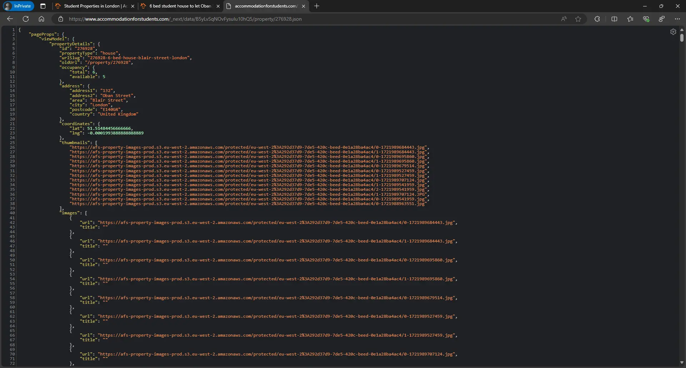

# Web scraping of a dynamic website using Crawlee for Python with HTTP client

Dynamic websites that use JavaScript for content rendering and backend interaction often create challenges for web scraping. The traditional approach to solving this problem is browser emulation, but it's not very efficient in terms of resource consumption.

:::note
One of our community members wrote this blog as a contribution to Crawlee Blog. If you want to contribute blogs like these to Crawlee Blog, please reach out to us on our [discord channel](https://apify.com/discord).
:::

In this article, we'll explore an alternative method based on in-depth site analysis and the use of an HTTP client. We'll go through the entire process from analyzing a dynamic website to implementing an efficient web crawler using the [`Crawlee for Python`](https://www.crawlee.dev/python/) framework.


<!-- truncate -->

## What you'll learn in this tutorial

Our subject of study is the  [Accommodation for Students](https://www.accommodationforstudents.com)  website. Using this example, we'll examine the specifics of analyzing sites built with the Next.js framework and implement a crawler capable of efficiently extracting data without using browser emulation.

By the end of this article, you will have:
- A clear understanding of how to analyze sites with dynamic content rendered using JavaScript.
- How to implement a crawler based on Crawlee for Python.
- Insight into some of the details of working with sites that use [`Next.js`](https://nextjs.org/).
- A link to a GitHub repository with the full crawler implementation code.

## Website analysis

To track all requests, open your Dev Tools and the `network` tab before entering the site. Some data may be transmitted only once the site is first opened.

As the site is intended for students in the UK, let's go to London. We'll start the analysis from the [search page](https://www.accommodationforstudents.com/search-results?location=London&beds=0&occupancy=min&minPrice=0&maxPrice=500&latitude=51.509865&longitude=-0.118092&geo=false&page=1)

Interacting with elements on the site page, you'll quickly notice a request of this type:

```plaintext
https://www.accommodationforstudents.com/search?limit=22&skip=0&random=false&mode=text&numberOfBedrooms=0&occupancy=min&countryCode=gb&location=London&sortBy=price&order=asc
```


If we look at the format of the received response, we'll immediately notice that it comes in [`JSON`](https://www.json.org/json-en.html) format.


Great, we're getting data in a structured format that's very convenient to work with. We see the total number of results links to listings are in the `url` attribute for each `properties` element

Let's also take a look at the server response headers.


- `content-type: application/json; charset=utf-8` - It tells us that the server response comes in JSON format, which we've already confirmed visually.
- `content-encoding: gzip` - It tells us that the response was compressed using [`gzip`](https://www.gnu.org/software/gzip/), and therefore we should use appropriate decompression in our crawler.
- `server: cloudflare` - The site is hosted on [Сloudflare](https://www.cloudflare.com/) servers and uses their protection. We should consider this when creating our crawler.

Great, let's also look at the parameters used in the search API request and make hypotheses about what they're responsible for:

- `limit: 22` - The number of elements we get per request.
- `skip: 0` - The element from which we'll start getting important data for pagination.
- `random: false` - We don't change the random sorting as we benefit from strict sorting.
- `mode: text` - An unusual parameter. If you decide to conduct several experiments, you'll find that it can take the following values: text, fallback, geo. - Interestingly, the geo parameter completely changes the output, returning about 5400 options. I assume it's necessary to search by coordinates, and if we don't pass any coordinates, we get all the available results.
- `numberOfBedrooms: 0 `- filter by bedrooms.
- `occupancy: min` - filter by occupancy.
- `countryCode: gb` - country code, in our case it's Great Britain
- `location: London` - search location
- `sortBy: price` - the field by which sorting is performed
- `order: asc` - type of sorting

But there's another important point to pay attention to. Let's look at our link in the browser bar, which looks like this: 

```plaintext
https://www.accommodationforstudents.com/search-results?location=London&beds=0&occupancy=min&minPrice=0&maxPrice=500&latitude=51.509865&longitude=-0.118092&geo=false&page=1
```

In it, we see the coordinate parameters `latitude` and `longitude`, which don't participate in any way when interacting with the backend, and the `geo` parameter with a false value. This also confirms our hypothesis regarding the mode parameter. This is quite useful if you want to extract all data from the site.

Great. We can get the site's search data in a convenient JSON format. We also have flexible parameters to guarantee data extraction, whether all are available on the site or for a specific city.

Let's move on to analyzing the property page.

Since after clicking on the listing it opens in a new window, make sure you have `Auto-open DevTools for popups` option set in Dev Tools

Unfortunately, we don't see any interesting interaction with the backend after analyzing all requests. All listing data is obtained in one request containing HTML code and JSON elements.


After carefully studying the page's source code, we can say that all the data we're interested in is in the JSON located in the `script` tag, which has an `id` attribute with the value `__NEXT_DATA__`. We can easily extract this JSON using a regular expression or HTML parser.

We already have everything necessary to build the crawler at this analysis stage. We know how to get data from the search, how pagination works, how to go from the search to the listing page, and where to extract the data we're interested in on the listing page.

But there's one obvious inconvenience: we get search data in JSON, and listing data we get in HTML inside, which is JSON. This isn't a problem but rather an inconvenience and higher traffic consumption, as such an HTML page will weigh much more than just JSON.

Let's continue our analysis.

The data in `__NEXT_DATA__` signals that the site uses the Next.js framework. Each framework has its own established internal patterns, parameters, and features.

Let's analyze the listing page again by refreshing it and analyzing the `.js` files we receive.


We're interested in the file containing `_buildManifest.js` in its name, the link to it will regularly change, so I'll provide an example:

```plaintext
https://www.accommodationforstudents.com/_next/static/B5yLvSqNOvFysuIu10hQ5/_buildManifest.js
```

This file contains all possible routes available on the site. After careful study, we can see a link format like `/property/[id]`, which is clearly related to the property page. After reading more about Next.js, we can get the final link—`https://www.accommodationforstudents.com/_next/data/[build_id]/property/[id].json`.

This link has two variables:

1. `build_id` - the current build of the `Next.js` application, it can be obtained from `__NEXT_DATA__` on any application page. In the example link for `_buildManifest.js`, its value is `B5yLvSqNOvFysuIu10hQ5`
2. `id` - the identifier for the property object whose data we're interested in.

Let's form a link and study the result in the browser.




As you can see, now we get the listing results in JSON format. But after all, `Next.js` works for search, so let's get a link for it, so that our future crawler interacts with only one API. It transforms from the link you see in the browser bar and will look like this:

```plaintext
https://www.accommodationforstudents.com/_next/data/[build_id]/search-results.json?location=[location]&page=[page]
```

I think you immediately noticed that I excluded part of the search parameters, I did this because we simply don't need them. Coordinates aren't used in basic interaction with the backend. I plan that the crawler will search by location, so I keep the location and pagination parameters.

Let's summarize our analysis.

1. For search pages, we'll use links of the format - `https://www.accommodationforstudents.com/_next/data/[build_id]/search-results.json?location=[location]&page=[page]`
2. For listing pages, we'll use links of the format - `https://www.accommodationforstudents.com/_next/data/[build_id]/property/[id].json`
3. We need to get the `build_id`, let's use the main page of the site and a simple regular expression for this.
4. We need an HTTP client that allows bypassing Cloudflare, and we don't need any HTML parsers, as we'll get all target data from JSON.

## Crawler implementation

I'm using Crawlee for Python version `0.3.5`, this is important, as the library is developing actively and will have more capabilities in higher versions. But this is an ideal moment to show how we can work with it for complex projects.

The library already has support for an HTTP client that allows bypassing Cloudflare - [`CurlImpersonateHttpClient`](https://github.com/apify/crawlee-python/blob/v0.3.6/src/crawlee/http_clients/curl_impersonate.py). Since we have to work with JSON responses we could use [`parsel_crawler`](https://github.com/apify/crawlee-python/tree/v0.3.5/src/crawlee/parsel_crawler) added in version `0.3.0`, but I think this is excessive for such tasks, besides I like the high speed of [`orjson`](https://github.com/ijl/orjson).. Therefore, we'll need to implement our crawler rather than using one of the ready-made ones.

As a sample crawler, we'll use [beautifulsoup_crawler](https://github.com/apify/crawlee-python/tree/v0.3.5/src/crawlee/beautifulsoup_crawler)

Let's install the necessary dependencies.

```Bash
pip install crawlee[curl-impersonate]==0.3.5
pip install orjson>=3.10.7,<4.0.0"
```

I'm using [`orjson`](https://pypi.org/project/orjson/) instead of the standard [`json`](https://docs.python.org/3/library/json.html) module due to its high performance, which is especially noticeable in asynchronous applications.

Well, let's implement our custom_crawler.
Let's define the `CustomContext` class with the necessary attributes.

```python
# custom_context.py

from __future__ import annotations

from dataclasses import dataclass
from typing import TYPE_CHECKING

from crawlee.basic_crawler import BasicCrawlingContext
from crawlee.http_crawler import HttpCrawlingResult

if TYPE_CHECKING:

    from collections.abc import Callable


@dataclass(frozen=True)
class CustomContext(HttpCrawlingResult, BasicCrawlingContext):
    """Crawling context used by CustomCrawler."""

    page_data: dict | None
    # not `EnqueueLinksFunction`` because we are breaking protocol since we are not working with HTML
    # and we are not using selectors
    enqueue_links: Callable

```

Note that in my context, `enqueue_links` is just `Callable`, not [`EnqueueLinksFunction`](https://github.com/apify/crawlee-python/blob/v0.3.5/src/crawlee/_types.py#L162). This is because we won't be using selectors and extracting links from HTML, which violate the agreed protocol. Still, I want the syntax in my crawler to be as close to standardized as possible.

Let's move on to the crawler functionality in the `CustomCrawler` class.

```python
# custom_crawler.py

from __future__ import annotations

import logging
from re import search
from typing import TYPE_CHECKING, Any, Unpack

from crawlee import Request
from crawlee.basic_crawler import (
    BasicCrawler,
    BasicCrawlerOptions,
    BasicCrawlingContext,
    ContextPipeline,
)
from crawlee.errors import SessionError
from crawlee.http_clients.curl_impersonate import CurlImpersonateHttpClient
from crawlee.http_crawler import HttpCrawlingContext
from orjson import loads

from afs_crawlee.constants import BASE_TEMPLATE, HEADERS

from .custom_context import CustomContext

if TYPE_CHECKING:
    from collections.abc import AsyncGenerator, Iterable


class CustomCrawler(BasicCrawler[CustomContext]):
    """A crawler that fetches the request URL using `curl_impersonate` and parses the result with `orjson` and `re`."""

    def __init__(
        self,
        *,
        impersonate: str = 'chrome124',
        additional_http_error_status_codes: Iterable[int] = (),
        ignore_http_error_status_codes: Iterable[int] = (),
        **kwargs: Unpack[BasicCrawlerOptions[CustomContext]],
    ) -> None:

        self._build_id = None
        self._base_url = BASE_TEMPLATE

        kwargs['_context_pipeline'] = (
            ContextPipeline()
            .compose(self._make_http_request)
            .compose(self._handle_blocked_request)
            .compose(self._parse_http_response)
        )

        # Initialize curl_impersonate http client using TLS preset and necessary headers
        kwargs.setdefault(
            'http_client',
            CurlImpersonateHttpClient(
                additional_http_error_status_codes=additional_http_error_status_codes,
                ignore_http_error_status_codes=ignore_http_error_status_codes,
                impersonate=impersonate,
                headers=HEADERS,
            ),
        )

        kwargs.setdefault('_logger', logging.getLogger(__name__))

        super().__init__(**kwargs)
```

In `__init__`, we define that we'll use `CurlImpersonateHttpClient` as the `http_client`. Another important element is `_context_pipeline`, which defines the sequence of methods through which our context passes.

`_make_http_request` - is completely identical to `BeautifulSoupCrawler`
`_handle_blocked_request` - since we get all data through the API, only the server response status will signal about blocking.

```python
    async def _handle_blocked_request(self, crawling_context: CustomContext) -> AsyncGenerator[CustomContext, None]:
        if self._retry_on_blocked:
            status_code = crawling_context.http_response.status_code

            if crawling_context.session and crawling_context.session.is_blocked_status_code(status_code=status_code):
                raise SessionError(f'Assuming the session is blocked based on HTTP status code {status_code}')

        yield crawling_context
```

`_parse_http_response` - a function that encapsulates the main logic of parsing responses

```python
    async def _parse_http_response(self, context: HttpCrawlingContext) -> AsyncGenerator[CustomContext, None]:

        page_data = None

        if context.http_response.headers['content-type'] == 'text/html; charset=utf-8':
            # Get Build ID for Next js from the start page of the site, form a link to next.js endpoints
            build_id = search(rb'"buildId":"(.{21})"', context.http_response.read()).group(1)
            self._build_id = build_id.decode('UTF-8')
            self._base_url = self._base_url.format(build_id=self._build_id)
        else:
            # Convert json to python dictionary
            page_data = context.http_response.read()
            page_data = page_data.decode('ISO-8859-1').encode('utf-8')
            page_data = loads(page_data)

        async def enqueue_links(
            *, path_template: str, items: list[str], user_data: dict[str, Any] | None = None, label: str | None = None
        ) -> None:

            requests = list[Request]()
            user_data = user_data if user_data else {}

            for item in items:
                link_user_data = user_data.copy()

                if label is not None:
                    link_user_data.setdefault('label', label)

                if link_user_data.get('label') == 'SEARCH':
                    link_user_data['location'] = item

                url = self._base_url + path_template.format(item=item, **user_data)
                requests.append(Request.from_url(url, user_data=link_user_data))

            await context.add_requests(requests)

        yield CustomContext(
            request=context.request,
            session=context.session,
            proxy_info=context.proxy_info,
            enqueue_links=enqueue_links,
            add_requests=context.add_requests,
            send_request=context.send_request,
            push_data=context.push_data,
            log=context.log,
            http_response=context.http_response,
            page_data=page_data,
        )
```

As you can see, if the server response comes in HTML, we get the `build_id` using a simple regular expression. This condition should be executed once for the first link and is necessary to interact further with the Next.js API. In all other cases, we simply convert JSON to a Python `dict` and save it in the context.

In `enqueue_links`, I create logic for generating links based on string templates and input parameters.

That's it: our custom Crawler Class for Crawlee for Python is ready, it's based on the `CurlImpersonateHttpClient` client, works with JSON responses instead of HTML, and implements the link generation logic we need.

 Let's finalize it by defining public classes for import.

```python
# init.py

from .custom_crawler import CustomCrawler
from .types import CustomContext

__all__ = ['CustomCrawler', 'CustomContext']

```

Now that we have the crawler functionality, let's implement routing and data extraction from the site. We'll use the [`official documentation`](https://www.crawlee.dev/python/docs/introduction/refactoring) as a template.

```python
# router.py

from crawlee.router import Router

from .constants import LISTING_PATH, SEARCH_PATH, TARGET_LOCATIONS
from .custom_crawler import CustomContext

router = Router[CustomContext]()


@router.default_handler
async def default_handler(context: CustomContext) -> None:
    """Handle the start URL to get the Build ID and create search links."""
    context.log.info(f'default_handler is processing {context.request.url}')

    await context.enqueue_links(
        path_template=SEARCH_PATH, items=TARGET_LOCATIONS, label='SEARCH', user_data={'page': 1}
    )


@router.handler('SEARCH')
async def search_handler(context: CustomContext) -> None:
    """Handle the SEARCH URL generates links to listings and to the next search page."""
    context.log.info(f'search_handler is processing {context.request.url}')

    max_pages = context.page_data['pageProps']['initialPageCount']
    current_page = context.request.user_data['page']
    if current_page < max_pages:

        await context.enqueue_links(
            path_template=SEARCH_PATH,
            items=[context.request.user_data['location']],
            label='SEARCH',
            user_data={'page': current_page + 1},
        )
    else:
        context.log.info(f'Last page for {context.request.user_data["location"]} location')

    listing_ids = [
        listing['property']['id']
        for group in context.page_data['pageProps']['initialListings']['groups']
        for listing in group['results']
        if listing.get('property')
    ]

    await context.enqueue_links(path_template=LISTING_PATH, items=listing_ids, label='LISTING')


@router.handler('LISTING')
async def listing_handler(context: CustomContext) -> None:
    """Handle the LISTING URL extracts data from the listings and saving it to a dataset."""
    context.log.info(f'listing_handler is processing {context.request.url}')

    listing_data = context.page_data['pageProps']['viewModel']['propertyDetails']
    if not listing_data['exists']:
        context.log.info(f'listing_handler, data is not available for url {context.request.url}')
        return
    property_data = {
        'property_id': listing_data['id'],
        'property_type': listing_data['propertyType'],
        'location_latitude': listing_data['coordinates']['lat'],
        'location_longitude': listing_data['coordinates']['lng'],
        'address1': listing_data['address']['address1'],
        'address2': listing_data['address']['address2'],
        'city': listing_data['address']['city'],
        'postcode': listing_data['address']['postcode'],
        'bills_included': listing_data.get('terms', {}).get('billsIncluded'),
        'description': listing_data.get('description'),
        'bathrooms': listing_data.get('numberOfBathrooms'),
        'number_rooms': len(listing_data['rooms']) if listing_data.get('rooms') else None,
        'rent_ppw': listing_data.get('terms', {}).get('rentPpw', {}).get('value', None),
    }

    await context.push_data(property_data)
```

Let's define our `main` function, which will launch the crawler.

```python
# main.py

from .custom_crawler import CustomCrawler
from .router import router


async def main() -> None:
    """The main function that starts crawling."""
    crawler = CustomCrawler(max_requests_per_crawl=50, request_handler=router)

    # Run the crawler with the initial list of URLs.
    await crawler.run(['https://www.accommodationforstudents.com/'])

    await crawler.export_data('results.json')
```

Let's look at the results.


As I prefer to manage my projects as packages and use `pyproject.toml` according to [PEP 518](https://peps.python.org/pep-0518/), the final structure of our project will look like this.


## Conclusion

In this project, we went through the entire cycle of crawler development, from analyzing a rather interesting dynamic site to full implementation of a crawler using `Crawlee for Python`. You can view the full project code on [GitHub](https://github.com/Mantisus/crawlee_python_example)

I would also like to hear your comments and thoughts on the web scraping topic you'd like to see in the next article. Feel free to comment here in the article or contact me in the [Crawlee developer community](https://apify.com/discord) on Discord.

If you are looking out to how to start scraping using Crawlee for Python, check out our [latest tutorial here](https://blog.apify.com/crawlee-for-python-tutorial/).

You can find me on the following platforms: [Github](https://github.com/Mantisus), [Linkedin](https://www.linkedin.com/in/max-bohomolov/), [Apify](https://apify.com/mantisus), [Upwork](https://www.upwork.com/freelancers/mantisus), [Contra](https://contra.com/mantisus).

Thank you for your attention. I hope you found this information useful.
