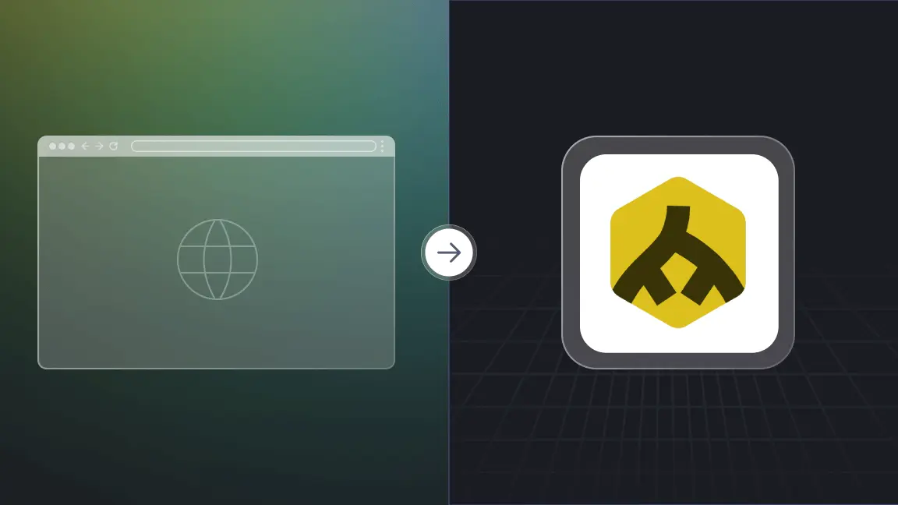
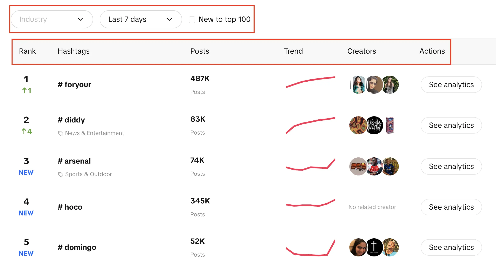
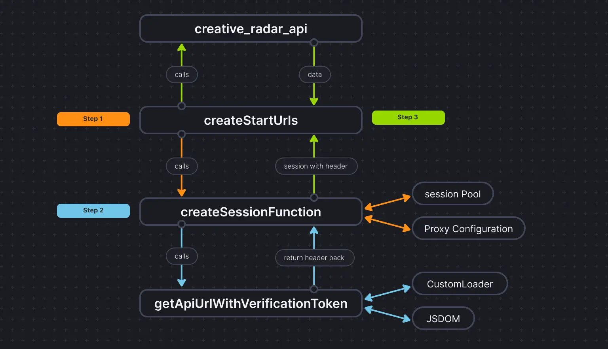

# Optimizing web scraping: Transitioning from browser-based to JSDOM

As scraping developers, we sometimes need to extract authentication data like temporary keys to perform our tasks. However, it is not as simple as that. Usually, it is in HTML or XHR network requests, but sometimes, the auth data is computed. In that case, we can either reverse-engineer the computation, which takes a lot of time to deobfuscate scripts or run the JavaScript that computes it. Normally, we use a browser, but that is expensive. Crawlee provides support for running browser scraper and Cheerio Scraper in parallel, but that is very complex and expensive in terms of compute resource usage. JSDOM helps us run page JavaScript with fewer resources than a browser and slightly higher than Cheerio.

This article will discuss a new approach that we use in one of our Actors to obtain the authentication data from TikTok ads creative center generated by browser web applications without actually running the browser but instead of it, using JSDOM.



<!--truncate-->

## Analyzing the website

When you visit this URL:

`https://ads.tiktok.com/business/creativecenter/inspiration/popular/hashtag/pc/en`

You will see a list of hashtags with their live ranking, the number of posts they have, trend chart, creators, and analytics. You can also notice that we can filter the industry, set the time period, and use a check box to filter if the trend is new to the top 100 or not.



Our goal here is to extract the top 100 hashtags from the list with the given filters.

The two possible approaches are to use [`CheerioCrawler`](https://crawlee.dev/docs/guides/cheerio-crawler-guide), and the second one will be browser-based scraping. Cheerio gives results faster but does not work with JavaScript-rendered websites.

Cheerio is not the best option here as the [Creative Center](https://ads.tiktok.com/business/creativecenter/inspiration/popular/hashtag/pad/en) is a web application, and the data source is API, so we can only get the hashtags initially present in the HTML structure but not each of the 100 as we require.

The second approach can be using libraries like Puppeteer, Playwright, etc, to do browser-based scraping and using automation to scrape all of the hashtags, but with previous experiences, it takes a lot of time for such a small task.

Now comes the new approach that we developed to make this process a lot better than browser based and very close to CheerioCrawler based crawling.

## JSDOM Approach

:::note

Before diving deep into this approach, I would like to give credit to [Alexey Udovydchenko](https://apify.com/alexey), Web Automation Engineer at Apify, for developing this approach. Kudos to him!

:::

In this approach, we are going to make API calls to `https://ads.tiktok.com/creative_radar_api/v1/popular_trend/hashtag/list` to get the required data.

Before making calls to this API, we will need few required headers (auth data, so we will first make the call to `https://ads.tiktok.com/business/creativecenter/inspiration/popular/hashtag/pad/en`
We will start this approach by creating a function that will create the URL for the API call for us and, make the call and get the data.

```js
export const createStartUrls = (input) => {
    const {
        days = "7",
        country = "",
        resultsLimit = 100,
        industry = "",
        isNewToTop100,
    } = input;

    const filterBy = isNewToTop100 ? "new_on_board" : "";
    return [
        {
            url: `https://ads.tiktok.com/creative_radar_api/v1/popular_trend/hashtag/list?page=1&limit=50&period=${days}&country_code=${country}&filter_by=${filterBy}&sort_by=popular&industry_id=${industry}`,
            headers: {
                // required headers
            },
            userData: { resultsLimit },
        },
    ];
};
```

In the above function, we create the start url for the API call that include various parameters as we talked about earlier. After creating the URL according to the parameters it will call the `creative_radar_api` and fetch all the results.

But it won’t work until we get the headers. So, let’s create a function that will first create a session using sessionPool and proxyConfiguration.

```js
export const createSessionFunction = async (
    sessionPool,
    proxyConfiguration,
) => {
    const proxyUrl = await proxyConfiguration.newUrl(Math.random().toString());
    const url =
        "https://ads.tiktok.com/business/creativecenter/inspiration/popular/hashtag/pad/en";
    // need url with data to generate token
    const response = await gotScraping({ url, proxyUrl });
    const headers = await getApiUrlWithVerificationToken(
        response.body.toString(),
        url,
    );
    if (!headers) {
        throw new Error(`Token generation blocked`);
    }
    log.info(`Generated API verification headers`, Object.values(headers));
    return new Session({
        userData: {
            headers,
        },
        sessionPool,
    });
};
```

In this function, the main goal is to call `https://ads.tiktok.com/business/creativecenter/inspiration/popular/hashtag/pad/en` and get headers in return. To get the headers we are using `getApiUrlWithVerificationToken` function.

:::note

Before going ahead, I want to mention that Crawlee natively supports JSDOM using the [JSDOM Crawler](https://crawlee.dev/api/jsdom-crawler). It gives a framework for the parallel crawling of web pages using plain HTTP requests and jsdom DOM implementation. It uses raw HTTP requests to download web pages, it is very fast and efficient on data bandwidth.

:::

Let’s see how we are going to create the `getApiUrlWithVerificationToken` function:

```js
const getApiUrlWithVerificationToken = async (body, url) => {
    log.info(`Getting API session`);
    const virtualConsole = new VirtualConsole();
    const { window } = new JSDOM(body, {
        url,
        contentType: "text/html",
        runScripts: "dangerously",
        resources: "usable" || new CustomResourceLoader(),
        // ^ 'usable' faster than custom and works without canvas
        pretendToBeVisual: false,
        virtualConsole,
    });
    virtualConsole.on("error", () => {
        // ignore errors cause by fake XMLHttpRequest
    });

    const apiHeaderKeys = ["anonymous-user-id", "timestamp", "user-sign"];
    const apiValues = {};
    let retries = 10;
    // api calls made outside of fetch, hack below is to get URL without actual call
    window.XMLHttpRequest.prototype.setRequestHeader = (name, value) => {
        if (apiHeaderKeys.includes(name)) {
            apiValues[name] = value;
        }
        if (Object.values(apiValues).length === apiHeaderKeys.length) {
            retries = 0;
        }
    };
    window.XMLHttpRequest.prototype.open = (method, urlToOpen) => {
        if (
            ["static", "scontent"].find((x) =>
                urlToOpen.startsWith(`https://${x}`),
            )
        )
        log.debug("urlToOpen", urlToOpen);
    };
    do {
        await sleep(4000);
        retries--;
    } while (retries > 0);

    await window.close();
    return apiValues;
};
```

In this function, we are creating a virtual console that uses `CustomResourceLoader` to run the background process and replace the browser with JSDOM.

For this particular example, we need three mandatory headers to make the API call, and those are `anonymous-user-id,` `timestamp,` and `user-sign.`

Using `XMLHttpRequest.prototype.setRequestHeader`, we are checking if the mentioned headers are in the response or not, if yeas, we take the value of those headers, and repeat the retries until we get all the headers.

Then, the most important part is that we use `XMLHttpRequest.prototype.open` to extract the auth data and make calls without actually using browsers or exposing the bot activity.

At the end of `createSessionFunction`, it returns a session with the required headers.

Now coming to our main code, we will use CheerioCrawler and will use `prenavigationHooks` to inject the headers that we got from the earlier function into the `requestHandler`.

```js
const crawler = new CheerioCrawler({
    sessionPoolOptions: {
        maxPoolSize: 1,
        createSessionFunction: async (sessionPool) =>
            createSessionFunction(sessionPool, proxyConfiguration),
    },
    preNavigationHooks: [
        (crawlingContext) => {
            const { request, session } = crawlingContext;
            request.headers = {
                ...request.headers,
                ...session.userData?.headers,
            };
        },
    ],
    proxyConfiguration,
});
```

Finally in the request handler we make the call using the headers and make sure how many calls are needed to fetch all the data handling pagination.

```js
async requestHandler(context) {
        const { log, request, json } = context;
        const { userData } = request;
        const { itemsCounter = 0, resultsLimit = 0 } = userData;
        if (!json.data) {
            throw new Error("BLOCKED");
        }
        const { data } = json;
        const items = data.list;
        const counter = itemsCounter + items.length;
        const dataItems = items.slice(
            0,
            resultsLimit && counter > resultsLimit
                ? resultsLimit - itemsCounter
                : undefined,
        );
        await context.pushData(dataItems);
        const {
            pagination: { page, total },
        } = data;
        log.info(
            `Scraped ${dataItems.length} results out of ${total} from search page ${page}`,
        );
        const isResultsLimitNotReached =
            counter < Math.min(total, resultsLimit);
        if (isResultsLimitNotReached && data.pagination.has_more) {
            const nextUrl = new URL(request.url);
            nextUrl.searchParams.set("page", page + 1);
            await crawler.addRequests([
                {
                    url: nextUrl.toString(),
                    headers: request.headers,
                    userData: {
                        ...request.userData,
                        itemsCounter: itemsCounter + dataItems.length,
                    },
                },
            ]);
        }
    }
```

One important thing to note here is that we are making this code in a way that we can make any numbers of API calls.

In this particular example we just made one request and a single session, but you can make more if you need. When the first API call will be completed, it will create the second API call. Again, you can make more calls if needed, but we stopped at two.

To make things more clear, here is how code flow looks:


## Conclusion

This approach helps us to get a third way to extract the authentication data without actually using a browser and pass the data to CheerioCrawler. This significantly improves the performance and reduces the RAM requirement by 50%, and while browser-based scraping performance is ten times slower than pure Cheerio, JSDOM does it just 3-4 times slower, which makes it 2-3 times faster than browser-based scraping.

The project's codebase is already [uploaded here](https://github.com/souravjain540/tiktok-trends). The code is written as an Apify Actor; you can find more about it [here](https://docs.apify.com/academy/getting-started/creating-actors), but you can also run it without using Apify SDK.

If you have any doubts or questions about this approach, reach out to us on our [Discord server](https://apify.com/discord).