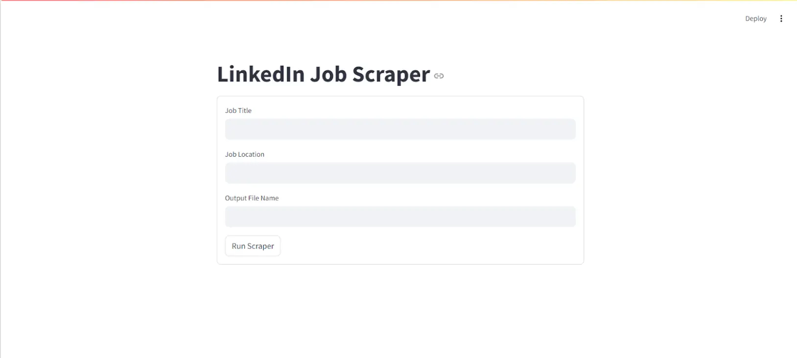
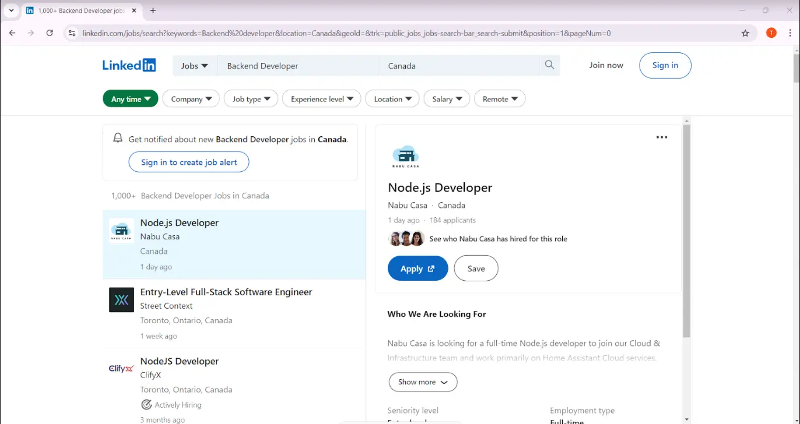
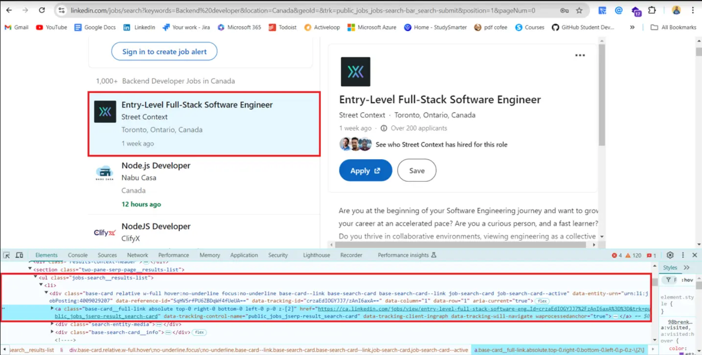
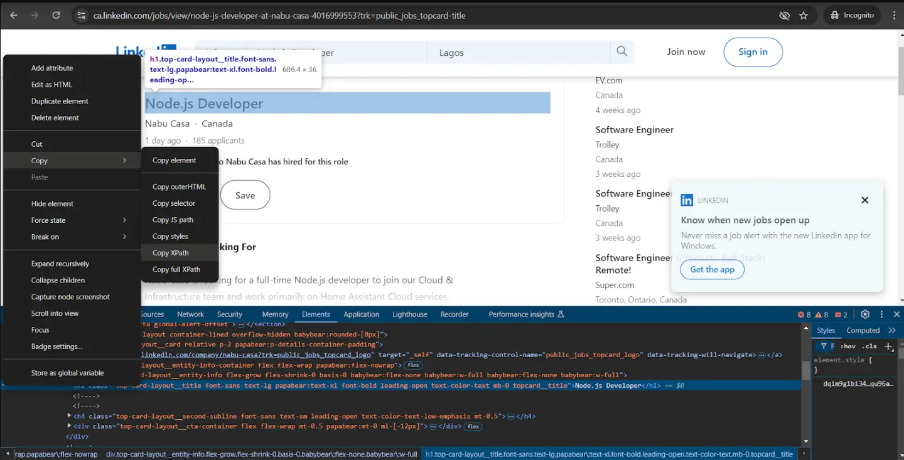
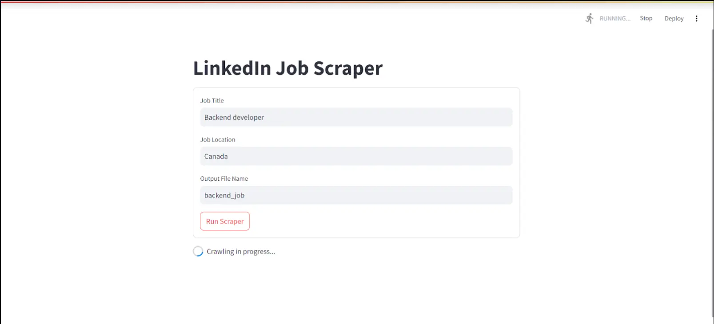
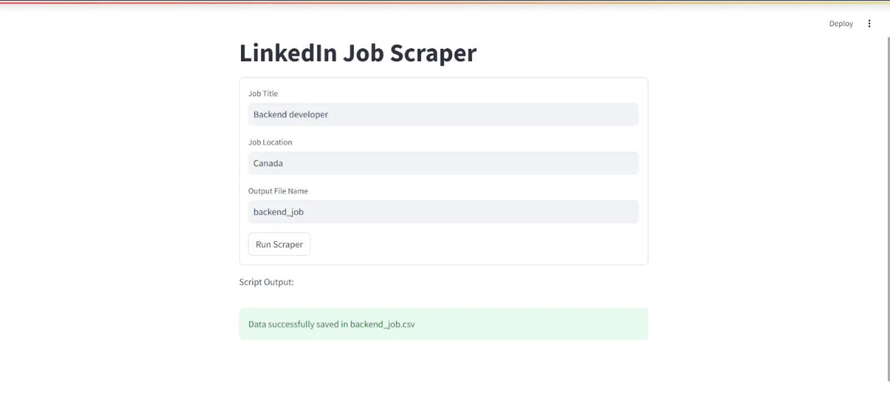
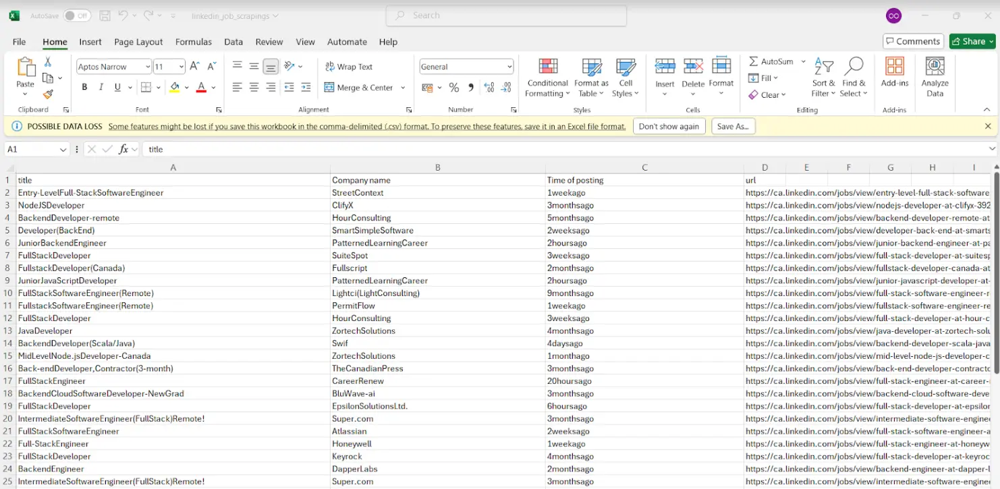

# How to create a LinkedIn job scraper in Python with Crawlee

## Introduction

In this article, we will build a web application that scrapes LinkedIn for job postings using Crawlee and Streamlit.

We will create a LinkedIn job scraper in Python using Crawlee for Python to extract the company name, job title, time of posting, and link to the job posting from dynamically received user input through the web application.

:::note

One of our community members wrote this blog as a contribution to Crawlee Blog. If you want to contribute blogs like these to Crawlee Blog, please reach out to us on our [discord channel](https://apify.com/discord).

:::

By the end of this tutorial, you’ll have had a fully functional web application that you can use to scrape job postings from LinkedIn.



Let's begin.

<!--truncate-->

## Prerequisites

Let's start by creating a new Crawlee for Python project with this command:

```bash
pipx run crawlee create linkedin-scraper
```

Select `PlaywrightCrawler` in the terminal when Crawlee asks for it.

After installation, Crawlee for Python will create boilerplate code for you. You can redirect it to the project folder and run this command to install dependencies.

```bash
poetry install
```

We are going to begin editing the files provided to us by Crawlee so we can build our scraper.

:::note

Before going ahead if you like reading this blog, we would be really happy if you gave [Crawlee for Python a star on GitHub](https://github.com/apify/crawlee-python/)!

:::

## Building the LinkedIn job Scraper in Python with Crawlee

In this section, we will be building the scraper using the Crawlee for Python package. To learn more about Crawlee, check out their [documentation](https://www.crawlee.dev/python/docs/quick-start).

### 1. Inspecting the LinkedIn job Search Page

Open LinkedIn in your web browser and sign out from the website (if you already have an account logged in). You should see an interface like this.


Navigate to the jobs section, search for a job and location of your choice, and copy the URL.



You should have something like this:

`https://www.linkedin.com/jobs/search?keywords=Backend%20Developer&location=Canada&geoId=101174742&trk=public_jobs_jobs-search-bar_search-submit&position=1&pageNum=0` 

We're going to focus on the search parameters, which is the part that goes after '?'. The keyword and location parameters are the most important ones for us. 

The job title the user supplies will be input to the keyword parameter, while the location the user supplies will go into the location parameter. Lastly, the `geoId` parameter will be removed while we keep the other parameters constant.

We are going to be making changes to our `main.py` file. Copy and paste the code below in your `main.py` file.

```py
from crawlee.playwright_crawler import PlaywrightCrawler
from .routes import router                                     
import urllib.parse

async def main(title: str, location: str, data_name: str) -> None:
    base_url = "https://www.linkedin.com/jobs/search"

    # URL encode the parameters
    params = {
        "keywords": title,
        "location": location,
        "trk": "public_jobs_jobs-search-bar_search-submit",
        "position": "1",
        "pageNum": "0"
    }

    encoded_params = urlencode(params)
    
    # Encode parameters into a query string
    query_string = '?' + encoded_params

    # Combine base URL with the encoded query string
    encoded_url = urljoin(base_url, "") + query_string

    # Initialize the crawler
    crawler = PlaywrightCrawler(
        request_handler=router,
    )

    # Run the crawler with the initial list of URLs
    await crawler.run([encoded_url])

    # Save the data in a CSV file
    output_file = f"{data_name}.csv"
    await crawler.export_data(output_file)
```

Now that we have encoded the URL, the next step for us is to adjust the generated router to handle LinkedIn job postings. 

### 2. Routing your crawler

We will be making use of two handlers for your application:

* **Default handler** 

The `default_handler` handles the start URL

* **Job listing**

The `job_listing` handler extracts the individual job details.

Playwright crawler is going to crawl through the job posting page and extract the links to all job postings on the page.



When you examine the job postings, you will discover that the job posting links are inside an ordered list with a class named `jobs-search__results-list`. We will then extract the links using the Playwright locator object and add them to the `job_listing` route for processing.

```py
router = Router[PlaywrightCrawlingContext]()

@router.default_handler
async def default_handler(context: PlaywrightCrawlingContext) -> None:
    """Default request handler."""

    #select all the links for the job posting on the page
    hrefs = await context.page.locator('ul.jobs-search__results-list a').evaluate_all("links => links.map(link => link.href)")

    #add all the links to the job listing route
    await context.add_requests(
            [Request.from_url(rec, label='job_listing') for rec in hrefs]
        )
```

Now that we have the job listings, the next step is to scrape their details.

We'll extract each job’s title, company's name, time of posting, and the link to the job post. Open your dev tools to extract each element using its CSS selector. 



After scraping each of the listings, we'll remove special characters from the text to make it clean and push the data to local storage using the `context.push_data` function.

```py
@router.handler('job_listing')
async def listing_handler(context: PlaywrightCrawlingContext) -> None:
    """Handler for job listings."""

    await context.page.wait_for_load_state('load')

    job_title = await context.page.locator('div.top-card-layout__entity-info h1.top-card-layout__title').text_content()
   
    company_name  = await context.page.locator('span.topcard__flavor a').text_content()   

    time_of_posting= await context.page.locator('div.topcard__flavor-row span.posted-time-ago__text').text_content()


    await context.push_data(
        {
            # we are making use of regex to remove special characters for the extracted texts

            'title': re.sub(r'[\s\n]+', '', job_title),
            'Company name': re.sub(r'[\s\n]+', '', company_name),
            'Time of posting': re.sub(r'[\s\n]+', '', time_of_posting),
            'url': context.request.loaded_url,
        }
    )
```

## 3. Creating your application

For this project, we will be using Streamlit for the web application. Before we proceed, we are going to create a new file named `app.py` in your project directory. In addition, ensure you have  [Streamlit](https://docs.streamlit.io/get-started/installation)  installed in your global Python environment before proceeding with this section.

```py
import streamlit as st
import subprocess

# Streamlit form for inputs 
st.title("LinkedIn Job Scraper")

with st.form("scraper_form"):
    title = st.text_input("Job Title", value="backend developer")
    location = st.text_input("Job Location", value="newyork")
    data_name = st.text_input("Output File Name", value="backend_jobs")

    submit_button = st.form_submit_button("Run Scraper")

if submit_button:

    # Run the scraping script with the form inputs
    command = f"""poetry run python -m linkedin-scraper --title "{title}"  --location "{location}" --data_name "{data_name}" """

    with st.spinner("Crawling in progress..."):
         # Execute the command and display the results
        result = subprocess.run(command, shell=True, capture_output=True, text=True)

        st.write("Script Output:")
        st.text(result.stdout)

        if result.returncode == 0:
            st.success(f"Data successfully saved in {data_name}.csv")
        else:
            st.error(f"Error: {result.stderr}")
```

The Streamlit web application takes in the user's input and uses the Python Subprocess package to run the Crawlee scraping script.


## 4. Testing your app

Before we test the application, we need to make a little modification to the `__main__` file in order for it to accommodate the command line arguments. 

```py
import asyncio
import argparse

from .main import main

def get_args():
    # ArgumentParser object to capture command-line arguments
    parser = argparse.ArgumentParser(description="Crawl LinkedIn job listings")


    # Define the arguments
    parser.add_argument("--title", type=str, required=True, help="Job title")
    parser.add_argument("--location", type=str, required=True, help="Job location")
    parser.add_argument("--data_name", type=str, required=True, help="Name for the output CSV file")


    # Parse the arguments
    return parser.parse_args()

if __name__ == '__main__':
    args = get_args()
    # Run the main function with the parsed command-line arguments
    asyncio.run(main(args.title, args.location, args.data_name))
```

We will start the Streamlit application by running this code in the terminal:

```bash
streamlit run app.py
```

This is what your application what the application should look like on the browser:



You will get this interface showing you that the scraping has been completed:



To access the scraped data, go over to your project directory and open the CSV file.



You should have something like this as the output of your CSV file.


## Conclusion

In this tutorial, we have learned how to build an application that can scrape job posting data from LinkedIn using Crawlee. Have fun building great scraping applications with Crawlee.

You can find the complete working Crawler code here on the [GitHub repository.](https://github.com/Arindam200/LinkedIn_Scraping)