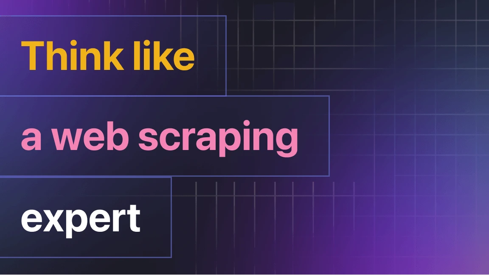
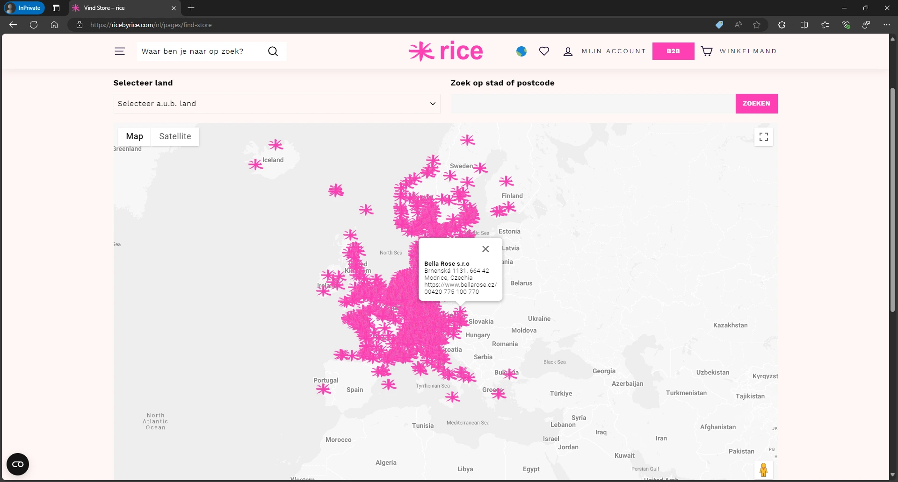
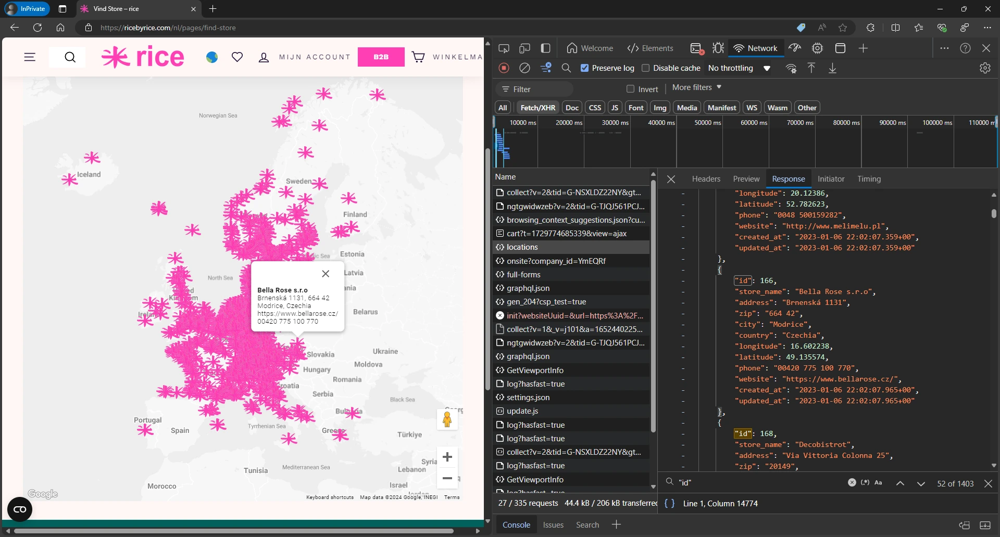
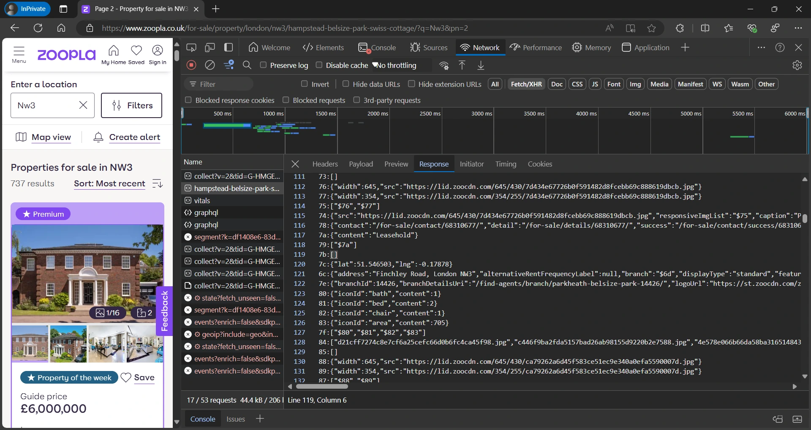

Typically, tutorials focus on the technical aspects, on what you can replicate: "Start here, follow this path, and you'll end up here." This is great for learning a particular technology, but it's sometimes difficult to understand why the author decided to do things a certain way or what guides their development process.

:::note

One of our community members wrote this blog as a contribution to Crawlee Blog. If you want to contribute blogs like these to Crawlee Blog, please reach out to us on our [discord channel](https://apify.com/discord).

:::

In this blog, I'll discuss the general rules and principles that guide me when I work on web scraping projects and allow me to achieve great results.

So, let's explore the mindset of a web scraping developer.



<!-- truncate -->

## 1. Choosing a data source for the project

When you start working on a project, you likely have a target site from which you need to extract specific data. Check what possibilities this site or application provides for data extraction. Here are some possible options:

- `Official API` - the site may provide a free official API through which you can get all the necessary data. This is the best option for you. For example, you can consider this approach if you need to extract data from [`Yelp`](https://docs.developer.yelp.com/docs/fusion-intro)
- `Website` - in this case, we study the website, its structure, as well as the ways the frontend and backend interact
- `Mobile Application` - in some cases, there's no website or API at all, or the mobile application provides more data, in which case, don't forget about the [`man-in-the-middle`](https://blog.apify.com/using-a-man-in-the-middle-proxy-to-scrape-data-from-a-mobile-app-api-e954915f979d/) approach

If one data source fails, try accessing another available source.

For example, for `Yelp`, all three options are available, and if the `Official AP`I doesn't suit you for some reason, you can try the other two.

## 2. Check [`robots.txt`](https://developers.google.com/search/docs/crawling-indexing/robots/intro) and [`sitemap`](https://developers.google.com/search/docs/crawling-indexing/sitemaps/build-sitemap)

I think everyone knows about `robots.txt` and `sitemap` one way or another, but I regularly see people simply forgetting about them. If you're hearing about these for the first time, here's a quick explanation:

- `robots` is the established name for crawlers in SEO. Usually, this refers to crawlers of major search engines like Google and Bing, or services like Ahrefs and ChatGPT.
- `robots.txt` is a file describing the allowed behavior for robots. It includes permitted crawler user-agents, wait time between page scans, patterns of pages forbidden for scanning, and more. These rules are typically based on which pages should be indexed by search engines and which should not.
- `sitemap` describes the site structure to make it easier for robots to navigate. It also helps in scanning only the content that needs updating, without creating unnecessary load on the site

Since you're not [`Google`](http://google.com/) or any other popular search engine, the robot rules in `robots.txt` will likely be against you. But combined with the `sitemap`, this is a good place to study the site structure, expected interaction with robots, and non-browser user-agents. In some situations, it simplifies data extraction from the site.

For example, using the [`sitemap`](https://www.coolbrnoblog.cz/wp-sitemap.xml) for [the blog](http://www.coolbrnoblog.cz), you can easily get direct links to posts both for the entire lifespan of the blog and for a specific period. One simple check, and you don't need to implement pagination logic.

## 3. Don't neglect site analysis

Thorough site analysis is an important prerequisite for creating an effective web scraper, especially if you're not planning to use browser automation. However, such analysis takes time, sometimes a lot of it. 

It's also worth noting that the time spent on analysis and searching for a more optimal crawling solution doesn't always pay off - you might spend hours only to discover that the most obvious approach was the best all along.

Therefore, it's wise to set limits on your initial site analysis. If you don't see a better path within the allocated time, revert to simpler approaches. As you gain more experience, you'll more often be able to tell early on, based on the technologies used on the site, whether it's worth dedicating more time to analysis or not.

Also, in projects where you need to extract data from a site just once, thorough site analysis can sometimes eliminate the need to write scraper code altogether. Here's an example of such a site - `https://ricebyrice.com/nl/pages/find-store`.



By analyzing it, you'll easily discover that all the data can be obtained with a single request. You simply need to copy this data from your browser into a JSON file, and your task is complete.



## 4. Maximum interactivity

When analyzing a site, switch sorts, pages, interact with various elements of the site, while watching the `Network` tab in your browser's [Dev Tools](https://developer.chrome.com/docs/devtools). This will allow you to better understand how the site interacts with the backend, what framework it's built on, and what behavior can be expected from it.

## 5. Data doesn't appear out of thin air

This is obvious, but it's important to keep in mind while working on a project. If you see some data or request parameters, it means they were obtained somewhere earlier, possibly in another request, possibly they may have already been on the website page, possibly they were formed using JS from other parameters. But they are always somewhere.

If you don't understand where the data on the page comes from, or the data used in a request, follow these steps:

1. Sequentially, check all requests the site made before this point.
2. Examine their responses, headers, and cookies.
3. Use your intuition: Could this parameter be a timestamp? Could it be another parameter in a modified form?
4. Does it resemble any standard hashes or encodings?

Practice makes perfect here. As you become familiar with different technologies, various frameworks, and their expected behaviors, and as you encounter a wide range of technologies, you'll find it easier to understand how things work and how data is transferred. This accumulated knowledge will significantly improve your ability to trace and understand data flow in web applications.

## 6. Data is cached

You may notice that when opening the same page several times, the requests transmitted to the server differ: possibly something was cached and is already stored on your computer. Therefore, it's recommended to analyze the site in incognito mode, as well as switch browsers.

This situation is especially relevant for mobile applications, which may store some data in storage on the device. Therefore, when analyzing mobile applications, you may need to clear the cache and storage.

## 7. Learn more about the framework

If during the analysis you discover that the site uses a framework you haven't encountered before, take some time to learn about it and its features. For example, if you notice a site is built with Next.js, understanding how it handles routing and data fetching could be crucial for your scraping strategy.

You can learn about these frameworks through official documentation or by using LLMs like [`ChatGPT`](https://openai.com/chatgpt/) or [`Claude`](https://claude.ai/). These AI assistants are excellent at explaining framework-specific concepts. Here's an example of how you might query an LLM about Next.js:

```
I am in the process of optimizing my website using Next.js. Are there any files passed to the browser that describe all internal routing and how links are formed?

Restrictions:
- Accompany your answers with code samples
- Use this message as the main message for all subsequent responses
- Reference only those elements that are available on the client side, without access to the project code base

```

You can create similar queries for backend frameworks as well. For instance, with GraphQL, you might ask about available fields and query structures. These insights can help you understand how to better interact with the site's API and what data is potentially available.

For effective work with LLM, I recommend at least basically studying the basics of [`prompt engineering`](https://parlance-labs.com/education/prompt_eng/berryman.html).

## 8. Reverse engineering

Web scraping goes hand in hand with reverse engineering. You study the interactions of the frontend and backend, you may need to study the code to better understand how certain parameters are formed.

But in some cases, reverse engineering may require more knowledge, effort, time, or have a high degree of complexity. At this point, you need to decide whether you need to delve into it or it's better to change the data source, or, for example, technologies. Most likely, this will be the moment when you decide to abandon HTTP web scraping and switch to a headless browser.

The main principle of most web scraping protections is not to make web scraping impossible, but to make it expensive.

Let's just look at what the response to a search on [`zoopla`](https://www.zoopla.co.uk/) looks like



## 9. Testing requests to endpoints

After identifying the endpoints you need to extract the target data, make sure you get a correct response when making a request. If you get a response from the server other than 200, or data different from expected, then you need to figure out why. Here are some possible reasons:

- You need to pass some parameters, for example cookies, or specific technical headers
- The site requires that when accessing this endpoint, there is a corresponding `Referrer` header
- The site expects that the headers will follow a certain order. I've encountered this only a couple of times, but I have encountered it
- The site uses protection against web scraping, for example with `TLS fingerprint`

And many other possible reasons, each of which requires separate analysis.

## 10. Experiment with request parameters

Explore what results you get when changing request parameters, if any. Some parameters may be missing but supported on the server side. For example, `order`, `sort`, `per_page`, `limit`, and others. Try adding them and see if the behavior changes.

This is especially relevant for sites using [`graphql`](https://graphql.org/)

Let's consider this [`example`](https://restoran.ua/en/posts?subsection=0)

If you analyze the site, you'll see a request that can be reproduced with the following code, I've formatted it a bit to improve readability:

```python
import requests

url = "<https://restoran.ua/graphql>"

data = {
    "operationName": "Posts_PostsForView",
    "variables": {"sort": {"sortBy": ["startAt_DESC"]}},
    "query": """query Posts_PostsForView(
    $where: PostForViewWhereInput,
    $sort: PostForViewSortInput,
    $pagination: PaginationInput,
    $search: String,
    $token: String,
    $coordinates_slice: SliceInput,
    {
        PostsForView(
                where: $where
                sort: $sort
                pagination: $pagination
                search: $search
                token: $token
                ) {
                        id
                        title: ukTitle
                        summary: ukSummary
                        slug
                        startAt
                        endAt
                        newsFeed
                        events
                        journal
                        toProfessionals
                        photoHeader {
                            address: mobile
                            __typename
                            }
                        coordinates(slice: $coordinates_slice) {
                            lng
                            lat
                            __typename
                            }
                        __typename
                    }
    }"""
}

response = requests.post(url, json=data)

print(response.json())
```

Now I'll update it to get results in 2 languages at once, and most importantly, along with the internal text of the publications:

```python
import requests

url = "<https://restoran.ua/graphql>"

data = {
    "operationName": "Posts_PostsForView",
    "variables": {"sort": {"sortBy": ["startAt_DESC"]}},
    "query": """query Posts_PostsForView(
    $where: PostForViewWhereInput,
    $sort: PostForViewSortInput,
    $pagination: PaginationInput,
    $search: String,
    $token: String,
    $coordinates_slice: SliceInput)
    {
        PostsForView(
                where: $where
                sort: $sort
                pagination: $pagination
                search: $search
                token: $token
                ) {
                        id
                        uk_title: ukTitle
                        en_title: enTitle
                        summary: ukSummary
                        slug
                        startAt
                        endAt
                        newsFeed
                        events
                        journal
                        toProfessionals
                        photoHeader {
                            address: mobile
                            __typename
                            }
                        mixedBlocks {
                            index
                            en_text: enText
                            uk_text: ukText
                            __typename
                            }
                        coordinates(slice: $coordinates_slice) {
                            lng
                            lat
                            __typename
                            }
                        __typename
                    }
    }"""
}

response = requests.post(url, json=data)

print(response.text)
```

As you can see, a small update of the request parameters allows me not to worry about visiting the internal page of each publication. You have no idea how many times this trick has saved me.

If you see `graphql` in front of you and don't know where to start, then my advice about documentation and LLM works here too.

## 11. Don't be afraid of new technologies

I know how easy it is to master a few tools and just use them because it works. I've fallen into this trap more than once myself.

But modern sites use modern technologies that have a significant impact on web scraping, and in response, new tools for web scraping are emerging. Learning these may greatly simplify your next project, and may even solve some problems that were insurmountable for you. I wrote about some tools [`earlier`](https://www.crawlee.dev/blog/common-problems-in-web-scraping).

I especially recommend paying attention to [`curl_cffi`](https://curl-cffi.readthedocs.io/en/latest/) and frameworks
[`botasaurus`](https://www.omkar.cloud/botasaurus/) and [`Crawlee for Python`](https://www.crawlee.dev/python/).

## 12. Help open-source libraries

Personally, I only recently came to realize the importance of this. All the tools I use for my work are either open-source developments or based on open-source. Web scraping literally lives thanks to open-source, and this is especially noticeable if you're a `Python` developer and have realized that on pure `Python` everything is quite sad when you need to deal with `TLS fingerprint`, and again, open-source saved us here.

And it seems to me that the least we could do is invest a little of our knowledge and skills in supporting open-source.

I chose to support [`Crawlee for Python`](https://www.crawlee.dev/python/), and no, not because they allowed me to write in their blog, but because it shows excellent development dynamics and is aimed at making life easier for web crawler developers. It allows for faster crawler development by taking care of and hiding under the hood such critical aspects as session management, session rotation when blocked, managing concurrency of asynchronous tasks (if you write asynchronous code, you know what a pain this can be), and much more.

:::tip
If you like the blog so far, please consider [giving Crawlee a star on GitHub](https://github.com/apify/crawlee), it helps us to reach and help more developers.
:::

And what choice will you make?

## Conclusion

I think some things in the article were obvious to you, some things you follow yourself, but I hope you learned something new too. If most of them were new, then try using these rules as a checklist in your next project.

I would be happy to discuss the article. Feel free to comment here, in the article, or contact me in the [Crawlee developer community](https://apify.com/discord) on Discord.

You can also find me on the following platforms: [Github](https://github.com/Mantisus), [Linkedin](https://www.linkedin.com/in/max-bohomolov/), [Apify](https://apify.com/mantisus), [Upwork](https://www.upwork.com/freelancers/mantisus), [Contra](https://contra.com/mantisus).

Thank you for your attention :)