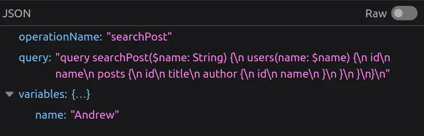
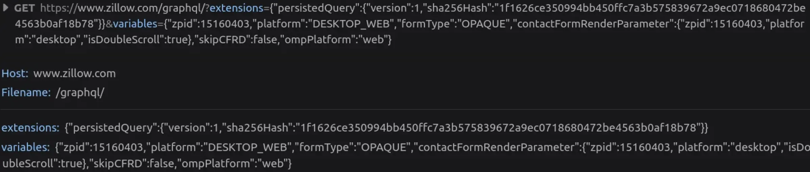
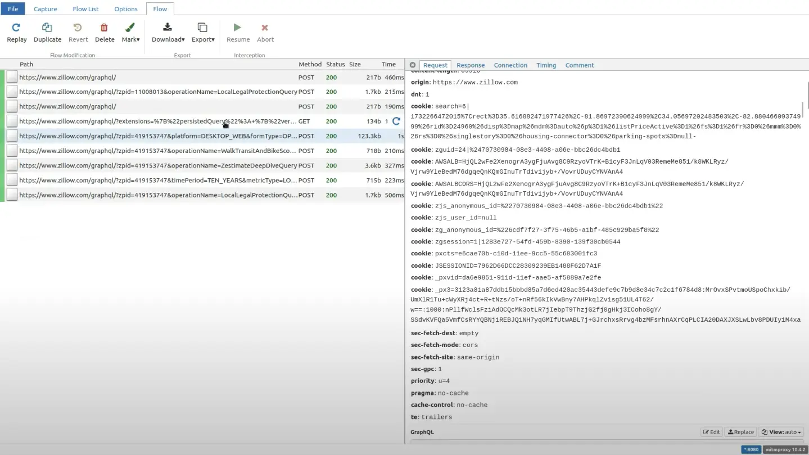
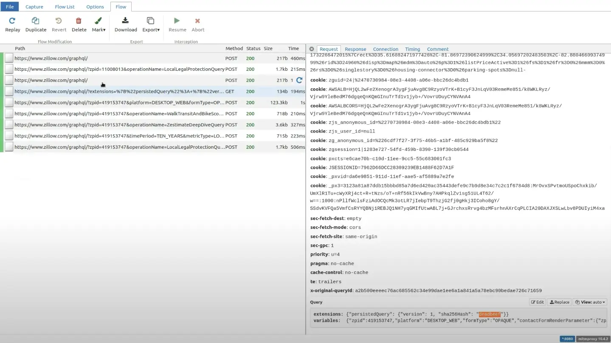
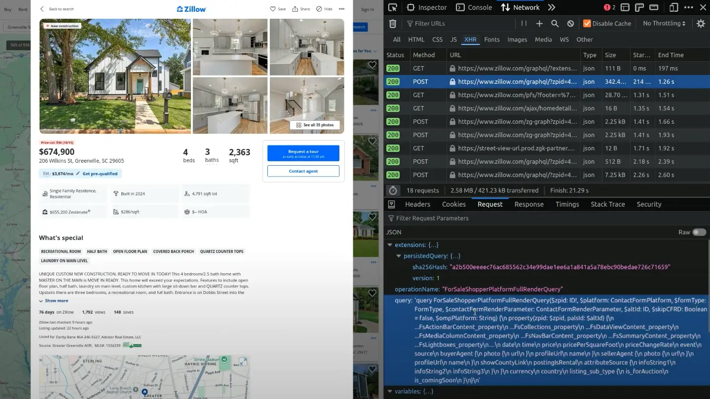

GraphQL is a query language for getting deeply nested structured data from a website's backend, similar to MongoDB queries.

The request is usually a POST to some general `/graphql` endpoint with a body like this:



However, with large data structures, this becomes inefficient - you are sending a large query in a POST request body, which is (almost always) the same and only changes on website updates; POST requests can’t be cached, etc. Therefore, an extension called “persisted queries” was developed. This isn’t an anti-scraping secret; you can read the public documentation about it [here](https://www.apollographql.com/docs/apollo-server/performance/apq/).


<!-- truncate -->

TLDR: the client computes the sha256 hash of the `query` text and only sends that hash. In addition, you can possibly fit all of this into the query string of a GET request, making it easily cachable. Below is an example request from Zillow



As you can see, it’s just some metadata about the persistedQuery extension, the hash of the query, and variables to be embedded in the query.

Here’s another request from expedia.com, sent as a POST, but with the same extension:

This primarily optimizes website performance, but it creates several challenges for web scraping:

- GET requests are usually more prone to being blocked.
- Hidden Query Parameters: We don’t know the full query, so if the website responds with a “Persisted query not found” error (asking us to send the query in full, not just the hash), we can’t send it.
- Once the website changes even a little bit and the clients start asking for a new query - even though the old one might still work, the server will very soon forget its ID/hash, and your request with this hash will never work again, since you can’t “remind” the server of the full query text.

Therefore, for different reasons, you might find yourself in the need to extract the whole query text. You could dig through the website JavaScript, and if you’re lucky, you might find the query text there in full, but often, it is somehow dynamically constructed from multiple fragments, etc. 

Therefore, we figured out a better way: we will not touch the client-side JavaScript at all. Instead, we will try to simulate the situation where the client tries to use a hash that the server does not know. Therefore, we need to intercept the (valid) request sent by the browser in-flight and modify the hash to a bogus one before passing it to the server.

For exactly this use case, a perfect tool exists: [mitmproxy](https://mitmproxy.org/), an open-source Python library that intercepts requests made by your own devices, websites, or apps and allows you to modify them with simple Python scripts.

Download `mitmproxy`, and prepare a Python script like this:

```python
import json

def request(flow):
    try:
        dat = json.loads(flow.request.text)
        dat[0]["extensions"]["persistedQuery"]["sha256Hash"] = "0d9e" # any bogus hex string here
        flow.request.text = json.dumps(dat)
    except:
        pass
```

This defines a hook that `mitmproxy` will run on every request: it tries to load the request's JSON body, modifies the hash to an arbitrary value, and writes the updated JSON as a new body of the request.

We also need to make sure we reroute our browser requests to `mitmproxy`. For this purpose we are going to use a browser extension called [FoxyProxy](https://chromewebstore.google.com/detail/foxyproxy/gcknhkkoolaabfmlnjonogaaifnjlfnp?hl=en). It is available in both Firefox and Chrome.

Just add a route with these settings:


Now we can run `mitmproxy` with this script: `mitmweb -s script.py`

This will open a browser tab where you can watch all the intercepted requests in real-time.



If you go to the particular path and see the query in the request section, you will see some garbage value has replaced the hash.



Now, if you visit Zillow and open that particular path that we tried for the extension, and go to the response section, the client-side receives the PersistedQueryNotFound error.


The front end of Zillow reacts with sending the whole query as a POST request.



We extract the query and hash directly from this POST request. To ensure that the Zillow server does not forget about this hash, we periodically run this POST request with the exact same query and hash. This will ensure that the scraper continues to work even when the server's cache is cleaned or reset or the website changes.

## Conclusion

Persisted queries are a powerful optimization tool for GraphQL APIs, enhancing website performance by minimizing payload sizes and enabling GET request caching. However, they also pose significant challenges for web scraping, primarily due to the reliance on server-stored hashes and the potential for those hashes to become invalid.

Using `mitmproxy` to intercept and manipulate GraphQL requests gives an efficient approach to reveal  the full query text without delving into complex client-side JavaScript. By forcing the server to respond with a `PersistedQueryNotFound` error, we can capture the full query payload and utilize it for scraping purposes. Periodically running the extracted query ensures the scraper remains functional, even when server-side cache resets occur or the website evolves.