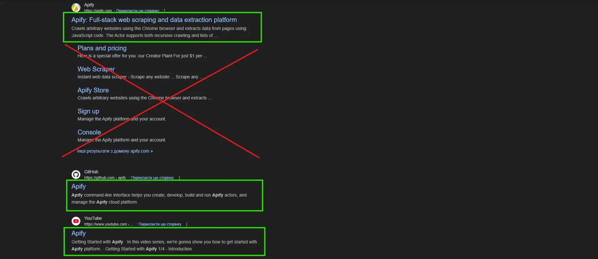
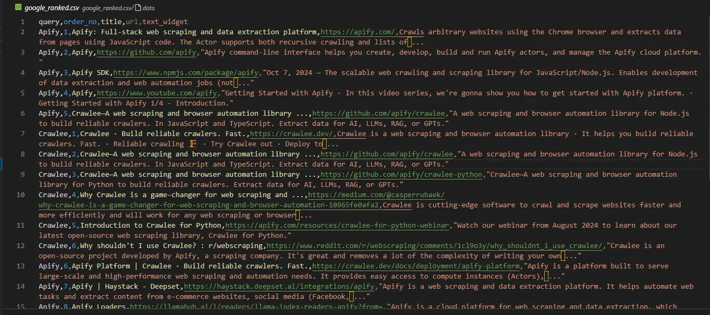

Google - I'm not even sure why I'm including a link to this service since if you have internet access, you know what Google is. Just a few years ago, the phrase "If your business isn't in Google search, it doesn't exist" rang true. Today, we're seeing the emergence of LLM-based search engines like Perplexity, Bing Copilot, and ChatGPT.

An interesting trend has emerged recently. More and more websites are starting to block LLM crawlers from extracting their content. However, I haven't encountered any sites that block Google's crawler from indexing their content. The only exceptions are websites in the Darknet or those in countries with internet isolation policies.

Well, I believe that analyzing Google search results will remain just as crucial in the coming years as it has been. Whether it's developing your website's content strategy or optimizing for [`SEO`](https://developers.google.com/search/docs/fundamentals/seo-starter-guide), the need persists. Interestingly, I wonder how SEO optimization might change for LLM-based search in a world without traditional search engines - for instance, how would you ensure this article gets found? Having some familiarity with both domains, I struggle to envision an alternative to creating vast amounts of interlinked, similar content on your platform. Perhaps you have a better solution in mind?

If Google search isn't going anywhere in the coming years, then tasks like [`SERP Analysis`](https://www.semrush.com/blog/serp-analysis/), SEO optimization, and evaluating your site's search ranking remain highly relevant - and for these, we need effective tools.

:::note

One of our community members wrote this blog as a contribution to Crawlee Blog. If you want to contribute blogs like these to Crawlee Blog, please reach out to us on our [discord channel](https://apify.com/discord).

:::

That's why in this blog, we'll explore creating a Google search results crawler with [`Crawlee for Python`](https://github.com/apify/crawlee-python). This will be particularly useful if you're conducting a small data analysis project, analyzing search results for your business, or writing an [article about Google ranking analysis](https://backlinko.com/search-engine-ranking). Rather ironically, don't you think, considering that the largest known crawler belongs to Google itself?

Let's get started!

## 1. Site Analysis

First, let's define the scope of what we want to extract. Google's search results are quite heterogeneous now, featuring map widgets, notable people, company information, video blocks, popular questions, and much more. Let's limit ourselves to analyzing classic search results with rankings.

Here's what we'll be extracting:



Let's verify whether we can extract the necessary data from the page's HTML code or if we need deeper analysis or `JS` rendering. Note that this verification is sensitive to HTML tags:


Based on the data obtained from the page, all necessary information is present in the HTML code. Therefore, we can use [`beautifulsoup_crawler`](https://www.crawlee.dev/python/docs/examples/beautifulsoup-crawler).

Let's analyze the HTML code of the elements we need to extract:


### Important Considerations

#### 1. Tag Attributes

There's an obvious distinction between *readable* id attributes and *generated* class names and other attributes. When creating selectors for data extraction, you should ignore any generated attributes. Even if you've read that Google has been using a particular generated tag for N years, you shouldn't rely on it - this is your experience in writing robust code.

#### 2. Complex Selectors

The abundance of generated tags and Google's data structure can be overwhelming. Don't hesitate to use advanced features within CSS and XPath selector syntax.

#### 3. Write Selectors Manually

For any project that needs to be reproduced more than once or any large-scale website project that might have multiple page layouts, you should avoid using selectors obtained from browser's "Copy XPath/selector" feature. Selectors built with absolute paths are not stable against any page changes. You should write selectors yourself, so familiarize yourself with the basics of [CSS](https://www.w3schools.com/cssref/css_selectors.php) and [XPath](https://www.w3schools.com/xml/xpath_syntax.asp) syntax.

If this were just another website to scrape data from, the analysis would be complete. But this is Google, so there are things we simply must consider.

### Site Specifics

1. **Results are Personalized** - Google tries to provide data that's useful to you based on the information it has. This is crucial when working with Google, and you should *always* keep it in mind.

2. **Do You Need Personalized Data?** - If you want to analyze data that's maximally relevant to your search results, use your main browser's `cookies`.

3. **Location Matters** - Your IP address's geolocation will influence Google search results.

4. **Don't Forget About [`advanced search`](https://www.google.com/advanced_search)** - Additional parameters might be very useful for your specific case. For example, if you want to get results predominantly in Spanish, you can use - `https://www.google.com/search?q={YOUR_QUERY}&lr=lang_es`

## 2. Implementing the Crawler

Implemented for [`Crawlee for Python`](https://www.crawlee.dev/python) v0.4.2

All necessary data can be obtained without browser emulation. We can use `beautifulsoup_crawler` for implementation.

Accordingly, we can use one of Crawlee's basic templates to create our project.

Execute the following commands:

```bash
pipx install crawlee[beautifulsoup,curl-impersonate]
pipx run crawlee create crawlee-google-search
cd crawlee-google-search
poetry install
```

In an ideal world, when ranking data, we'd want to pass multiple input `QUERIES` and limit the scanning depth with `CRAWL_DEPTH`. Why do we need the fifth page that nobody sees? Or... even the second?

Google may block you if your web scraping is too aggressive, so configure `ConcurrencySettings` for the crawler or use a `proxy`. Using limitations in `ConcurrencySettings` is good practice for any scraping as it helps avoid excessive server load.

Let's implement this step by step.

First, let's create the crawler configuration that we'll use during development. We'll use `CurlImpersonateHttpClient` as our `http_client` with preset `headers` and `impersonate` corresponding to the [`Chrome`](https://www.google.com/intl/en/chrome/) browser:

```python
from crawlee.beautifulsoup_crawler import BeautifulSoupCrawler
from crawlee.http_clients.curl_impersonate import CurlImpersonateHttpClient
from crawlee import ConcurrencySettings, HttpHeaders

async def main() -> None:
    concurrency_settings = ConcurrencySettings(max_concurrency=5, max_tasks_per_minute=200)

    http_client = CurlImpersonateHttpClient(impersonate="chrome124",
                                            headers=HttpHeaders({"referer": "https://www.google.com/",
                                                     "accept-language": "en",
                                                     "accept-encoding": "gzip, deflate, br, zstd",
                                                     "user-agent": "Mozilla/5.0 (Windows NT 10.0; Win64; x64) AppleWebKit/537.36 (KHTML, like Gecko) Chrome/131.0.0.0 Safari/537.36"
                                            }))

    crawler = BeautifulSoupCrawler(
        max_request_retries=1,
        concurrency_settings=concurrency_settings,
        http_client=http_client,
        max_requests_per_crawl=10,
        max_crawl_depth=5
    )

    await crawler.run(['https://www.google.com/search?q=Apify'])
```

As our crawler deals with only one type of page, we can use `router.default_handler` for processing it. Within the handler, we'll use `BeautifulSoup` to iterate through each search result, extracting data such as `title`, `url`, and `text_widget` while saving the results

```python
@crawler.router.default_handler
async def default_handler(context: BeautifulSoupCrawlingContext) -> None:
    """Default request handler."""
    context.log.info(f'Processing {context.request} ...')

    for item in context.soup.select("div#search div#rso div[data-hveid][lang]"):
        data = {
            'title': item.select_one("h3").get_text(),
            "url": item.select_one("a").get("href"),
            "text_widget": item.select_one("div[style*='line']").get_text(),
        }
        await context.push_data(data)
```

We also need to implement pagination handling. The `max_crawl_depth` parameter controls how many pages our crawler should scan. Therefore, we simply need to get the next page link and add it to the crawler's queue.

```python
@crawler.router.default_handler
async def default_handler(context: BeautifulSoupCrawlingContext) -> None:
    """Default request handler."""
    context.log.info(f'Processing {context.request} ...')

    for item in context.soup.select("div#search div#rso div[data-hveid][lang]"):
        data = {
            'title': item.select_one("h3").get_text(),
            "url": item.select_one("a").get("href"),
            "text_widget": item.select_one("div[style*='line']").get_text(),
        }
        await context.push_data(data)

    await context.enqueue_links(selector="div[role='navigation'] td[role='heading']:last-of-type > a")
```

The core crawler logic is ready.

Now, let's modify the script to handle multiple queries and track ranking positions for search results analysis. We'll also set the crawling depth in a top-level variable. Let's move the router.default_handler to routes.py to match the project structure:

```python
# crawlee-google-search.main

from crawlee.beautifulsoup_crawler import BeautifulSoupCrawler, BeautifulSoupCrawlingContext
from crawlee.http_clients.curl_impersonate import CurlImpersonateHttpClient
from crawlee import Request, ConcurrencySettings, HttpHeaders

from .routes import router

QUERIES = ["Apify", "Crawlee"]

CRAWL_DEPTH = 2


async def main() -> None:
    """The crawler entry point."""

    concurrency_settings = ConcurrencySettings(max_concurrency=5, max_tasks_per_minute=200)

    http_client = CurlImpersonateHttpClient(impersonate="chrome124",
                                            headers=HttpHeaders({"referer": "https://www.google.com/",
                                                     "accept-language": "en",
                                                     "accept-encoding": "gzip, deflate, br, zstd",
                                                     "user-agent": "Mozilla/5.0 (Windows NT 10.0; Win64; x64) AppleWebKit/537.36 (KHTML, like Gecko) Chrome/131.0.0.0 Safari/537.36"
                                            }))
    crawler = BeautifulSoupCrawler(
        request_handler=router,
        max_request_retries=1,
        concurrency_settings=concurrency_settings,
        http_client=http_client,
        max_requests_per_crawl=100,
        max_crawl_depth=CRAWL_DEPTH
    )

    requests_lists = [Request.from_url(f"https://www.google.com/search?q={query}", user_data = {"query": query}) for query in QUERIES]

    await crawler.run(requests_lists)
```

Let's also modify the handler to add `query` and `order_no` fields and basic error handling:

```python
# crawlee-google-search.routes

from crawlee.beautifulsoup_crawler import BeautifulSoupCrawlingContext
from crawlee.router import Router

router = Router[BeautifulSoupCrawlingContext]()


@router.default_handler
async def default_handler(context: BeautifulSoupCrawlingContext) -> None:
    """Default request handler."""
    context.log.info(f'Processing {context.request.url} ...')

    order = context.request.user_data.get("last_order", 1)
    query = context.request.user_data.get("query")
    for item in context.soup.select("div#search div#rso div[data-hveid][lang]"):
        try:
            data = {
                "query": query,
                "order_no": order,
                'title': item.select_one("h3").get_text(),
                "url": item.select_one("a").get("href"),
                "text_widget": item.select_one("div[style*='line']").get_text(),
            }
            await context.push_data(data)
            order += 1
        except AttributeError as e:
            context.log.warning(f'Attribute error for query "{query}": {str(e)}')
        except Exception as e:
            context.log.error(f'Unexpected error for query "{query}": {str(e)}')

    await context.enqueue_links(selector="div[role='navigation'] td[role='heading']:last-of-type > a",
                                user_data={"last_order": order, "query": query})
```

To save the results as a table, we just add:

```python
await crawler.export_data_csv("google_ranked.csv")
```

And we're done!

Our Google search crawler is ready. Let's look at the results in the `google_ranked.csv` file:



## Conclusion

In this blog, we've created a Google search crawler that captures ranking data. How you analyze this dataset is entirely up to you!

The code repository is available on [`GitHub`](https://github.com/Mantisus/crawlee-google-search)

I'd like to think that in 5 years, I'll need to write an article on "How to Extract Data from the Best LLM Search Engine," but I suspect that in 5 years, you'll still be reading this article.

Thanks for your attention!
