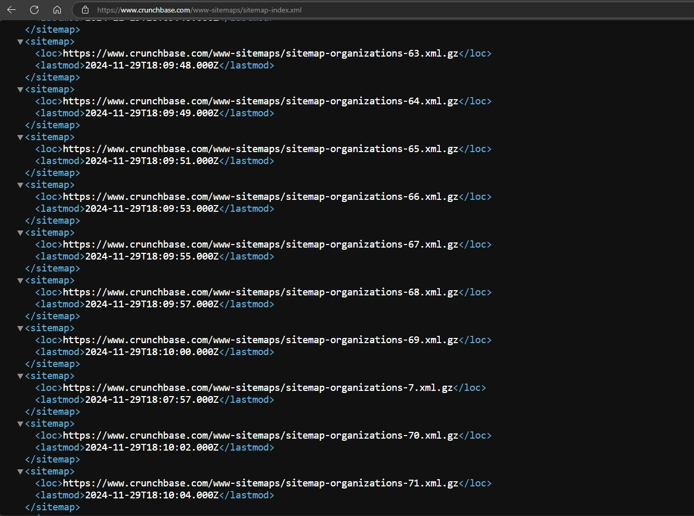
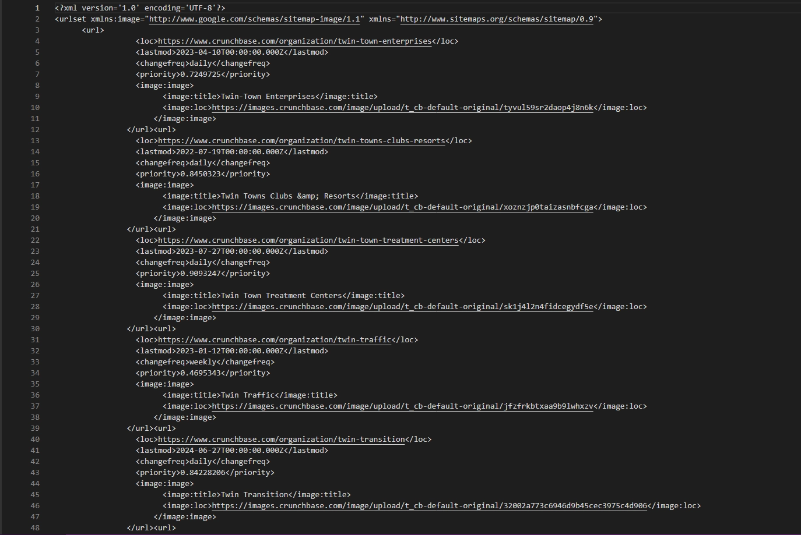
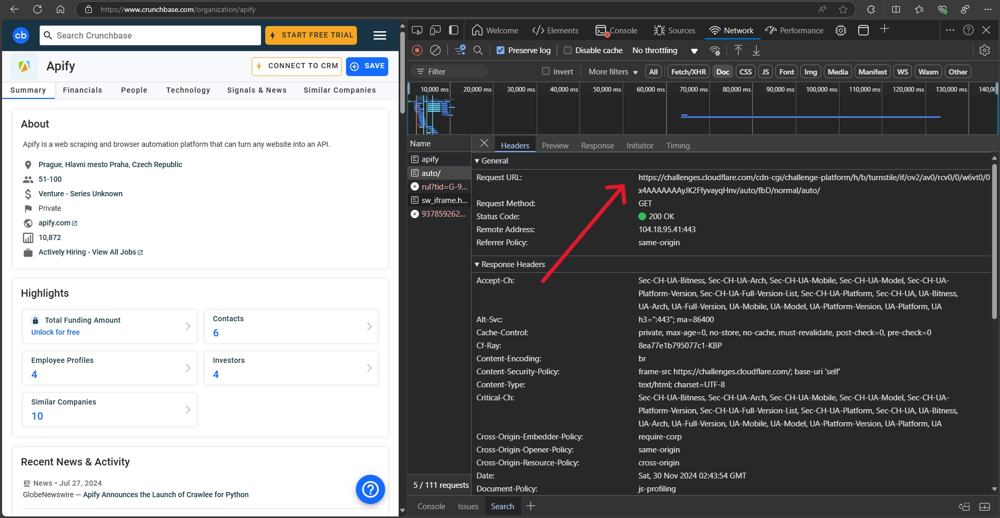
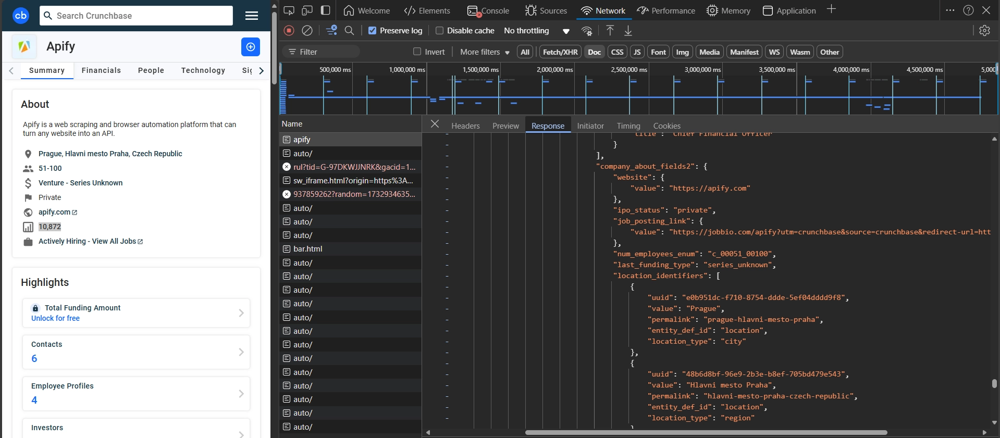
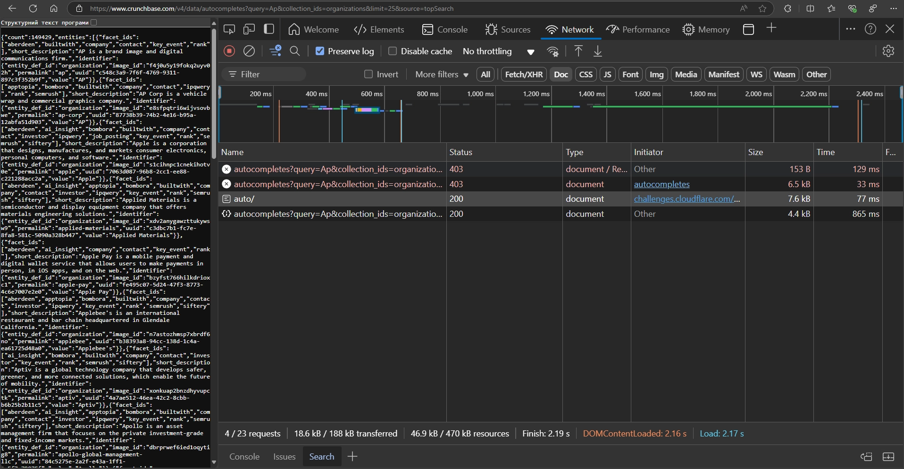

Python developers know the drill: you need reliable company data, and Crunchbase has it. This guide shows you how to build an effective [Crunchbase](https://www.crunchbase.com/) scraper in Python that gets you the data you need.

Crunchbase tracks details that matter: locations, business focus, founders, and investment histories. Manual extraction from such a large dataset isn't practical -automation is essential for transforming this information into an analyzable format.

By the end of this blog, we'll explore three different ways to extract data from Crunchbase using [`Crawlee for Python`](https://github.com/apify/crawlee-python). We'll fully implement two of them and discuss the specifics and challenges of the third. This will help us better understand how important it is to properly [choose the right data source](https://www.crawlee.dev/blog/web-scraping-tips#1-choosing-a-data-source-for-the-project).

:::note

This guide comes from a developer in our growing community. Have you built interesting projects with Crawlee? Join us on [Discord](https://discord.com/invite/jyEM2PRvMU) to share your experiences and blog ideas - we value these contributions from developers like you.

:::


Key steps we'll cover:

1. Project setup
2. Choosing the data source
3. Implementing sitemap-based crawler
4. Analysis of search-based approach and its limitations
5. Implementing the official API crawler
6. Conclusion and repository access

<!-- truncate -->

## Prerequisites

- Python 3.7 or higher
- Familiarity with web scraping concepts
- Crawlee for Python `v0.5.0`

### Project setup

Before we start scraping, we need to set up our project. In this guide, we won't be using crawler templates (`Playwright` and `Beautifulsoup`), so we'll set up the project manually.

1. Install [`Poetry`](https://python-poetry.org/)

    ```bash
    pipx install poetry
    ```

2. Create and navigate to the project folder.

    ```bash
    mkdir crunchbase-crawlee && cd crunchbase-crawlee
    ```

3. Initialize the project using Poetry, leaving all fields empty.

    ```bash
    poetry init
    ```

4. Add and install Crawlee with necessary dependencies to your project using `Poetry.`

    ```bash
    poetry add crawlee[parsel,curl-impersonate]
    ```

5. Complete the project setup by creating the standard file structure for `Crawlee for Python` projects.

    ```bash
    mkdir crunchbase-crawlee && touch crunchbase-crawlee/{__init__.py,__main__.py,main.py,routes.py}
    ```

After setting up the basic project structure, we can explore different methods of obtaining data from Crunchbase.

### Choosing the data source

While we can extract target data directly from the [company page](https://www.crunchbase.com/organization/apify), we need to choose the best way to navigate the site.

A careful examination of Crunchbase's structure shows that we have three main options for obtaining data:

1. [`Sitemap`](https://www.crunchbase.com/www-sitemaps/sitemap-index.xml) - for complete site traversal.
2. [`Search`](https://www.crunchbase.com/discover/organization.companies) - for targeted data collection.
3. [Official API](https://data.crunchbase.com/v4-legacy/docs/crunchbase-basic-getting-started) - recommended method.

Let's examine each of these approaches in detail.

## Scraping Crunchbase using sitemap and Crawlee for Python

`Sitemap` is a standard way of site navigation used by crawlers like [`Google`](https://google.com/), [`Ahrefs`](https://ahrefs.com/), and other search engines. All crawlers must follow the rules described in [`robots.txt`](https://www.crunchbase.com/robots.txt).

Let's look at the structure of Crunchbase's Sitemap:



As you can see, links to organization pages are located inside second-level `Sitemap` files, which are compressed using `gzip`.

The structure of one of these files looks like this:



The `lastmod` field is particularly important here. It allows tracking which companies have updated their information since the previous data collection. This is especially useful for regular data updates.

### 1. Configuring the crawler for scraping

To work with the site, we'll use [`CurlImpersonateHttpClient`](https://www.crawlee.dev/python/api/class/CurlImpersonateHttpClient), which impersonates a `Safari` browser. While this choice might seem unexpected for working with a sitemap, it's necessitated by Crunchbase's protection features.

The reason is that Crunchbase uses [Cloudflare](https://www.cloudflare.com/) to protect against automated access. This is clearly visible when analyzing traffic on a company page:



An interesting feature is that `challenges.cloudflare` is executed after loading the document with data. This means we receive the data first, and only then JavaScript checks if we're a bot. If our HTTP client's fingerprint is sufficiently similar to a real browser, we'll successfully receive the data.

Cloudflare [also analyzes traffic at the sitemap level](https://developers.cloudflare.com/waf/custom-rules/use-cases/allow-traffic-from-verified-bots/). If our crawler doesn't look legitimate, access will be blocked. That's why we impersonate a real browser.

To prevent blocks due to overly aggressive crawling, we'll configure [`ConcurrencySettings`](https://www.crawlee.dev/python/api/class/ConcurrencySettings).

When scaling this approach, you'll likely need proxies. Detailed information about proxy setup can be found in the [documentation](https://crawlee.dev/python/docs/guides/proxy-management).

We'll save our scraping results in `JSON` format. Here's how the basic crawler configuration looks:

```python
# main.py

from crawlee.crawlers import ParselCrawler
from crawlee.http_clients import CurlImpersonateHttpClient
from crawlee import ConcurrencySettings, HttpHeaders

async def main() -> None:
    """The crawler entry point."""

    concurrency_settings = ConcurrencySettings(max_concurrency=1, max_tasks_per_minute=50)

    http_client = CurlImpersonateHttpClient(impersonate="safari17_0",
                                            headers=HttpHeaders({
                                                "accept-language": "en",
                                                "accept-encoding": "gzip, deflate, br, zstd",
                                                }))
    crawler = ParselCrawler(
        request_handler=router,
        max_request_retries=1,
        concurrency_settings=concurrency_settings,
        http_client=http_client,
        max_requests_per_crawl=30,
    )

    await crawler.run(['https://www.crunchbase.com/www-sitemaps/sitemap-index.xml'])

    await crawler.export_data_json("crunchbase_data.json")
```

### 2. Implementing sitemap navigation

Sitemap navigation happens in two stages. In the first stage, we need to get a list of all files containing organization information:

```python
# routes.py

from crawlee.crawlers import ParselCrawlingContext
from crawlee.router import Router
from crawlee import Request

router = Router[ParselCrawlingContext]()


@router.default_handler
async def default_handler(context: ParselCrawlingContext) -> None:
    """Default request handler."""
    context.log.info(f'default_handler processing {context.request} ...')

    requests = [Request.from_url(url, label='sitemap') for url in context.selector.xpath('//loc[contains(., "sitemap-organizations")]/text()').getall()]

    await context.add_requests(requests, limit=1) # Since this is a tutorial, I don't want to upload more than one sitemap link
```

In the second stage, we process second-level sitemap files stored in `gzip` format. This requires a special approach as the data needs to be decompressed first:

```python
# routes.py

from gzip import decompress
from parsel import Selector

@router.handler('sitemap')
async def sitemap_handler(context: ParselCrawlingContext) -> None:
    """Sitemap gzip request handler."""
    context.log.info(f'sitemap_handler processing {context.request.url} ...')

    data = context.http_response.read()
    data = decompress(data)

    selector = Selector(data.decode())

    requests = [Request.from_url(url, label='company') for url in selector.xpath('//loc/text()').getall()]

    await context.add_requests(requests)
```

### 3. Extracting and saving data

Each company page contains a large amount of information. For demonstration purposes, we'll focus on the main fields: `Company Name`, `Short Description`, `Website`, and `Location`.

One of Crunchbase's advantages is that all data is stored in `JSON` format within the page:



This significantly simplifies data extraction - we only need to use one `Xpath` selector to get the `JSON`, and then apply [`jmespath`](https://jmespath.org/) to extract the needed fields:

```python
# routes.py

@router.handler('company')
async def company_handler(context: ParselCrawlingContext) -> None:
    """Company request handler."""
    context.log.info(f'company_handler processing {context.request.url} ...')

    json_selector = context.selector.xpath('//*[@id="ng-state"]/text()')

    await context.push_data({
        "Company Name": json_selector.jmespath('HttpState.*.data[].properties.identifier.value').get(),
        "Short Description": json_selector.jmespath('HttpState.*.data[].properties.short_description').get(),
        "Website": json_selector.jmespath('HttpState.*.data[].cards.company_about_fields2.website.value').get(),
        "Location": "; ".join(json_selector.jmespath('HttpState.*.data[].cards.company_about_fields2.location_identifiers[].value').getall()),
    })
```

The collected data is saved in `Crawlee for Python`'s internal storage using the `context.push_data` method. When the crawler finishes, we export all collected data to a JSON file:

```python
# main.py

await crawler.export_data_json("crunchbase_data.json")
```

### 4. Finally, characteristics of using the sitemap crawler

The sitemap approach has its distinct advantages and limitations. It's ideal in the following cases:

- When you need to collect data about all companies on the platform
- When there are no specific company selection criteria
- If you have sufficient time and computational resources

However, there are significant limitations to consider:

- Almost no ability to filter data during collection
- Requires constant monitoring of Cloudflare blocks
- Scaling the solution requires proxy servers, which increases project costs

## Using search for scraping Crunchbase

The limitations of the sitemap approach might point to search as the next solution. However, Crunchbase applies tighter security measures to its search functionality compared to its public pages.

The key difference lies in how Cloudflare protection works. While we receive data before the `challenges.cloudflare` check when accessing a company page, the search API requires valid `cookies` that have passed this check.

Let's verify this in practice. Open the following link in Incognito mode:

```plaintext
<https://www.crunchbase.com/v4/data/autocompletes?query=Ap&collection_ids=organizations&limit=25&source=topSearch>
```

When analyzing the traffic, we'll see the following pattern:



The sequence of events here is:

1. First, the page is blocked with code `403`
2. Then the `challenges.cloudflare` check is performed
3. Only after successfully passing the check do we receive data with code `200`

Automating this process would require a `headless` browser capable of bypassing [`Cloudflare Turnstile`](https://www.cloudflare.com/application-services/products/turnstile/). The current version of `Crawlee for Python` (v0.5.0) doesn't provide this functionality, although it's planned for future development.

You can extend the capabilities of Crawlee for Python by integrating [`Camoufox`](https://camoufox.com/) following this [example.](https://www.crawlee.dev/python/docs/examples/playwright-crawler-with-camoufox)

## Working with the official Crunchbase API

Crunchbase provides a [free API](https://data.crunchbase.com/v4-legacy/docs/crunchbase-basic-using-api) with basic functionality. Paid subscription users get expanded data access. Complete documentation for available endpoints can be found in the [official API specification](https://app.swaggerhub.com/apis-docs/Crunchbase/crunchbase-enterprise_api).

### 1. Setting up API access

To start working with the API, follow these steps:

1. [Create a Crunchbase account](https://www.crunchbase.com/register)
2. Go to the Integrations section
3. Create a Crunchbase Basic API key

Although the documentation states that key activation may take up to an hour, it usually starts working immediately after creation.

### 2. Configuring the crawler for API work

An important API feature is the limit - no more than 200 requests per minute, but in the free version, this number is significantly lower. Taking this into account, let's configure [`ConcurrencySettings`](https://www.crawlee.dev/python/api/class/ConcurrencySettings). Since we're working with the official API, we don't need to mask our HTTP client. We'll use the standard ['HttpxHttpClient'](https://crawlee.dev/python/api/class/HttpxHttpClient) with preset headers.

First, let's save the API key in an environment variable:

```bash
export CRUNCHBASE_TOKEN={YOUR KEY}
```

Here's how the crawler configuration for working with the API looks:

```python
# main.py

import os

from crawlee.crawlers import HttpCrawler
from crawlee.http_clients import HttpxHttpClient
from crawlee import ConcurrencySettings, HttpHeaders

from .routes import router

CRUNCHBASE_TOKEN = os.getenv("CRUNCHBASE_TOKEN", "")

async def main() -> None:
    """The crawler entry point."""

    concurrency_settings = ConcurrencySettings(max_tasks_per_minute=60)

    http_client = HttpxHttpClient(headers=HttpHeaders({
        "accept-encoding": "gzip, deflate, br, zstd",
        "X-cb-user-key": CRUNCHBASE_TOKEN
        }))
    crawler = HttpCrawler(
        request_handler=router,
        concurrency_settings=concurrency_settings,
        http_client=http_client,
        max_requests_per_crawl=30,
    )

    await crawler.run(['https://api.crunchbase.com/api/v4/autocompletes?query=apify&collection_ids=organizations&limit=25'])

    await crawler.export_data_json("crunchbase_data.json")
```

### 3. Processing search results

For working with the API, we'll need two main endpoints:

1. [get_autocompletes](https://app.swaggerhub.com/apis-docs/Crunchbase/crunchbase-enterprise_api/1.0.3#/Autocomplete/get_autocompletes) - for searching
2. [get_entities_organizations__entity_id](https://app.swaggerhub.com/apis-docs/Crunchbase/crunchbase-enterprise_api/1.0.3#/Entity/get_entities_organizations__entity_id_) - for getting data

First, let's implement search results processing:

```python
import json

from crawlee.crawlers import HttpCrawler
from crawlee.router import Router
from crawlee import Request

router = Router[HttpCrawlingContext]()

@router.default_handler
async def default_handler(context: HttpCrawlingContext) -> None:
    """Default request handler."""
    context.log.info(f'default_handler processing {context.request.url} ...')

    data = json.loads(context.http_response.read())

    requests = []

    for entity in data['entities']:
        permalink = entity["identifier"]["permalink"]
        requests.append(
            Request.from_url(
                url=f"https://api.crunchbase.com/api/v4/entities/organizations/{permalink}?field_ids=short_description%2Clocation_identifiers%2Cwebsite_url",
                label='company'
            )
        )

    await context.add_requests(requests)
```

### 4. Extracting company data

After getting the list of companies, we extract detailed information about each one:

```python
@router.handler('company')
async def company_handler(context: HttpCrawlingContext) -> None:
    """Company request handler."""
    context.log.info(f'company_handler processing {context.request.url} ...')

    data = json.loads(context.http_response.read())

    await context.push_data({
        "Company Name": data['properties']["identifier"]["value"],
        "Short Description": data['properties']["short_description"],
        "Website": data['properties'].get("website_url"),
        "Location": "; ".join([item["value"] for item in data['properties'].get("location_identifiers", [])]),
    })
```

### 5. Advanced location-based search

If you need more flexible search capabilities, the API provides a special [`search`](https://app.swaggerhub.com/apis-docs/Crunchbase/crunchbase-enterprise_api/1.0.3#/Search/post_searches_organizations) endpoint. Here's an example of searching for all companies in Prague:

```python
payload = {
    'field_ids': [
        'identifier',
        'location_identifiers',
        'short_description',
        'website_url'
    ],
    'limit': 200,
    'order': [{'field_id': 'rank_org', 'sort': 'asc'}],
    'query': [
        {
            'field_id': 'location_identifiers',
            'operator_id': 'includes',
            'type': 'predicate',
            'values': ['e0b951dc-f710-8754-ddde-5ef04dddd9f8']
        },
        {
            'field_id': 'facet_ids',
            'operator_id': 'includes',
            'type': 'predicate',
            'values': ['company']
        }
    ]
}

serialiazed_payload = json.dumps(payload)
await crawler.run([
    Request.from_url(
        url="https://api.crunchbase.com/api/v4/searches/organizations",
        method="POST",
        payload=serialiazed_payload,
        use_extended_unique_key=True,
        headers=HttpHeaders({'Content-Type': 'application/json'}),
        label="search"
    )
])
```

For processing search results and pagination, we use the following handler:

```python
@router.handler('search')
async def search_handler(context: HttpCrawlingContext) -> None:
    """Search results handler with pagination support."""
    context.log.info(f'search_handler processing {context.request.url} ...')

    data = json.loads(context.http_response.read())

    last_entity = None
    results = []

    for entity in data['entities']:
        last_entity = entity['uuid']
        results.append({
            "Company Name": entity['properties']["identifier"]["value"],
            "Short Description": entity['properties']["short_description"],
            "Website": entity['properties'].get("website_url"),
            "Location": "; ".join([item["value"] for item in entity['properties'].get("location_identifiers", [])]),
        })

    if results:
        await context.push_data(results)

    if last_entity:
        payload = json.loads(context.request.payload)
        payload["after_id"] = last_entity
        payload = json.dumps(payload)

        await context.add_requests([
            Request.from_url(
                url="https://api.crunchbase.com/api/v4/searches/organizations",
                method="POST",
                payload=payload,
                use_extended_unique_key=True,
                headers=HttpHeaders({'Content-Type': 'application/json'}),
                label="search"
            )
        ])
```

### 6. Finally, free API limitations

The free version of the API has significant limitations:

- Limited set of available endpoints
- Autocompletes function only works for company searches
- Not all data fields are accessible
- Limited search filtering capabilities

Consider a paid subscription for production-level work. The API provides the most reliable way to access Crunchbase data, even with its rate constraints.

## What’s your best path forward?

We've explored three different approaches to obtaining data from Crunchbase:

1. **Sitemap** - for large-scale data collection
2. **Search** - difficult to automate due to Cloudflare protection
3. **Official API** - the most reliable solution for commercial projects

Each method has its advantages, but for most projects, I recommend using the official API despite its limitations in the free version.

The complete source code is available in my [repository](https://github.com/Mantisus/crunchbase-crawlee). Have questions or want to discuss implementation details? Join our [Discord](https://discord.com/invite/jyEM2PRvMU) - our community of developers is there to help.
