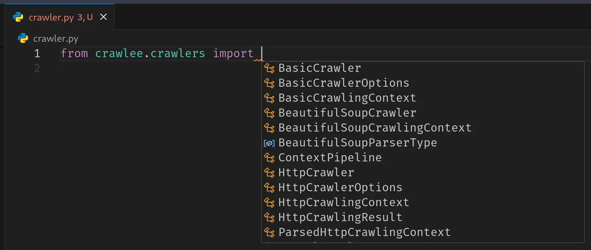

Crawlee for Python v0.5 is now available! This is our biggest release to date, bringing new ported functionality from the [Crawlee for JavaScript](https://github.com/apify/crawlee), brand-new features that are exclusive to the Python library (for now), a new consolidated package structure, and a bunch of bug fixes and further improvements.

## Getting started

You can upgrade to the latest version straight from [PyPI](https://pypi.org/project/crawlee/):

```shell
pip install --upgrade crawlee
```

Check out the full changelog on our [website](https://www.crawlee.dev/python/docs/changelog#050-2025-01-02) to see all the details. If you are updating from an older version, make sure to follow our [Upgrading to v0.5](https://www.crawlee.dev/python/docs/upgrading/upgrading-to-v0x#upgrading-to-v05) guide for a smooth upgrade.

## New package structure

We have introduced a new consolidated package structure. The goal is to streamline the development experience, help you find the crawlers you are looking for faster, and improve the IDE's code suggestions while importing.

### Crawlers

We have grouped all crawler classes (and their corresponding crawling context classes) into a single sub-package called `crawlers`. Here is a quick example of how the imports have changed:

```diff
- from crawlee.beautifulsoup_crawler import BeautifulSoupCrawler, BeautifulSoupCrawlingContext
+ from crawlee.crawlers import BeautifulSoupCrawler, BeautifulSoupCrawlingContext
```

Look how you can see all the crawlers that we have, isn't that cool!



### Storage clients

Similarly, we have moved all storage client classes under `storage_clients` sub-package. For instance:

```diff
- from crawlee.memory_storage_client import MemoryStorageClient
+ from crawlee.storage_clients import MemoryStorageClient
```

This consolidation makes it clearer where each class belongs and ensures that your IDE can provide better autocompletion when you are looking for the right crawler or storage client.

## Continued parity with Crawlee JS

We are constantly working toward feature parity with our JavaScript library, [Crawlee JS](https://github.com/apify/crawlee). With v0.5, we have brought over more functionality:

### HTML to text context helper

The `html_to_text` crawling context helper simplifies extracting text from an HTML page by automatically removing all tags and returning only the raw text content. It's available in the [`ParselCrawlingContext`](https://www.crawlee.dev/python/api/class/ParselCrawlingContext#html_to_text) and [`BeautifulSoupCrawlingContext`](https://www.crawlee.dev/python/api/class/BeautifulSoupCrawlingContext#html_to_text).

```python
import asyncio

from crawlee.crawlers import ParselCrawler, ParselCrawlingContext


async def main() -> None:
    crawler = ParselCrawler()

    @crawler.router.default_handler
    async def handler(context: ParselCrawlingContext) -> None:
        context.log.info('Crawling: %s', context.request.url)
        text = context.html_to_text()
        # Continue with the processing...

    await crawler.run(['https://crawlee.dev'])


if __name__ == '__main__':
    asyncio.run(main())
```

In this example, we use a [`ParselCrawler`](https://www.crawlee.dev/python/api/class/ParselCrawler) to fetch a webpage, then invoke `context.html_to_text()` to extract clean text for further processing.

### Use state

The [`use_state`](https://www.crawlee.dev/python/api/class/UseStateFunction) crawling context helper makes it simple to create and manage persistent state values within your crawler. It ensures that all state values are automatically persisted. It enables you to maintain data across different crawler runs, restarts, and failures. It acts as a convenient abstraction for interaction with [`KeyValueStore`](https://www.crawlee.dev/python/api/class/KeyValueStore).

```python
import asyncio

from crawlee import Request
from crawlee.configuration import Configuration
from crawlee.crawlers import ParselCrawler, ParselCrawlingContext


async def main() -> None:
    # Create a crawler with purge_on_start disabled to retain state across runs.
    crawler = ParselCrawler(
        configuration=Configuration(purge_on_start=False),
    )

    @crawler.router.default_handler
    async def handler(context: ParselCrawlingContext) -> None:
        context.log.info(f'Crawling {context.request.url}')

        # Retrieve or initialize the state with a default value.
        state = await context.use_state('state', default_value={'runs': 0})

        # Increment the run count.
        state['runs'] += 1

    # Create a request with always_enqueue enabled to bypass deduplication and ensure it is processed.
    request = Request.from_url('https://crawlee.dev/', always_enqueue=True)

    # Run the crawler with the start request.
    await crawler.run([request])

    # Fetch the persisted state from the key-value store.
    kvs = await crawler.get_key_value_store()
    state = await kvs.get_auto_saved_value('state')
    crawler.log.info(f'Final state after run: {state}')


if __name__ == '__main__':
    asyncio.run(main())
```

Please note that the `use_state` is an experimental feature. Its behavior and interface may evolve in future versions.

## Brand new features

In addition to porting features from JS, we are introducing new, Python-first functionalities that will eventually make their way into Crawlee JS in the coming months.

### Crawler's stop method

The [`BasicCrawler`](https://www.crawlee.dev/python/api/class/BasicCrawler), and by extension, all crawlers that inherit from it, now has a [`stop`](https://www.crawlee.dev/python/api/class/BasicCrawler#stop) method. This makes it easy to halt the crawling when a specific condition is met, for instance, if you have found the data you were looking for.

```python
import asyncio

from crawlee.crawlers import ParselCrawler, ParselCrawlingContext


async def main() -> None:
    crawler = ParselCrawler()

    @crawler.router.default_handler
    async def handler(context: ParselCrawlingContext) -> None:
        context.log.info('Crawling: %s', context.request.url)

        # Extract and enqueue links from the page.
        await context.enqueue_links()

        title = context.selector.css('title::text').get()

        # Condition when you want to stop the crawler, e.g. you
        # have found what you were looking for.
        if 'Crawlee for Python' in title:
            context.log.info('Condition met, stopping the crawler.')
            await crawler.stop()

    await crawler.run(['https://crawlee.dev'])


if __name__ == '__main__':
    asyncio.run(main())
```

### Request loaders

There are new classes [`RequestLoader`](https://www.crawlee.dev/python/api/class/RequestLoader), [`RequestManager`](https://www.crawlee.dev/python/api/class/RequestManager) and [`RequestManagerTandem`](https://www.crawlee.dev/python/api/class/RequestManagerTandem) that manage how Crawlee accesses and stores requests. They allow you to use other component (service) as a source for requests and optionally you can combine it with a [`RequestQueue`](https://www.crawlee.dev/python/api/class/RequestQueue). They let you plug in any request source, and combine the external data sources with Crawlee's standard `RequestQueue`.

<!-- TODO: uncoment this, once the guide is ready -->
<!-- You can learn more about these new features in the [Request loaders guide](https://www.crawlee.dev/python/docs/guides/request-loaders). -->

```python
import asyncio

from crawlee.crawlers import ParselCrawler, ParselCrawlingContext
from crawlee.request_loaders import RequestList, RequestManagerTandem
from crawlee.storages import RequestQueue


async def main() -> None:
    rl = RequestList(
        [
            'https://crawlee.dev',
            'https://apify.com',
            # Long list of URLs...
        ],
    )

    rq = await RequestQueue.open()

    # Combine them into a single request source.
    tandem = RequestManagerTandem(rl, rq)

    crawler = ParselCrawler(request_manager=tandem)

    @crawler.router.default_handler
    async def handler(context: ParselCrawlingContext) -> None:
        context.log.info(f'Crawling {context.request.url}')
        # ...

    await crawler.run()


if __name__ == '__main__':
    asyncio.run(main())
```

In this example we combine a [`RequestList`](https://www.crawlee.dev/python/api/class/RequestList) with a [`RequestQueue`](https://www.crawlee.dev/python/api/class/RequestQueue). However, instead of the `RequestList` you can use any other class that implements the [`RequestLoader`](https://www.crawlee.dev/python/api/class/RequestLoader) interface to suit your specific requirements.

### Service locator

The [`ServiceLocator`](https://www.crawlee.dev/python/api/class/ServiceLocator) is primarily an internal mechanism for managing the services that Crawlee depends on. Specifically, the [`Configuration`](https://www.crawlee.dev/python/api/class/ServiceLocator), [`StorageClient`](https://www.crawlee.dev/python/api/class/ServiceLocator), and [`EventManager`](https://www.crawlee.dev/python/api/class/ServiceLocator). By swapping out these components, you can adapt Crawlee to suit different runtime environments.

You can use the service locator explicitly:

```python
import asyncio

from crawlee import service_locator
from crawlee.configuration import Configuration
from crawlee.crawlers import ParselCrawler, ParselCrawlingContext
from crawlee.events import LocalEventManager
from crawlee.storage_clients import MemoryStorageClient


async def main() -> None:
    service_locator.set_configuration(Configuration())
    service_locator.set_storage_client(MemoryStorageClient())
    service_locator.set_event_manager(LocalEventManager())

    crawler = ParselCrawler()

    # ...


if __name__ == '__main__':
    asyncio.run(main())
```

Or pass the services directly to the crawler instance, and they will be set under the hood:

```python
import asyncio

from crawlee.configuration import Configuration
from crawlee.crawlers import ParselCrawler, ParselCrawlingContext
from crawlee.events import LocalEventManager
from crawlee.storage_clients import MemoryStorageClient


async def main() -> None:
    crawler = ParselCrawler(
        configuration=Configuration(),
        storage_client=MemoryStorageClient(),
        event_manager=LocalEventManager(),
    )

    # ...


if __name__ == '__main__':
    asyncio.run(main())
```

## Conclusion

We are excited to share that Crawlee v0.5 is here. If you have any questions or feedback, please open a [GitHub discussion](https://github.com/apify/crawlee-python/discussions). If you encounter any bugs, or have an idea for a new feature, please open a [GitHub issue](https://github.com/apify/crawlee-python/issues).
