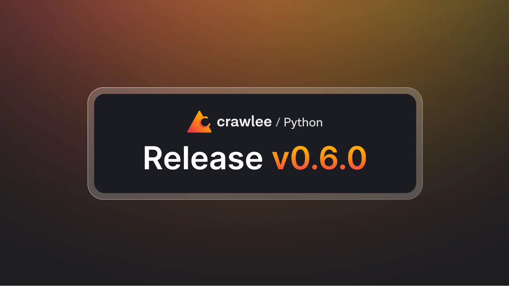

Crawlee for Python v0.6 is here, and it's packed with new features, important bug fixes, and some breaking improvements designed to streamline your Crawlee experience. If you're upgrading from a previous version, please take a moment to review the breaking changes detailed below to ensure a smooth transition.



<!-- truncate -->

## Getting started

You can upgrade to the latest version straight from [PyPI](https://www.pypi.org/project/crawlee/):

```shell
pip install --upgrade crawlee
```

Check out the full changelog on our [website](https://www.crawlee.dev/python/docs/changelog#060-2025-03-03) to see all the details. If you are updating from an older version, make sure to follow our [Upgrading to v0.6](https://www.crawlee.dev/python/docs/upgrading/upgrading-to-v0x#upgrading-to-v06) guide.

## Adaptive Playwright crawler

The new [`AdaptivePlaywrightCrawler`](https://www.crawlee.dev/python/api/class/AdaptivePlaywrightCrawler) is a hybrid solution that combines the best of two worlds: full browser rendering with [Playwright](https://www.playwright.dev/) and lightweight HTTP-based crawling (using, for example, [`BeautifulSoupCrawler`](https://www.crawlee.dev/python/api/class/BeautifulSoupCrawler) or [`ParselCrawler`](https://www.crawlee.dev/python/api/class/ParselCrawler)). It automatically switches between the two methods based on real-time analysis of the target page, helping you achieve lower crawl costs and improved performance when crawling a variety of websites.

The example below demonstrates how the `AdaptivePlaywrightCrawler` can handle both static and dynamic content.

```python
import asyncio
from datetime import timedelta

from crawlee.crawlers import AdaptivePlaywrightCrawler, AdaptivePlaywrightCrawlingContext


async def main() -> None:
    crawler = AdaptivePlaywrightCrawler.with_beautifulsoup_static_parser(
        max_requests_per_crawl=5,
        playwright_crawler_specific_kwargs={'browser_type': 'chromium'},
    )

    @crawler.router.default_handler
    async def request_handler(context: AdaptivePlaywrightCrawlingContext) -> None:
        # Do some processing using `parsed_content`
        context.log.info(context.parsed_content.title)

        # Locate element h2 within 5 seconds
        h2 = await context.query_selector_one('h2', timedelta(milliseconds=5000))
        # Do stuff with element found by the selector
        context.log.info(h2)

        # Find more links and enqueue them.
        await context.enqueue_links()
        # Save some data.
        await context.push_data({'Visited url': context.request.url})

    await crawler.run(['https://www.crawlee.dev/'])


if __name__ == '__main__':
    asyncio.run(main())
```

Check out our [Adaptive Playwright crawler guide](https://www.crawlee.dev/python/docs/guides/adaptive-playwright-crawler) for more details on how to use this new crawler.

## Browserforge fingerprints

To help you avoid detection and blocking, Crawlee now integrates the [browserforge](https://www.github.com/daijro/browserforge) library - intelligent browser header & fingerprint generator. This feature simulates real browser behavior by automatically randomizing HTTP headers and fingerprints, making your crawling sessions significantly more resilient against anti-bot measures.

With [browserforge](https://www.github.com/daijro/browserforge) fingerprints enabled by default, your crawler sends realistic HTTP headers and user-agent strings. HTTP-based crawlers, which use [`HttpxHttpClient`](https://www.crawlee.dev/python/api/class/HttpxHttpClient) by default benefit from these adjustments, while the [`CurlImpersonateHttpClient`](https://www.crawlee.dev/python/api/class/CurlImpersonateHttpClient) employs its own stealthy techniques. The [`PlaywrightCrawler`](https://www.crawlee.dev/python/docs/guides/playwright-crawler) adjusts HTTP headers and browser fingerprints accordingly. Together, these improvements make your crawlers much harder to detect.

Below is an example of using `PlaywrightCrawler`, which now benefits from the [browserforge](https://www.github.com/daijro/browserforge) library:

```python
import asyncio

from crawlee.crawlers import PlaywrightCrawler, PlaywrightCrawlingContext


async def main() -> None:
    # The browserforge fingerprints and headers are used by default.
    crawler = PlaywrightCrawler()

    @crawler.router.default_handler
    async def handler(context: PlaywrightCrawlingContext) -> None:
        url = context.request.url
        context.log.info(f'Crawling URL: {url}')

        # Decode and log the response body, which contains the headers we sent.
        headers = (await context.response.body()).decode()
        context.log.info(f'Response headers: {headers}')

        # Extract and log the User-Agent and UA data used in the browser context.
        ua = await context.page.evaluate('() => window.navigator.userAgent')
        ua_data = await context.page.evaluate('() => window.navigator.userAgentData')
        context.log.info(f'Navigator user-agent: {ua}')
        context.log.info(f'Navigator user-agent data: {ua_data}')

    # The endpoint httpbin.org/headers returns the request headers in the response body.
    await crawler.run(['https://www.httpbin.org/headers'])


if __name__ == '__main__':
    asyncio.run(main())
```

For further details on utilizing [browserforge](https://www.github.com/daijro/browserforge) to avoid blocking, please refer to our [Avoid getting blocked guide](https://www.crawlee.dev/python/docs/guides/avoid-blocking).

## CLI dependencies

In v0.6, we've reduced the size of the core package by moving CLI (template creation) dependencies to optional extras. This change reduces the package footprint, keeping the base installation lightweight. To use Crawlee's CLI for creating new projects, simply install the package with the CLI extras.

For example, to create a new project from a template using `pipx`, run:

```shell
pipx run 'crawlee[cli]' create my-crawler
```

Or with `uvx`:

```shell
uvx 'crawlee[cli]' create my-crawler
```

This change ensures that while the core package remains lean, you can still opt in to CLI functionality when bootstrapping new projects.

## Conclusion

We are excited to share that Crawlee v0.6 is here. If you have any questions or feedback, please open a [GitHub discussion](https://www.github.com/apify/crawlee-python/discussions). If you encounter any bugs, or have an idea for a new feature, please open a [GitHub issue](https://www.github.com/apify/crawlee-python/issues).
