Build a price tracker with Crawlee for Python to scrape product details, export data in multiple formats, and send email alerts for price drops, then deploy and schedule it as an Apify Actor.

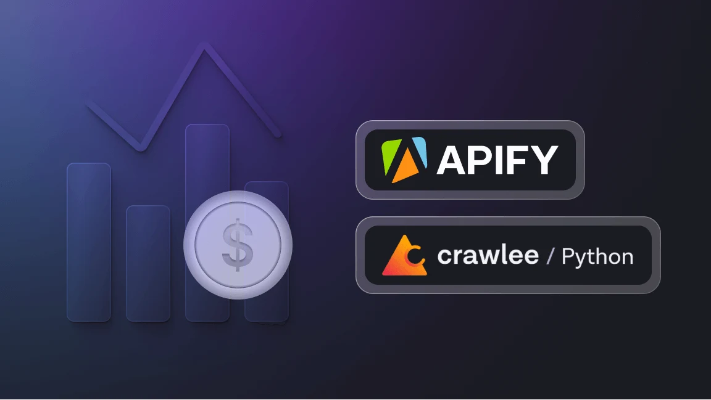

<!-- truncate -->

In this tutorial, we’ll build a price tracker using Crawlee for Python and Apify. By the end, you’ll have an Apify Actor that scrapes product details from a webpage, exports the data in various formats (CSV, Excel, JSON, and more), and sends an email alert when the product’s price falls below your specified threshold.

## 1. Project Setup
Our first step is to install the [Apify CLI](https://docs.apify.com/cli/docs). You can do this using either Homebrew or NPM with the following commands:
s
### Homebrew
```Bash
brew install apify-cli
```
### Via NPM
```Bash
npm -g install apify-cli
```

Next, let’s run the following commands to use one of Apify’s pre-built templates. This will streamline the setup process and get us coding right away:

```Bash
apify create price-tracking-actor
```

A dropdown list will appear. To follow along with this tutorial, select **`Python`** and **`Crawlee + BeautifulSoup`** `template`. Once the template is installed, navigate to the newly created folder and open it in your preferred IDE.

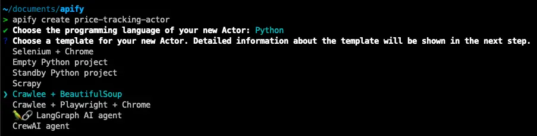

Navigate to **`src/main.py`** in your project, and you’ll find that a significant amount of boilerplate code has already been generated for you. If you’re new to Apify or Crawlee, don’t worry, it’s not as complex as it might seem. This pre-written code is designed to save you time and streamline your development process.

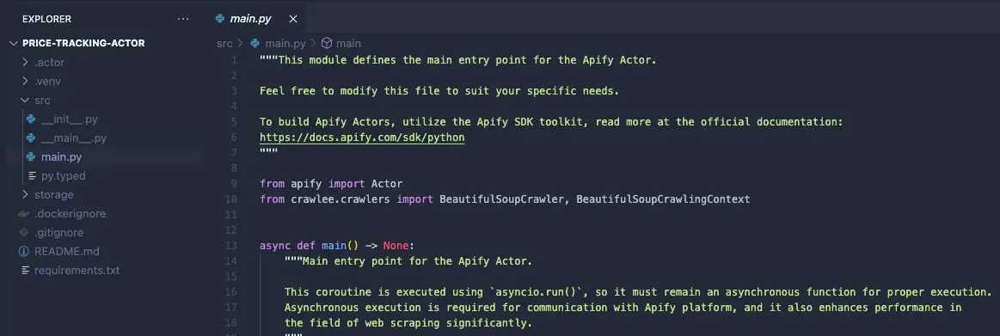

In fact, this template comes with fully functional code that scrapes the Apify homepage. To test it out, simply run the command **`apify run`**. Within a few seconds, you’ll see the **`storage/datasets`** directory populate with the scraped data in JSON format.

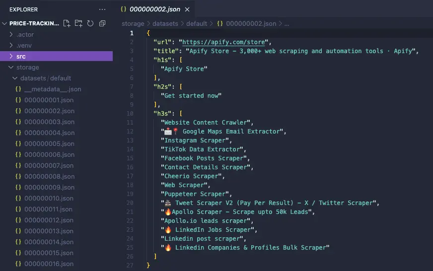


## 2. Customizing the template
Now that our project is set up, let’s customize the template to scrape our target website: [Raspberry Pi 5 (8GB RAM) on Central Computer](https://www.centralcomputer.com/raspberry-pi-5-8gb-ram-board.html).

First, on the `src/main.py` file, go to the `start_urls` list and replace the current `url` with the target website, as shown below:

```Python
start_urls = [
            url.get('url') 
            for url in actor_input.get(
                'start_urls',
                [{'url': 'https://www.centralcomputer.com/raspberry-pi-5-8gb-ram-board.html'}],
            )
        ]
```

Next, update the URL in the `storage/key_value_stores/INPUT.json` file. The Actor template prioritizes user-provided input and only defaults to the predefined URL if none is given. To ensure our code runs correctly, replace the placeholder `apify.com` with our target website.

```JSON
{
    "start_urls": [
        {
            "url": "https://www.centralcomputer.com/raspberry-pi-5-8gb-ram-board.html"
        }
    ]
}
```

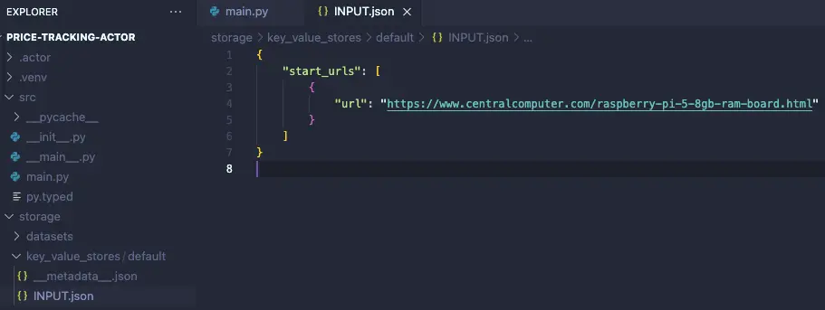

### Extracting the Product’s Name and Price

Finally, let’s modify our template to extract key elements from the page, such as the product name and price.

Starting with the **product name**, inspect the [target page](https://www.centralcomputer.com/raspberry-pi-5-8gb-ram-board.html) using DevTools to find suitable selectors for targeting the element.

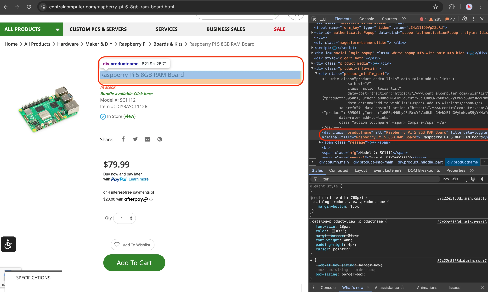

Next, create a `product_name_element` variable to hold the element selected with the CSS selectors found on the page and update the `data` dictionary with the element’s text contents. Also, remove the line of code that previously made the Actor crawl the Apify website, as we now want it to scrape only a single page.

Your `request_handler` function should look similar to the example below:

```python
@crawler.router.default_handler
async def request_handler(context: BeautifulSoupCrawlingContext) -> None:
    url = context.request.url
    Actor.log.info(f'Scraping {url}...')

    # Select the product name and price elements.
    product_name_element = context.soup.find('div', class_='productname')

    # Extract the desired data.
    data = {
        'url': context.request.url,
        'product_name': product_name_element.text.strip() if product_name_element else None,
    }

    # Store the extracted data to the default dataset.
    await context.push_data(data)

    # Enqueue additional links found on the current page.
    # await context.enqueue_links() -> REMOVE THIS LINE
```

It’s a good practice to test our code after every significant change to ensure it works as expected.

Run `apify run` again, but this time, add the `–-purge` flag to prevent the newly scraped data from mixing with previous runs:

```bash
apify run --purge
```

Navigate to `storage/datasets`, and you should find a file with the scraped content:

```json
{
    "url": "https://www.centralcomputer.com/raspberry-pi-5-8gb-ram-board.html",
    "product_name": "Raspberry Pi 5 8GB RAM Board"}
}
```

Now that you’ve got the hang of it, let’s do the same thing for the price: `79.99`.

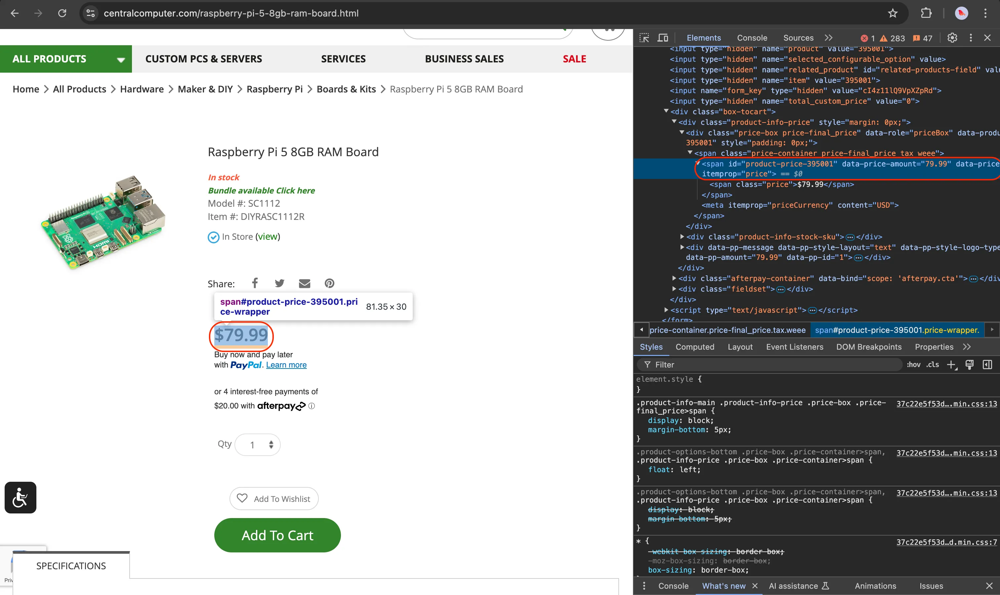

In the code below, you’ll notice a slight difference: instead of extracting the element’s text content, we’re retrieving the value of its `data-price-amount` attribute. This approach avoids capturing the dollar sign `($)` that would otherwise come with the text.

If you prefer working with text content instead, that’s perfectly fine, you can simply use `.replace('$', '')` to remove the dollar sign.

Also, keep in mind that the extracted price will be a `string` by default. To perform numerical comparisons, we need to convert it to a `float`. This conversion will allow us to accurately compare the price values later on.

Here’s how the updated code looks so far:

```python
# main.py

# ...previous code

@crawler.router.default_handler
async def request_handle(context: BeautifulSoupCrawlingContext) -> None:
    url = context.request.url
    Actor.log.info(f'Scraping {url}...')

    # Select the product name and price elements.
    product_name_element = context.soup.find('div', class_='productname')
    product_price_element = context.soup.find('span', id='product-price-395001')

    # Extract the desired data.
    data = {
        'url': context.request.url,       
        'product_name': product_name_element.text.strip() if product_name_element else None,
        'price': float(product_price_element['data-price-amount']) if product_price_element else None,
    }

    # Store the extracted data to the default dataset.
    await context.push_data(data)
```
       
Again, try running it with `apify run --purge` and check if you get a similar output as the example below:

```json
{
    "url": "https://www.centralcomputer.com/raspberry-pi-5-8gb-ram-board.html", 
    "product_name": "Raspberry Pi 5 8GB RAM Board", 
    "price": 79.99
}
```

That’s it for the extraction part! Below is the complete code we’ve written so far.

>💡 **TIP:** If you’d like to get some more practice, try scraping additional elements such as the **`model`**, **`Item #`**, or **`stock availability (In stock)`**.

```python
# main.py

from apify import Actor
from crawler.crawlers import BeautifulSoupCrawler, BeautifulSoupCrawlingContext


async def main() -> None:

    # Enter the context of the Actor.
    async with Actor:
        # Retrieve the Actor input, and use default values if not provided.
        actor_input = await Actor.get_input() or {}
        start_urls = [
            url.get('url')
            for url in actor_input.get(
                'start_urls',
                [{'url': 'https://www.centralcomputer.com/raspberry-pi-5-8gb-ram-board.html'}],
            )
        ]

        # Exit if no start URLs are provided.
        if not start_urls:
            Actor.log.info('No start URLs specified in Actor input, exiting...')
            await Actor.exit()

        # Create a crawler.
        crawler = BeautifulSoupCrawler(
            # Limit the crawl to max requests. Remove or increase it for crawling all links.
            max_requests_per_crawl=50,
        )

        # Define a request handler, which will be called for every request.
        @crawler.router.default_handler
        async def request_handler(context: BeautifulSoupCrawlingContext) -> None:
            url = context.request.url
            Actor.log.info(f'Scraping {url}...')
            
            # Select the product name and price elements.
            product_name_element = context.soup.find('div', class_='productname')
            product_price_element = context.soup.find('span', id='product-price-395001')

            # Extract the desired data.
            data = {
                'url': context.request.url,
                'product_name': product_name_element.text.strip() if product_name_element else None,
                'price': float(product_price_element['data-price-amount']) if product_price_element else None,
            }

            # Store the extracted data to the default dataset.
            await context.push_data(data)

        # Run the crawler with the starting requests.
        await crawler.run(start_urls)
```
                                                                                

## 3. Sending an Email Alert

From this point forward, you’ll need an **Apify account**. You can create one for free [here](https://console.apify.com/sign-up).

We need an Apify account because we’ll be making an API call to a pre-existing Actor from the **Apify Store,** the “Send Email Actor”, to handle notifications. Apify’s email system takes care of sending alerts, so we don’t have to worry about handling **2FA** in our automation.

```python
# main.py

# ...previous code

# Define a price threshold
price_threshold = 80

# Call the "Send Email" Actor when the price goes below the threshold            
if data['price'] < price_threshold:
    actor_run = await Actor.start(
        actor_id="apify/send-mail",
        run_input={
            "to": "your_email@email.com",
            "subject": "Python Price Alert",
            "text": f"The price of '{data['product_name']}' has dropped below ${price_threshold} and is now ${data['price']}.\n\nCheck it out here: {data['url']}",
        },
    )
    Actor.log.info(f"Email sent with run ID: {actor_run.id}")
```

In the code above, we’re using the **Apify Python SDK**, which is already included in our project, to call the “Send Email” Actor with the required input.

To make this API call work, you’ll need to log in to your Apify account from the terminal using your **`APIFY_API_TOKEN`**.

To get your **`APIFY_API_TOKEN`**, sign up for an Apify account, then navigate to **Settings → API & Integrations**, and copy your **Personal API token**.

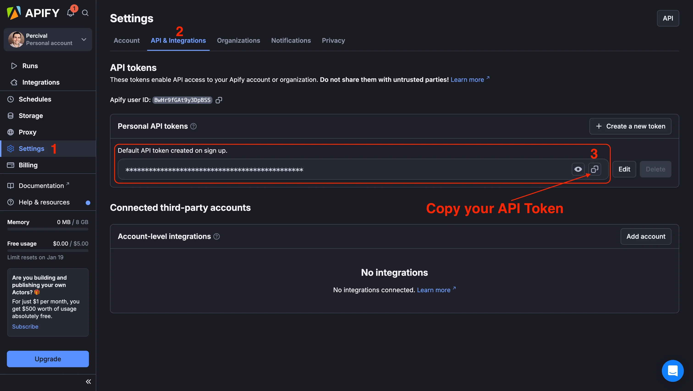

Next, enter the following command in the terminal inside your **Price Tracking Project**:

```python
apify login
```

Select `Enter API Token Manually` , paste the token you copied from your account and hit enter.

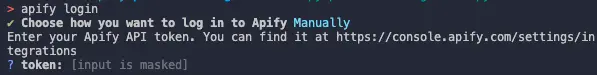

You’ll see a confirmation that you’re now logged into your Apify account. When you run the code, the API token will be automatically inferred from your account, allowing you to use the **Send Email Actor**.

If you encountered any issues, double-check that your code matches the one below:

```python
from apify import Actor
from crawlee.crawlers import BeautifulSoupCrawler, BeautifulSoupCrawlingContext


async def main() -> None:

    # Enter the context of the Actor.
    async with Actor:
        # Retrieve the Actor input, and use default values if not provided.
        actor_input = await Actor.get_input() or {}
        start_urls = [
            url.get('url')
            for url in actor_input.get(
                'start_urls',
                [{'url': 'https://www.centralcomputer.com/raspberry-pi-5-8gb-ram-board.html'}],
            )
        ]

        # Exit if no start URLs are provided.
        if not start_urls:
            Actor.log.info('No start URLs specified in Actor input, exiting...')
            await Actor.exit()

        # Create a crawler.
        crawler = BeautifulSoupCrawler(
            # Limit the crawl to max requests. Remove or increase it for crawling all links.
            max_requests_per_crawl=50,
        )

        # Define a request handler, which will be called for every request.
        @crawler.router.default_handler
        async def request_handler(context: BeautifulSoupCrawlingContext) -> None:
            url = context.request.url
            Actor.log.info(f'Scraping {url}...')
            
            # Select the product name and price elements.
            product_name_element = context.soup.find('div', class_='productname')
            product_price_element = context.soup.find('span', id='product-price-395001')

            # Extract the desired data.
            data = {
                'url': context.request.url,
                'product_name': product_name_element.text.strip() if product_name_element else None,
                'price': float(product_price_element['data-price-amount']) if product_price_element else None,
            }
            
            price_threshold = 80
            
            if data['price'] < price_threshold:
                actor_run = await Actor.start(
                    actor_id="apify/send-mail",
                    run_input={
                        "to": "your_email@gmail.com",
                        "subject": "Python Price Alert",
                        "text": f"The price of '{data['product_name']}' has dropped below ${price_threshold} and is now ${data['price']}.\n\nCheck it out here: {data['url']}",
                    },
                )
                Actor.log.info(f"Email sent with run ID: {actor_run.id}")

            # Store the extracted data to the default dataset.
            await context.push_data(data)

        # Run the crawler with the starting requests.
        await crawler.run(start_urls)
```

> 🔖 Replace the placeholder email address with your actual email, the one where you want to receive notifications. Make sure it matches the email you used to register your **Apify account**.

Then, run the code using:

```bash
apify run --purge
```

If everything works correctly, you should receive an email like the one below in your inbox.

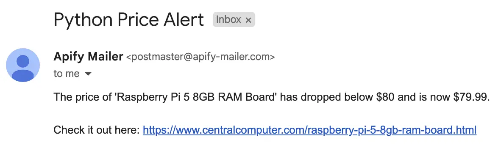


## 4. Deploying your Actor

It’s time to deploy your Actor to the cloud, allowing it to take full advantage of the Apify Platform’s features.

Fortunately, this process is incredibly simple. Since you’re already logged into your account, just run the following command:

```bash
apify push
```

In just a few seconds, you’ll find your newly created Actor in your Apify account by navigating to **Actors → Development → Price Tracking Actor**.

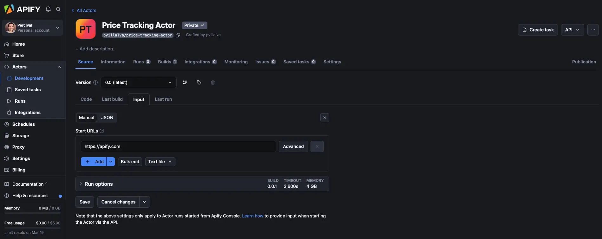

Note that the **Start URLs** input has been reset to **apify.com**, so be sure to replace it with our target website:

[https://www.centralcomputer.com/raspberry-pi-5-8gb-ram-board.html](https://www.centralcomputer.com/raspberry-pi-5-8gb-ram-board.html)

Once updated, click the green _**Save & Start**_ button at the bottom of the page to run your Actor.

After the run completes, you’ll see a **preview of the results** in the _**Output**_ tab. You can also export your data in multiple formats from the _**Storage**_ tab.
 
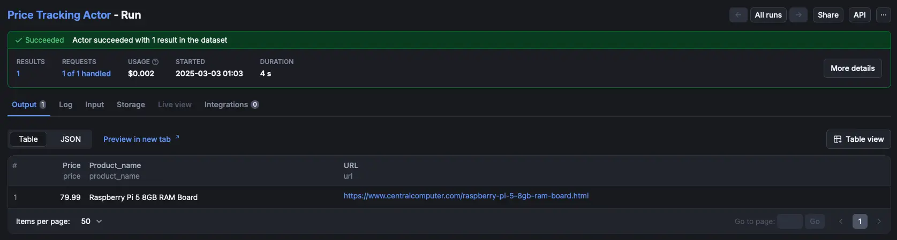
 
**Export dataset:**

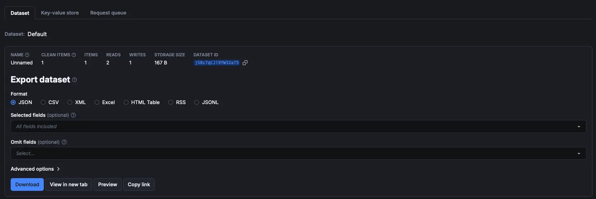

 
## 5. Schedule your runs
 
Now, a **price monitoring script** wouldn’t be very effective unless it ran on a schedule, automatically checking the product’s price and notifying us when it drops below the threshold.
 
Since our Actor is already deployed on the **Apify Platform**, scheduling it to run, say, every hour, is incredibly simple.
 
On your Actor page, click the three dots in the top-right corner of the screen and select **“Schedule Actor.”**

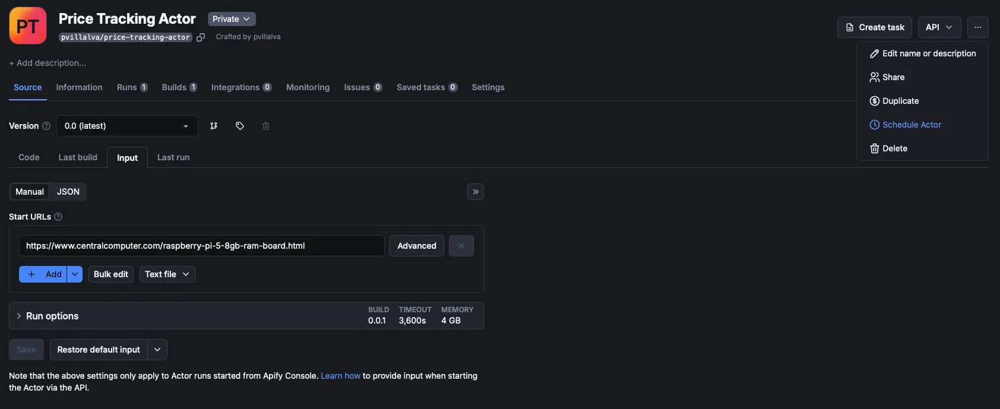
 
Next, choose how often you want your Actor to run, and that’s it! Your script will now run in the cloud, continuously monitoring the product’s price and sending you an email notification whenever it goes on sale.

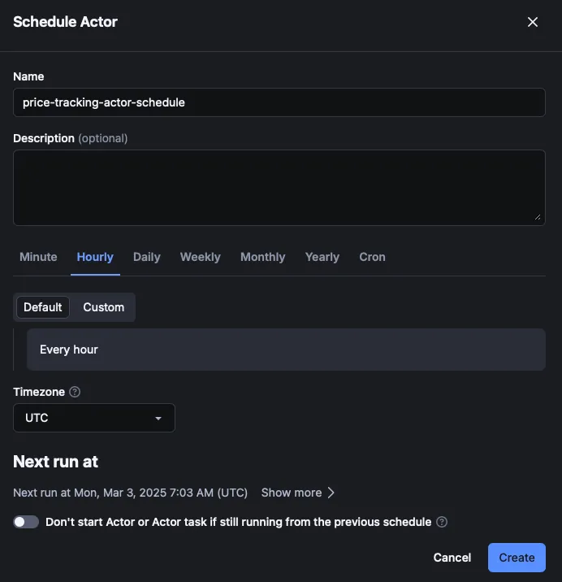

 
## That’s a wrap!
 
Congratulations on completing this tutorial! I hope you enjoyed getting your feet wet with Crawlee and feel confident enough to tweak the code to build your own price tracker.
 
We’ve only scratched the surface of what Apify and Crawlee can do. As a next step, join our [Discord community](https://discord.com/invite/jyEM2PRvMU) to connect with other web scraping developers and stay up to date with the latest news about Crawlee and Apify!
 