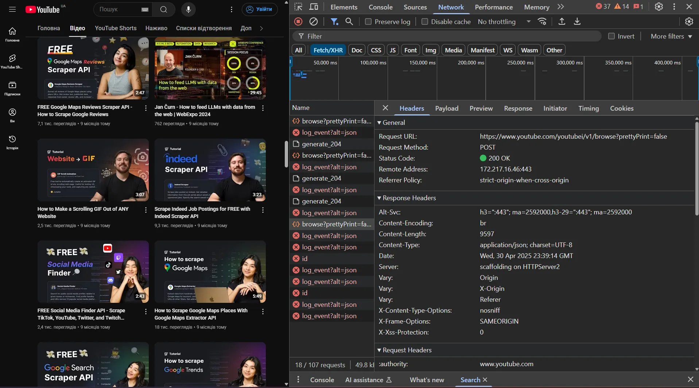
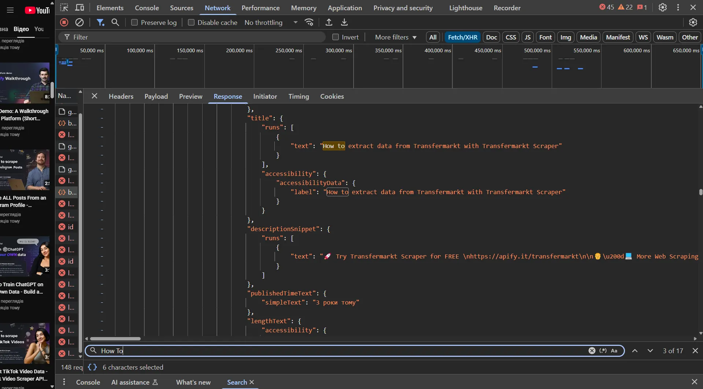
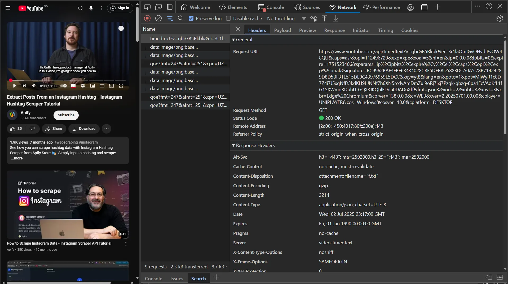
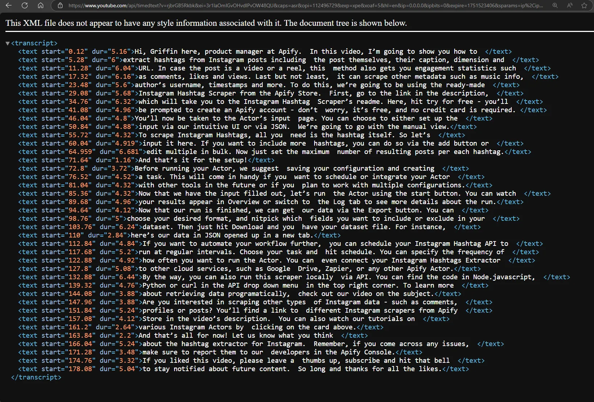
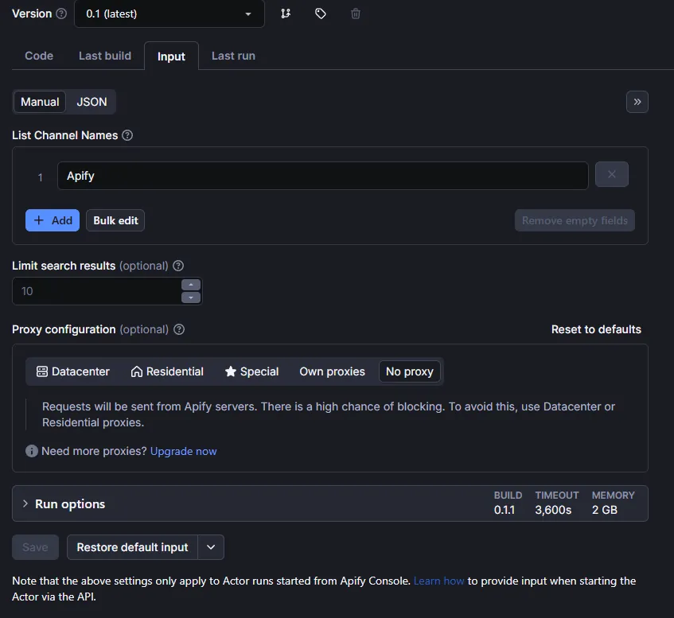
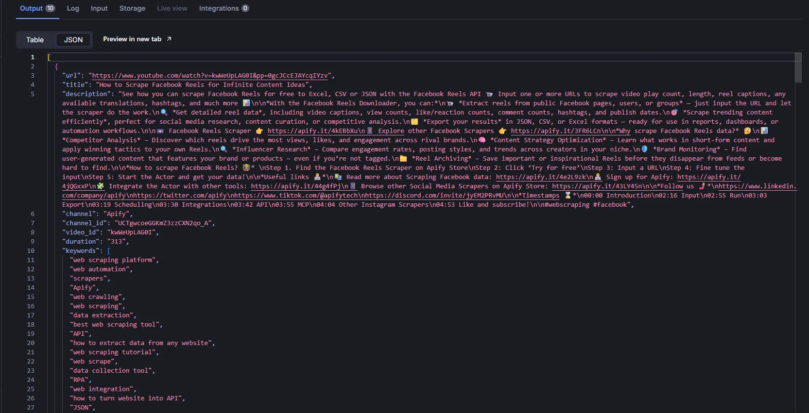

[YouTube](https://www.youtube.com/) is the world's largest video platform for original content. Its users generate massive amounts of data daily on various topics, making it an ideal source for training neural networks, data analysis, and much more.

Whatever task you need YouTube data for, it's crucial to obtain it in a convenient format for further processing. In this blog, we'll explore how to efficiently collect data from YouTube using [Crawlee for Python](https://github.com/apify/crawlee-python). Our scraper will extract video metadata, video statistics, and transcripts - giving you structured data perfect for content analysis, ML training, or trend monitoring.

:::note

One of our community members wrote this blog as a contribution to the Crawlee Blog. If you'd like to contribute articles like these, please reach out to us on our [Discord channel](https://apify.com/discord).

:::


Key steps we'll cover:

1. [Project setup](https://www.crawlee.dev/blog/scrape-youtube-python#1-project-setup)
2. [Analyzing YouTube and determining a scraping strategy](https://www.crawlee.dev/blog/scrape-youtube-python#2-analyzing-youtube-and-determining-a-scraping-strategy)
3. [Configuring YouTube](https://www.crawlee.dev/blog/scrape-youtube-python#3-configuring-crawlee)
4. [Extracting YouTube data](https://www.crawlee.dev/blog/scrape-youtube-python#4-extracting-youtube-data)
5. [Enhancing the scraper capabilities](https://www.crawlee.dev/blog/scrape-youtube-python#5-enhancing-the-scraper-capabilities)
6. [Creating YouTube Actor on the Apify platform](https://www.crawlee.dev/blog/scrape-youtube-python#6-creating-youtube-actor-on-the-apify-platform)
7. [Deploying to Apify](https://www.crawlee.dev/blog/scrape-youtube-python#7-deploying-to-apify)

<!-- truncate -->

## Prerequisites

- Python 3.9 or higher
- Familiarity with web scraping concepts
- Crawlee for Python `v0.6.0` or higher
- [uv](https://docs.astral.sh/uv/) `v0.7` or higher

## 1. Project setup

:::note

Before going ahead with the project, I'd like to ask you to star Crawlee for Python on [GitHub](https://github.com/apify/crawlee-python/), it helps us to spread the word to fellow scraper developers.

:::

In this project, we'll use uv for package management and a specific Python version will be installed through uv. If you don't have uv installed yet, just follow the [guide](https://docs.astral.sh/uv/getting-started/installation/) or use this command:

```bash
curl -LsSf https://astral.sh/uv/install.sh | sh
```

To create the project, run:

```bash
uvx crawlee['cli'] create youtube-crawlee
```

In the `cli` menu that opens, select:

1. `Playwright`
2. `Httpx`
3. `uv`
4. Leave the default value - `https://crawlee.dev`
5. `y`

Or, just run the command:

```bash
uvx crawlee['cli'] create youtube-crawlee --crawler-type playwright --http-client httpx --package-manager uv --apify --start-url 'https://crawlee.dev'
```

Or, if you prefer to use `pipx`.

```bash
pipx run crawlee['cli'] create youtube-crawlee --crawler-type playwright --http-client httpx --package-manager uv --apify --start-url 'https://crawlee.dev'
```

Creating the project may take a few minutes. After installation is complete, navigate to the project folder:

```bash
cd youtube-crawlee
```

## 2. Analyzing YouTube and determining a scraping strategy

If you're working on a small project to extract data from YouTube, you should use the [YouTube API](https://developers.google.com/youtube/v3/docs/search/list) to get the necessary data. However, the API has very strict quotas, no more than [10000 units per day](https://developers.google.com/youtube/v3/determine_quota_cost), which allows you to get no more than 100 search pages, and you can't increase this limit.

If your project requires more data than the API allows, you'll need to use crawling. Let's examine the site to develop an optimal crawling strategy.

Let's study the navigation on a YouTube channel page using [Apify channel](https://www.youtube.com/@Apify) as our example to better understand the navigation features and data extraction points.

To load new elements on the page, YouTube uses infinite scrolling, similar to what we discussed in the corresponding [article](https://www.crawlee.dev/blog/infinite-scroll-using-python) from the [Apify](https://apify.com/) team. Let's look at how this works using [DevTools](https://developer.chrome.com/docs/devtools) and the [Network](https://developer.chrome.com/docs/devtools/network/) tab.



If we look at the response structure, we can see that YouTube uses [JSON](https://www.json.org) to transmit data, but its structure is quite complex to navigate.



Therefore, we'll use [Playwright](https://playwright.dev/python/docs/intro) for crawling, which will help us avoid parsing complex JSON responses. But if you want to practice crawling complex websites, try implementing a crawler based on an HTTP client, like in this [article](https://www.crawlee.dev/blog/scraping-dynamic-websites-using-python).

Let's analyze the selectors for getting video links using the [Elements](https://developer.chrome.com/docs/devtools/elements/) tab:


It looks like we're interested in `a` tags with the attribute `id="video-title-link"`!

Let's look at the video page to better understand how YouTube transmits data. As expected, we see data in JSON format.


Now let's get the transcript link. Click on the subtitles button in the player to trigger the transcript request.



Let's verify that we can access the transcript via this link. Remove the `fmt=json3` parameter from the URL and open it in your browser. Removing the `fmt` parameter is necessary to get the data in a convenient XML format instead of the complex JSON3 format.



If you live in a country where [GDPR](https://gdpr-info.eu/) applies, you'll need to handle the following popup before you can access the data:


After our analysis, we now understand:

- **Navigation strategy**: How to navigate the channel page to retrieve all videos using infinite scroll
- **Video metadata extraction**: How to extract video statistics, title, description, publish date, and other metadata from video pages
- **Transcript access**: How to obtain the correct transcript link
- **Data formats**: Transcript data is available in XML format, which is easier to parse than JSON3
- **Regional considerations**: Special handling required for GDPR consent in European countries

With this knowledge, we're ready to implement our YouTube scraper using Crawlee for Python.

## 3. Configuring Crawlee

Configuring Crawlee for YouTube is very similar to configuring it for [TikTok](https://www.crawlee.dev/blog/scrape-tiktok-python). But it will have some key differences.

Since pages have infinite scrolling, we need to limit the number of elements we want to get. For this, we'll add a `max_items` parameter that will limit the maximum number of elements for each search and pass it in `user_data` when forming a [Request](https://www.crawlee.dev/python/api/class/Request).

We'll limit the intensity of scraping by setting `max_tasks_per_minute` in [`ConcurrencySettings`](https://www.crawlee.dev/python/api/class/ConcurrencySettings). This will help us reduce the likelihood of being blocked by YouTube.

Scrolling pages can take a long time, so we should increase the time limit for processing a single request using `request_handler_timeout`.

Since we won't be saving images, videos, and similar media content during crawling, we can block requests to them using [`block_requests`](https://www.crawlee.dev/python/api/class/BlockRequestsFunction) and [`pre_navigation_hook`](https://www.crawlee.dev/python/api/class/PlaywrightCrawler#pre_navigation_hook).

Also, to handle the `GDPR` page only once, we'll use [`use_state`](https://www.crawlee.dev/python/api/class/UseStateFunction) to pass the appropriate cookies between sessions, ensuring all requests have the necessary cookies.

```python
# main.py

from datetime import timedelta

from apify import Actor
from crawlee import ConcurrencySettings, Request
from crawlee.crawlers import PlaywrightCrawler, PlaywrightPreNavCrawlingContext

from .routes import router


async def main() -> None:
    """The crawler entry point."""
    async with Actor:
        # Create a crawler instance with the router
        crawler = PlaywrightCrawler(
            # Limit scraping intensity by setting a limit on requests per minute
            concurrency_settings=ConcurrencySettings(max_tasks_per_minute=50),
            # We'll configure the `router` in the next step
            request_handler=router,
            # Increase the timeout for the request handling pipeline
            request_handler_timeout=timedelta(seconds=120),
            # You can use `False` during development. But for production, it's always `True`
            headless=True,
            # Limit requests per crawl for testing purposes
            max_requests_per_crawl=100,
        )

        # Set the maximum number of items to scrape per youtube channel
        max_items = 1
        # Set the list of channels to scrape
        channels = ['Apify']

        # Set hook for prepare context before navigation on each request
        crawler.pre_navigation_hook(pre_hook)

        await crawler.run(
            [
                Request.from_url(f'https://www.youtube.com/@{channel}/videos', user_data={'limit': max_items})
                for channel in channels
            ]
        )
```

Let's prepare the `pre_hook` function to block requests and set cookies:

```python
# main.py

async def pre_hook(context: PlaywrightPreNavCrawlingContext) -> None:
    """Prepare context before navigation."""
    crawler_state = await context.use_state()
    # Check if there are cookies in the crawler state and set them for the session
    if 'cookies' in crawler_state and context.session:
        cookies = crawler_state['cookies']
        # Set cookies for the session
        context.session.cookies.set_cookies_from_playwright_format(cookies)
    # Block requests to resources that aren't needed for parsing
    # This is similar to the default value, but we don't block `css` as it is needed for Player loading
    await context.block_requests(
        url_patterns=['.webp', '.jpg', '.jpeg', '.png', '.svg', '.gif', '.woff', '.pdf', '.zip']
    )
```

## 4. Extracting YouTube data

After configuration, let's move on to navigation and data extraction.

For infinite scrolling, we'll use the built-in helper function ['infinite_scroll'](https://www.crawlee.dev/python/api/class/PlaywrightCrawlingContext#infinite_scroll). But instead of waiting for scrolling to complete, which in some cases can take a really long time, we'll use Python's `asyncio` capabilities to make it a background task.

The `GDPR` page requiring consent for cookie usage is on the domain `consent.youtube.com`, which might cause an error when forming a [Request](https://www.crawlee.dev/python/api/class/Request) for a video page. Therefore, we need to use a helper function for the `transform_request_function` parameter in [`extract_links`](https://www.crawlee.dev/python/api/class/ExtractLinksFunction).

This function will check each extracted URL, and if it contains 'consent.youtube', we'll replace it with 'www.youtube'. This will allow us to get the correct URL for the video page.

```python
# routes.py

from __future__ import annotations

import asyncio
import xml.etree.ElementTree as ET
from typing import TYPE_CHECKING

from yarl import URL

from crawlee import Request, RequestOptions, RequestTransformAction
from crawlee.crawlers import PlaywrightCrawlingContext
from crawlee.router import Router

if TYPE_CHECKING:
    from playwright.async_api import Request as PlaywrightRequest
    from playwright.async_api import Route as PlaywrightRoute

router = Router[PlaywrightCrawlingContext]()


def request_domain_transform(request_param: RequestOptions) -> RequestOptions | RequestTransformAction:
    """Transform request before adding it to the queue."""
    if 'consent.youtube' in request_param['url']:
        request_param['url'] = request_param['url'].replace('consent.youtube', 'www.youtube')
        return request_param
    return 'unchanged'
```

Let's implement a function that will intercept transcript requests for later modification and processing in the crawler:

```python
# routes.py

async def extract_transcript_url(context: PlaywrightCrawlingContext) -> str | None:
    """Extract the transcript URL from request intercepted by Playwright."""
    transcript_url = None

    # Define a handler for the transcript request
    # This will be called when the page requests the transcript
    async def handle_transcript_request(route: PlaywrightRoute, request: PlaywrightRequest) -> None:
        nonlocal transcript_url

        transcript_url = request.url

        await route.fulfill(status=200)

    # Set up a route to intercept requests to the transcript API
    await context.page.route('**/api/timedtext**', handle_transcript_request)

    # Click the subtitles button to trigger the transcript request
    await context.page.click('.ytp-subtitles-button')

    # Wait for the transcript URL to be set
    # We use `asyncio.wait_for` to avoid waiting indefinitely
    while not transcript_url:
        await asyncio.sleep(1)
        context.log.info('Waiting for transcript URL...')

    return transcript_url
```

Now let's create the main handler that will handle navigating to the channel page, performing infinite scrolling, and extracting links to videos.

```python
# routes.py

@router.default_handler
async def default_handler(context: PlaywrightCrawlingContext) -> None:
    """Handle requests that do not match any specific handler."""
    context.log.info(f'Processing {context.request.url} ...')

    # Get the limit from user_data, default to 10 if not set
    limit = context.request.user_data.get('limit', 10)
    if not isinstance(limit, int):
        raise TypeError('Limit must be an integer')

    # Wait for the page to load
    await context.page.locator('h1').first.wait_for(state='attached')

    # Check if there's a GDPR popup on the page requiring consent for cookie usage
    cookies_button = context.page.locator('button[aria-label*="Accept"]').first
    if await cookies_button.is_visible():
        await cookies_button.click()

        # Save cookies for later use with other sessions
        cookies_state = [cookie for cookie in await context.page.context.cookies() if cookie['name'] == 'SOCS']
        crawler_state = await context.use_state()
        crawler_state['cookies'] = cookies_state

    # Wait until at least one video loads
    await context.page.locator('a[href*="watch"]').first.wait_for()

    # Create a background task for infinite scrolling
    scroll_task: asyncio.Task[None] = asyncio.create_task(context.infinite_scroll())
    # Scroll the page to the end until we reach the limit or finish scrolling
    while not scroll_task.done():
        # Extract links to videos
        requests = await context.extract_links(
            selector='a[href*="watch"]',
            label='video',
            transform_request_function=request_domain_transform,
            strategy='same-domain',
        )
        # Create a dictionary to avoid duplicates
        requests_map = {request.id: request for request in requests}
        # If the limit is reached, cancel the scrolling task
        if len(requests_map) >= limit:
            scroll_task.cancel()
            break
        # Switch the asynchronous context to allow other tasks to execute
        await asyncio.sleep(0.2)
    else:
        # If the scroll task is done, we can safely assume that we have reached the end of the page
        requests = await context.extract_links(
            selector='a[href*="watch"]',
            label='video',
            transform_request_function=request_domain_transform,
            strategy='same-domain',
        )
        requests_map = {request.id: request for request in requests}

    requests = list(requests_map.values())
    requests = requests[:limit]

    # Add the requests to the queue
    await context.enqueue_links(requests=requests)
```

Let's take a closer look at the parameters used in [`extract_links`](https://www.crawlee.dev/python/api/class/ExtractLinksFunction#Methods):

- `selector` - selector for extracting links to videos. We expected that we could use `id="video-title-link"`, but YouTube uses different page formats with different selectors, so the selector `a[href*="watch"]` will be more universal.
- `label` - pointer for the router that will be used to handle the video page.
- `transform_request_function` - function to transform the request before adding it to the queue. We use it to replace the domain `consent.youtube` with `www.youtube`, which helps avoid errors when processing the video page.
- `strategy` - strategy for extracting links. We use `same-domain` to extract links to any subdomain of `youtube.com`.

Let's move on to the handler for video pages. In it, we'll extract video data, and also look at how to get and process the video transcript link.

```python
# routes.py

@router.handler('video')
async def video_handler(context: PlaywrightCrawlingContext) -> None:
    """Handle video requests."""
    context.log.info(f'Processing video {context.request.url} ...')
    # extract video data from the page
    video_data = await context.page.evaluate('window.ytInitialPlayerResponse')
    main_data = {
        'url': context.request.url,
        'title': video_data['videoDetails']['title'],
        'description': video_data['videoDetails']['shortDescription'],
        'channel': video_data['videoDetails']['author'],
        'channel_id': video_data['videoDetails']['channelId'],
        'video_id': video_data['videoDetails']['videoId'],
        'duration': video_data['videoDetails']['lengthSeconds'],
        'keywords': video_data['videoDetails']['keywords'],
        'view_count': video_data['videoDetails']['viewCount'],
        'like_count': video_data['microformat']['playerMicroformatRenderer']['likeCount'],
        'is_shorts': video_data['microformat']['playerMicroformatRenderer']['isShortsEligible'],
        'publish_date': video_data['microformat']['playerMicroformatRenderer']['publishDate'],
    }

    # Try to extract the transcript URL
    try:
        transcript_url = await asyncio.wait_for(extract_transcript_url(context), timeout=20)
    except asyncio.TimeoutError:
        transcript_url = None

    if transcript_url:
        transcript_url = str(URL(transcript_url).without_query_params('fmt'))
        context.log.info(f'Found transcript URL: {transcript_url}')
        await context.add_requests(
            [Request.from_url(transcript_url, label='transcript', user_data={'video_data': main_data})]
        )
    else:
        await context.push_data(main_data)
```

Note that if we want to extract the video transcript, we need to get the link to the transcript file and pass the video data to the next handler before it's saved to the [`Dataset`](https://www.crawlee.dev/python/api/class/Dataset).

The final stage is processing the transcript. YouTube uses [XML](https://www.w3schools.com/xml/) to transmit transcript data, so we need to use a library for parsing XML, such as [`xml.etree.ElementTree`](https://docs.python.org/3/library/xml.etree.elementtree.html).

```python
# routes.py

@router.handler('transcript')
async def transcript_handler(context: PlaywrightCrawlingContext) -> None:
    """Handle transcript requests."""
    context.log.info(f'Processing transcript {context.request.url} ...')

    # Get the main video data extracted in `video_handler`
    video_data = context.request.user_data.get('video_data', {})

    try:
        # Get XML data from the response
        root = ET.fromstring(await context.response.text())

        # Extract text elements from XML
        transcript_data = [text_element.text.strip() for text_element in root.findall('.//text') if text_element.text]

        # Enrich video data by adding the transcript
        video_data['transcript'] = '\n'.join(transcript_data)

        # Save the data to Dataset
        await context.push_data(video_data)
    except ET.ParseError:
        context.log.warning('Incorect XML Response')
        # Save the video data without the transcript
        await context.push_data(video_data)
```

After collecting the data, we need to save the results to a file. Just add the following code to the end of the `main` function in `main.py`:

```python
# main.py

# Export the data from Dataset to JSON format
await crawler.export_data_json('youtube.json')
```

To run the crawler, use the command:

```bash
uv run python -m youtube_crawlee
```

Example result record:

```json
{
  "url": "https://www.youtube.com/watch?v=r-1J94tk5Fo",
  "title": "Facebook Marketplace API - Scrape Data Based on LOCATION, CATEGORY and SEARCH",
  "description": "See how you can export Facebook Marketplace listings to Excel, CSV or JSON with the Facebook Marketplace API 🛍️ Input one or more URLs to scrape price, description, images, delivery info, seller data, location, listing status, and much more 📊\n\nWith the Facebook Marketplace Downloader, you can:\n🛒 **Extract listings and seller details** from any public Marketplace category or search query.\n📷 **Scrape product details**, including images, prices, descriptions, locations, and timestamps.\n💰 **Get thousands of marketplace listings** quickly and efficiently.\n📦 **Export results** via API or in JSON, CSV, or Excel with all listing details.\n\n🛍️ Facebook Marketplace Search API 👉 https://apify.it/3E5NLz4\n📱 Explore other Facebook Scrapers 👉 https://apify.it/43Bae1f\n\n*Why scrape Facebook Marketplace data?* 🤔\n💰 Price & Demand Analysis – Track product pricing trends and demand fluctuations.\n📊 Competitor Insights – Monitor listings from competitors to adjust pricing and strategy.\n📍 Location-Based Market Trends – Identify popular products in specific regions.\n🔎 Product Availability Monitoring – Detect shortages or oversupply in certain categories.\n📈 Reselling Opportunities – Find underpriced items for profitable flips.\n🛍 Consumer Behavior Insights – Understand what products and features attract buyers.\n💡 Trend Spotting – Discover emerging products before they go mainstream.\n📝 Market Research – Gather data for academic, business, or personal research.\n\n*How to* scrape *facebook marketplace? 🧑‍🏫* \nStep 1. Find the Facebook Marketplace dataset tool on Apify Store\nStep 2: Click ‘Try for free’\nStep 3: Input a URL\nStep 4: Fine tune the input\nStep 5: Start the Actor and get your data!\n\n*Useful links 🧑‍💻*\n📚 Read more about Scraping Facebook data: https://apify.it/43wyth9\n🧑‍💻 Sign up for Apify: https://apify.it/42e8nNu\n🧩 Integrate the Actor with other tools: https://apify.it/43Ustiz\n📱 Browse other Social Media Scrapers on Apify Store: https://apify.it/4jhq7i8\n\n*Follow us 🤳*\nhttps://www.linkedin.com/company/apifytech\nhttps://twitter.com/apify\nhttps://www.tiktok.com/@apifytech\nhttps://discord.com/invite/jyEM2PRvMU\n\n*Timestamps ⌛️*\n00:00 Introduction\n01:27 Input\n02:17 Run\n02:26 Export\n02:41 Scheduling\n02:54 Integrations\n03:00 API\n03:13 Other Meta Scrapers\n03:26 Like and subscribe!\n\n#webscraping #instagram",
  "channel": "Apify",
  "channel_id": "UCTgwcoeGGKmZ3zzCXN2qo_A",
  "video_id": "r-1J94tk5Fo",
  "duration": "226",
  "keywords": [
    "web scraping platform",
    "web automation",
    "scrapers",
    "Apify",
    "web crawling",
    "web scraping",
    "data extraction",
    "best web scraping tool",
    "API",
    "how to extract data from any website",
    "web scraping tutorial",
    "web scrape",
    "data collection tool",
    "RPA",
    "web integration",
    "how to turn website into API",
    "JSON",
    "python web scraping",
    "web scraping python",
    "web api integration",
    "how to turn website into api",
    "scraping",
    "apify",
    "data extraction tools",
    "how to web scrape",
    "web scraping javascript",
    "web scraping tool"
  ],
  "view_count": "765",
  "like_count": "8",
  "is_shorts": false,
  "publish_date": "2025-04-03T05:33:18-07:00",
  "transcript": "Hi, Theo here. In this video, I’ll \nshow you how to scrape structured\ndata from Facebook Marketplace by location, \ncategory, or specific search query. You’ll\nbe able to extract listing details like price, \ndescription, images, delivery info, seller data,\nlocation, and listing status — using a \ntool called Facebook Marketplace Scraper.\nHere’s what you can do with it. \nIf you&#39;re reselling, flipping,\nor deal hunting, scraping helps you track \nprices, spot trends, and catch underpriced\nor free items early. Looking for a rental \nor house? Compare listings across cities,\ncheck historical prices, and avoid wasting \ntime on overpriced options. Selling on\nMarketplace? Analyze top-performing listings, \noptimize keywords, and price competitively.\nFor businesses, scraping \nenables competitor tracking,\ndynamic pricing, real estate \nresearch, fraud detection,\nand brand protection — like spotting counterfeit \nor unauthorized listings before they do damage.\nThe best part is you don’t need to \njump through hoops to get this data:\nFacebook Marketplace Scraper makes things simple: \nno login, no cookies, no browser extension.\nIt runs in the cloud, and you can export \nresults in JSON, CSV, Excel — or use the API.\nLet’s see how it works.\nFirst, head to the link in the description, \nwhich’ll take you to Facebook Marketplace\nScraper’s README. Click on `try \nfor free`, which will send you to\nthe `Login page` and you can get started \nwith a free Apify account - don’t worry,\nthere’s no limit on the free plan and \nno credit card will ever be required.\nAfter logging in, you’ll land on the Actor’s \ninput page. While you can configure this through\neither the intuitive UI or JSON, we’ll \nstick with the UI option to keep it easy.\nFor scraping Facebook Marketplace, you’re gonna \nneed the URL from Facebook. You can use a URL of\na search term, location or an item category. For \nthis tutorial, we’re gonna go with an iPhone. So\nlet’s open up Facebook Marketplace, input a search \nterm and then copy the URL from the toolbar and\npaste it in the input. You can add more via the \nadd button, edit them in bulk or import the URLs\nas a text file. Next, you can limit how many \nposts you want to scrape. And that’s it.\nBefore running your Actor, it’s a great idea \nto save your configuration and create a task.\nThis will come in handy for scheduling or \nintegrating your Actor with other tools,\nor if you plan to work with \nmultiple configurations.\nNow that we have the `input`, let’s run \nthe Actor by hitting START. You can watch\nyour results appear in Overview or switch to \nthe Log tab to see more details about run.\nNow that your run is finished, we can get the \ndata via the Export button. You can choose your\npreffered format, and select which fields you want \nto include or exclude in your dataset. Then just\nhit Download and you have your dataset file. Let \nme show you what this looks like in JSON format.\nIf you want to automate your workflow \neven more, you can schedule your Facebook\nMarketplace Scraper to run at regular intervals. \nChoose your task and hit schedule. You can set\nthe frequency of how often you want to run \nthe Actor. You can even connect your Actor\nto other cloud services, such as Google \nDrive, Make, or any other Apify Actor.\nYou can also run this scraper locally via \nAPI. You can find the code in Node.js,\nPython, or curl in the API \ndrop down menu in the top-right\ncorner. To learn more about retrieving data \nprogramatically, check out our video on it.\nNeed more Facebook or Instagram data? \nCheck out our other scrapers in Apify\nStore. We have got dozens of meta \nscrapers, links are in the description.\nIf you prefer video tutorials, we have a playlist \ncovering different Instagram scraping use cases.\nAnd that’s all for today! Let us know what you \nthink about the Facebok Marketplace Scraper.\nRemember, if you come across any issues, make \nsure to report them to our team in Apify Console.\nIf you found this helpful, give us a thumbs \nup and subscribe. Don&#39;t forget to hit the\nbell to stay updated on new tutorials. Thanks for \nwatching! So long, and thanks for all the likes"
}
```

## 5. Enhancing the scraper capabilities

As with any project working with a large site like YouTube, you may encounter various issues that need to be resolved.
Currently, the Crawlee for Python documentation contains many guides and examples to help you with this.

- Use [`Camoufox`](https://camoufox.com/), a project compatible with Playwright, which allows you to get a browser configuration that's more resistant to blocking, and you can easily [integrate it with Crawlee for Python](https://www.crawlee.dev/python/docs/examples/playwright-crawler-with-camoufox).

- Improve error handling and logging for unusual cases so you can easily debug and maintain the project; the guide on [error handling](https://www.crawlee.dev/python/docs/guides/error-handling) is a good place to start.

- Add proxy support to avoid blocks from YouTube. You can use [Apify Proxy](https://apify.com/proxy) and [`ProxyConfiguration`](https://www.crawlee.dev/python/api/class/ProxyConfiguration); you can learn more in this guide in the [documentation](https://www.crawlee.dev/python/docs/guides/proxy-management#proxy-configuration).

- Make your crawler a web service that crawls pages by user request, using [FastAPI](https://fastapi.tiangolo.com/) and following this [guide](https://www.crawlee.dev/python/docs/guides/running-in-web-server).

## 6. Creating YouTube Actor on the Apify platform

For deployment, we'll use the [Apify platform](https://apify.com/). It's a simple and effective environment for cloud deployment, allowing efficient interaction with your crawler. Call it via [API](https://docs.apify.com/api/v2/), [schedule tasks](https://docs.apify.com/platform/schedules), [integrate](https://docs.apify.com/platform/integrations) with various services, and much more.

To deploy to the Apify platform, we need to adapt our project for the [Apify Actor](https://apify.com/actors) structure.

Create an `.actor` folder with the necessary files.

```bash
mkdir .actor && touch .actor/{actor.json,input_schema.json}
```

Move the `Dockerfile` from the root folder to `.actor`.

```bash
mv Dockerfile .actor
```

Let's fill in the empty files:

The `actor.json` file contains project metadata for the Apify platform. Follow the [documentation for proper configuration](https://docs.apify.com/platform/actors/development/actor-definition/actor-json):

```json
{
  "actorSpecification": 1,
  "name": "YouTube-Crawlee",
  "title": "YouTube - Crawlee",
  "minMemoryMbytes": 2048,
  "description": "Scrape video stats, metadata and transcripts from videos in YouTube channels",
  "version": "0.1",
  "meta": {
    "templateId": "youtube-crawlee"
  },
  "input": "./input_schema.json",
  "dockerfile": "./Dockerfile"
}
```

Actor input parameters are defined using `input_schema.json`, which is specified [here](https://docs.apify.com/platform/actors/development/actor-definition/input-schema/specification/v1).

Let's define input parameters for our crawler:

- `maxItems` - maximum number of videos per channel for scraping.
- `channelNames` - these are the YouTube channel names to scrape.
- `proxySettings` - proxy settings, since without a proxy you'll be using the datacenter IP that Apify uses.

```json
{
    "title": "YouTube Crawlee",
    "type": "object",
    "schemaVersion": 1,
    "properties": {
        "channelNames": {
            "title": "List Channel Names",
            "type": "array",
            "description": "Channel names for extraction video stats, metadata and transcripts.",
            "editor": "stringList",
            "prefill": ["Apify"]
        },
        "maxItems": {
            "type": "integer",
            "editor": "number",
            "title": "Limit search results",
            "description": "Limits the maximum number of results, applies to each search separately.",
            "default": 10
        },
        "proxySettings": {
            "title": "Proxy configuration",
            "type": "object",
            "description": "Select proxies to be used by your scraper.",
            "prefill": { "useApifyProxy": true },
            "editor": "proxy"
        }
    },
    "required": ["channelNames"]
}
```

Let's update the code to accept input parameters.

```python
# main.py

async def main() -> None:
    """The crawler entry point."""
    async with Actor:
        # highlight-start
        # Get the input parameters from the Actor
        actor_input = await Actor.get_input()

        max_items = actor_input.get('maxItems', 0)
        channels = actor_input.get('channelNames', [])
        proxy = await Actor.create_proxy_configuration(actor_proxy_input=actor_input.get('proxySettings'))
        # highlight-end

        crawler = PlaywrightCrawler(
            concurrency_settings=ConcurrencySettings(max_tasks_per_minute=50),
            request_handler=router,
            request_handler_timeout=timedelta(seconds=120),
            headless=True,
            max_requests_per_crawl=100,
            proxy_configuration=proxy
        )
```

And delete export to JSON from the `main` function, as the Apify platform will handle data storage in the [Dataset](https://docs.apify.com/platform/storage/dataset).

That's it, the project is ready for deployment.

## 7. Deploying to Apify

Use the official [Apify CLI](https://docs.apify.com/cli/) to upload your code:

Authenticate using your API token from [Apify Console](https://console.apify.com/settings/integrations):

```bash
apify login
```

Choose "Enter API token manually" and paste your token.

Push the project to the platform:

```bash
apify push
```

Now you can configure runs on the Apify platform.

Let's perform a test run:

Fill in the input parameters:



View results in the dataset:



If you want to make your Actor public and provide access to other users, potentially to earn income from it, follow this [publishing guide](https://docs.apify.com/platform/actors/publishing) for [Apify Store](https://apify.com/store).

## Conclusion

We've created a good foundation for crawling YouTube using Crawlee for Python and Playwright. If you're just starting your journey in crawling, this will be an excellent project for learning and practice. You can use it as a basis for creating more complex crawlers that will collect data from YouTube. If this is your first project using Crawlee for Python, check out all the documentation links provided in this article; it will help you better understand how Crawlee for Python works and how you can use it for your projects.

You can find the complete code in the [repository](SOON)

If you enjoyed this blog, feel free to support Crawlee for Python by starring the [repository](https://github.com/apify/crawlee-python) or joining the maintainer team.

Have questions or want to discuss implementation details? Join our [Discord](https://discord.com/invite/jyEM2PRvMU) - our community of 10,000+ developers is there to help.
