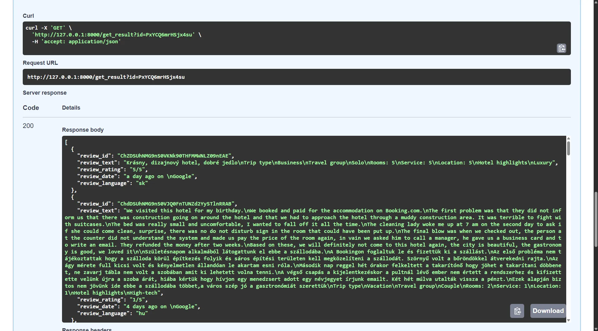

Google reviews are an important element of [Google Maps](https://www.google.com/maps) that help users find and evaluate businesses. They're an excellent source of information about various points of interest in a location, business and service ratings, as well as data that can help identify businesses manipulating reviews.

In this blog, we'll explore how to automate the process of collecting reviews from Google Maps using [Crawlee for Python](https://github.com/apify/crawlee-python). We'll also show you how to create a simple web application for this purpose.

:::note

One of our community members wrote this blog as a contribution to the Crawlee Blog. If you'd like to contribute articles like these, please reach out to us on our [Discord channel](https://apify.com/discord).

:::


Key steps we'll cover:

1. Project setup
2. Analyzing Google Maps and determining a scraping strategy for Google reviews
3. Configuring Crawlee
4. Extracting Google reviews
5. Create web app for scraping Google reviews

<!-- truncate -->

## Prerequisites

- Python 3.9 or higher
- Crawlee for Python `v0.6.0` or higher
- [uv](https://docs.astral.sh/uv/) `v0.7` or higher
- Familiarity with web scraping concepts
- Familiarity with the content of the article about [Google Maps](https://crawlee.dev/blog/scrape-google-maps)

## 1. Project setup

:::note

Before going ahead with the project, I'd like to ask you to star Crawlee for Python on [GitHub](https://github.com/apify/crawlee-python/), it helps us to spread the word to fellow scraper developers.

:::

In this project, we'll use uv for package management and a specific Python version will be installed through uv. Uv is a fast and modern package manager written in Rust.

If you don't have uv installed yet, just follow the [guide](https://docs.astral.sh/uv/getting-started/installation/) or use this command:

```bash
curl -LsSf https://astral.sh/uv/install.sh | sh
```

For this project, we won't be using templates.

To create the project, run the following commands:

```bash
uv init google-review-crawlee --package
cd google-review-crawlee && touch src/google_review_crawlee/{crawler.py,routes.py,server.py}
```

Install the necessary dependencies:

```bash
uv add crawlee[playwright]
uv add fastapi[standard]
uv run playwright install
```

## 2. Analyzing Google Maps and determining a scraping strategy

We'll extract reviews using direct links to Google Maps businesses, for example:

```text
https://www.google.com/maps/place/Lucerna+Music+Bar/@50.0809028,14.4257493,19z/data=!4m16!1m9!3m8!1s0x470b94ed6a1b741b:0xdcd6e1ab527503c!2sLucerna+Music+Bar!8m2!3d50.0809028!4d14.4263944!9m1!1b1!16s%2Fm%2F0kvdfmj!3m5!1s0x470b94ed6a1b741b:0xdcd6e1ab527503c!8m2!3d50.0809028!4d14.4263944!16s%2Fm%2F0kvdfmj
```

How to get direct links to Google Maps businesses was covered in the [article about Google Maps](https://crawlee.dev/blog/scrape-google-maps). Therefore, we can focus on extracting reviews.

As you can see, Google Maps links use a rather complex structure and encoding, so we won't edit the links to get a direct link to reviews. Instead, we'll use [Playwright](https://playwright.dev/) for navigation.

The first step is to navigate to the `Reviews` tab:


Try to avoid using attributes like `aria-label` as reference points in your selectors, as they can change depending on language and region. Instead, use more stable attributes like `jsaction`, `jslog`, `data-review-id`, and also use `class`, but only if there are no other options, as when classes look automatically generated, it's not recommended to use them as reference points in selectors. We'll use the selector `button[jslog*="145620"]` to click on the `Reviews` tab.

The next step is to sort reviews by `Newest`:


When your project uses a large number of non-obvious, strange, or complex selectors, be sure to document them in your code. This will help you and other developers in the future, especially if the site changes something.
For sorting, we'll use `button[jslog*="59550"]` to click on the dropdown menu and `div[vet*="25740"]` to click on `Newest`.

Now we can proceed directly to extracting reviews. It's very important to handle cases with expandable reviews that have a `More` button, as in the example below:


For the case shown, the optimal selector would be `button[jsaction*="expandReview"]`.

We've looked at several selectors that we'll need to extract reviews and that point to various basic elements. It's also important to note that Google Reviews has several different page layouts, each of which may have its own selectors. Therefore, working on such projects requires a lot of time and patience. This project will use selectors for several page formats that I know of.

## 3. Configuring Crawlee

Now that we've analyzed Google Maps and identified the selectors we need, let's move on to setting up the project. We'll use [PlaywrightCrawler](https://crawlee.dev/python/api/class/PlaywrightCrawler), which allows us to use Playwright for navigating pages and extracting data.

We don't need to worry about [ConcurrencySettings](https://crawlee.dev/python/api/class/ConcurrencySettings) since we're not navigating to any internal pages. For the same reason, it's very important to set a high value for [request_handler_timeout](https://crawlee.dev/python/api/class/BasicCrawlerOptions#request_handler_timeout) since navigation and infinite scrolling can take a long time.

To handle infinite scrolling, we'll use the same approach as in [TikTok scraping](https://crawlee.dev/blog/scrape-tiktok-python) by creating a background task for the [infinite_scroll](https://crawlee.dev/python/api/class/PlaywrightCrawlingContext#infinite_scroll) function.

We'll use [pre_navigation_hook](https://crawlee.dev/python/api/class/PlaywrightCrawler#pre_navigation_hook) and [block_requests](https://crawlee.dev/python/api/class/BlockRequestsFunction) to block auxiliary resources that don't affect the site's functionality.

```python
# crawler.py

import asyncio
from datetime import timedelta

from crawlee import Request
from crawlee.crawlers import PlaywrightCrawler, PlaywrightPreNavCrawlingContext

from .routes import router


async def run_crawler() -> None:
    """Run crawler direct with urls list."""
    # Set the maximum number of reviews to scrape per place
    max_items = 40
    # Set the list of places to scrape
    place_urls = [
        'https://www.google.com/maps/place/Courtyard+Brno/@49.1851075,16.5963346,14z/data=!4m22!1m12!3m11!1s0x471295aa49ef065b:0xce58732130551370!2sCourtyard+Brno!5m2!4m1!1i2!8m2!3d49.1821852!4d16.6060524!9m1!1b1!16s%2Fg%2F11c1rf_fv9!3m8!1s0x471295aa49ef065b:0xce58732130551370!5m2!4m1!1i2!8m2!3d49.1821852!4d16.6060524!16s%2Fg%2F11c1rf_fv9',
        'https://www.google.com/maps/place/BC+TITANIUM/@49.1877079,16.5342363,13z/data=!4m15!1m7!3m6!1s0x471294548d5a37a9:0x3cff77f7c3e63814!2sBC+TITANIUM!8m2!3d49.1880603!4d16.6067257!16s%2Fg%2F11b6b1klw3!3m6!1s0x471294548d5a37a9:0x3cff77f7c3e63814!8m2!3d49.1880603!4d16.6067257!15sCg4sVGl0YW5pdW0gYnJub5IBG3Byb3BlcnR5X21hbmFnZW1lbnRfY29tcGFueaoBWQoKL20vMDI1c2s1NgoIL20vMGZzX3MQASoMIgh0aXRhbml1bSgiMh4QASIa2bEE58DkfHWcn2aXmv7h0ctyiywVuERw878yERACIg10aXRhbml1bSBicm5v4AEA!16s%2Fg%2F11b6b1klw3',
        'https://www.google.com/maps/place/Lucerna+Music+Bar/@50.0809028,14.4257493,19z/data=!4m16!1m9!3m8!1s0x470b94ed6a1b741b:0xdcd6e1ab527503c!2sLucerna+Music+Bar!8m2!3d50.0809028!4d14.4263944!9m1!1b1!16s%2Fm%2F0kvdfmj!3m5!1s0x470b94ed6a1b741b:0xdcd6e1ab527503c!8m2!3d50.0809028!4d14.4263944!16s%2Fm%2F0kvdfmj',
    ]

    # Create a crawler instance with the router
    crawler = PlaywrightCrawler(
        # We'll configure the `router` in the next step
        request_handler=router,
        # Increase the timeout for the request handling pipeline
        request_handler_timeout=timedelta(seconds=300),
        # You can use `False` during development. But for production, it's always `True`
        headless=True,
    )

    # Set hook for blocking requests for additional resources before navigation
    crawler.pre_navigation_hook(pre_hook)

    await crawler.run([Request.from_url(channel, user_data={'limit': max_items}) for channel in place_urls])
```

And the corresponding `pre_navigation_hook`:

```python
# crawler.py

async def pre_hook(context: PlaywrightPreNavCrawlingContext) -> None:
    """Block requests for additional resources before navigation."""
    await context.block_requests()
```

That's it, now we're ready to proceed directly to data extraction.

## 4. Extracting Google reviews

We only need a `default_handler` in `routes.py` since there's no navigation to other pages. We'll also move the review extraction logic to a separate function for more convenient use with `infinite_scroll`:

```python
# routes.py

import asyncio

from crawlee.crawlers import PlaywrightCrawlingContext
from crawlee.router import Router
from playwright.async_api import Page

router = Router[PlaywrightCrawlingContext]()


@router.default_handler
async def default_handler(context: PlaywrightCrawlingContext) -> None:
    """Handle requests that do not match any specific handler."""
    context.log.info(f'Start Processing {context.request.url} ...')

    # Get the limit from user_data, default to 10 if not set
    limit = context.request.user_data.get('limit', 10)
    if not isinstance(limit, int):
        raise TypeError('Limit must be an integer')

    # Check GDPR popup for countries with GDPR regulations
    gdpr_popup_locator = context.page.locator('button[jsname="tWT92d"]').first

    if await gdpr_popup_locator.is_visible():
        await gdpr_popup_locator.click()

    # Navigate to the reviews section
    await context.page.locator('button[jslog*="145620"]').first.click()

    # Sort reviews by newest first
    await context.page.locator('button[jslog*="59550"]').first.click()
    await context.page.locator('div[vet*="25740"]').first.click()

    # Before scrolling, we need to click on the first review for switching to the review tab
    await context.page.locator('div[data-review-id]').first.click()

    # Create a task to handle infinite scrolling
    scroll_task: asyncio.Task[None] = asyncio.create_task(context.infinite_scroll())

    # Wait for scroll task to finish or for the reviews to be collected
    while not scroll_task.done():
        reviews = await extract_reviews(context.page)
        if len(reviews) >= limit:
            # If we have enough reviews, cancel the scroll task
            scroll_task.cancel()
            break
        await asyncio.sleep(0.2)
    else:
        # If the scroll task is done, we can safely assume that we have reached the end of the page
        reviews = await extract_reviews(context.page)

    reviews = reviews[:limit]

    # Save the reviews to the `Dataset``
    await context.push_data(reviews)

    context.log.info(f'Finished Processing {context.request.url} ...')
```

Let's look at the `extract_reviews` function where all the data extraction magic happens. Note that there are several data formats for ratings. Some fields may also have multiple selectors or be missing. We're not extracting author data, as these are personal data not important for analysis.

```python
async def extract_reviews(page: Page) -> list[dict]:
    """Extract review ID from the request URL."""
    reviews = []

    # Iterate all review items on the page
    for item in await page.locator('div[role="main"] div[jsaction*=".review."]').all():
        # extract review ID from the item
        review_id = await item.get_attribute('data-review-id')

        # Check and click on the "Show Original" button if it exists
        translated_locator = item.locator('button[jsaction*="showReviewInOriginal"]').first
        if await translated_locator.is_visible():
            await translated_locator.click()

        # Check and click on the "More" button if it exists
        expand_locator = item.locator('button[jsaction*="expandReview"]').first
        if await expand_locator.is_visible():
            await expand_locator.click()

        # Selector for rating with stars image
        stars_rating = item.locator('span.kvMYJc').first
        # Selector for rating with text
        text_rating = item.locator('div.DU9Pgb > span.fzvQIb').first
        if await stars_rating.is_visible():
            review_rating = await stars_rating.get_attribute('aria-label')
            review_date = await item.locator('span.rsqaWe').first.inner_text()
        elif await text_rating.is_visible():
            review_rating = await text_rating.inner_text()
            review_date = await item.locator('span.xRkPPb').first.inner_text()
        else:
            review_rating = None
            review_date = None

        # Selectors for review text
        review_locator_basic = item.locator('div.MyEned').first
        review_locator_sub = item.locator('div[jslog*="127691"]').first

        if await review_locator_basic.is_visible():
            review_text = await review_locator_basic.inner_text()
            review_language = await review_locator_basic.get_attribute('lang')
        elif await review_locator_sub.is_visible():
            review_text = await review_locator_sub.inner_text()
            review_language = None
        else:
            review_text = None
            review_language = None

        reviews.append(
            {
                'review_id': review_id,
                'review_text': review_text,
                'review_rating': review_rating,
                'review_date': review_date,
                'review_language': review_language,
            }
        )

    return reviews
```

That's it, we just need to add a condition for direct execution in `crawler.py` to test the crawler.

```python
# crawler.py

if __name__ == '__main__':
    # Run the crawler
    asyncio.run(run_crawler())
```

And execute the command:

```bash
uv run -m src.google_review_crawlee.crawler
```

Sample result:

```json
{
  "review_id": "ChZDSUhNMG9nS0VJQ0FnTURvcWFXZElBEAE",
  "review_text": "Jezdíme do Brna pravidelně a ubytování často střídáme. Tento hotel řadím na přední příčky a nebál bych se ani říct, že tento hotel je nejlepší ze všech navštívených. Nový, moderní, čistý, vše funkční, kousek od centra a za velmi příznivou cenu. Snídaně úplně geniální, obrovský výběr všeho možného. Podzemní parkování, které by mohlo mít o pár cm větší parkovací místa. Pokud bude při naší příští návštěvě místo, rozhodně pojedeme sem.\nTrip type\nVacation\nTravel group\nFriends\nRooms: 5\nService: 5\nLocation: 5\nHotel highlights\nLuxury, Great view, Romantic, Quiet, Great value",
  "review_rating": "5/5",
  "review_date": "a week ago on \nGoogle",
  "review_language": "cs"
}
```

## 5. Create web app for scraping Google reviews

Let's adapt the crawler to work in a web application. We'll use [FastAPI](https://fastapi.tiangolo.com/) as the web framework. The Crawlee for Python documentation has an excellent [guide](https://crawlee.dev/python/docs/guides/running-in-web-server) on how to create a web application crawler that processes one page at a time using an HTTP client.

This approach doesn't work well for our case, as getting reviews can take a long time due to infinite scrolling. This can cause timeout errors on the client side.

Let's adapt the web application so that it returns an `id` formed from the URL to the client, not the result. The client can use the `id` to get the result later. We'll also use named [Datasets](https://crawlee.dev/python/api/class/Dataset) to store results. This will allow us to link results for a specific input URL to a specific `Dataset` and help avoid duplicate runs.

```python
# server.py

from crawlee import Request as CrawleeRequest
from crawlee.storages import Dataset
from fastapi import FastAPI

from .crawler import lifespan

app = FastAPI(lifespan=lifespan, title='Google review crawler app')


@app.post('/scrape')
async def start_scrape(url: str, limit: int = 10) -> dict:
    """Start the scraping process for the given URL."""
    crawlee_request = CrawleeRequest.from_url(url, user_data={'limit': limit})

    await app.state.crawler.add_requests([crawlee_request])

    return {'message': 'Scraping started', 'id': crawlee_request.id}


@app.get('/get_result')
async def get_result(id: str) -> list[dict]:
    """Get the scraping result for the given request ID."""
    dataset = await Dataset.open(name=id)
    result = await dataset.get_data()
    return result.items
```

This will allow us to start a task to get reviews using a `POST` request to `/scrape`, and then get the result using a `GET` request to `/get_result` with the `id`.

Now we need to change `run_crawler` to `lifespan` to allow the crawler to start and stop correctly with the application.

```python
# crawler.py

import asyncio
from collections.abc import AsyncIterator
from contextlib import asynccontextmanager
from datetime import timedelta

from crawlee import Request
from crawlee.crawlers import PlaywrightCrawler, PlaywrightPreNavCrawlingContext
from fastapi import FastAPI

from .routes import router

@asynccontextmanager
async def lifespan(app: FastAPI) -> AsyncIterator[None]:
    """Lifespan event for the FastAPI app."""
    # Start up code that runs once when the app starts

    crawler = PlaywrightCrawler(
        request_handler=router,
        request_handler_timeout=timedelta(seconds=300),
        headless=True,
        keep_alive=True,
    )

    crawler.pre_navigation_hook(pre_hook)

    # Start the crawler without awaiting it to finish
    crawler.log.info(f'Starting crawler for the {app.title}')
    run_task = asyncio.create_task(crawler.run([]))

    # Set the crawler instance in the app state
    app.state.crawler = crawler

    yield

    # Cleanup code that runs once when the app shuts down
    crawler.stop()
    # Wait for the crawler to finish
    await run_task
```

We also need to update the `default_handler` to write to the appropriate `Dataset`:

```python
# routes.py
reviews = reviews[:limit]

dataset = await Dataset.open(name=context.request.id)
await dataset.push_data(reviews)

context.log.info(f'Finished Processing {context.request.url} ...')
```

Let's run the application:

```bash
uv run fastapi dev src/google_review_crawlee/server.py
```

And test it using the documentation page - `http://127.0.0.1:8000/docs`

Add a URL to the queue:


And get the results by `id` `PxYCQ6mrHSjx4su`:



## Conclusion

We've covered how to use Crawlee for Python to extract reviews from Google Maps and how to create a simple web application for this purpose. Combined with the data from the [article about Google Maps](https://crawlee.dev/blog/scrape-google-maps), you have everything you need to create a pipeline for extracting reviews from Google Maps.

Where to go next? Expand the testing logic to find pages with different layouts. Improve logging to track them during crawling. Add a new endpoint that allows users to get the crawling status. I recommend starting with the [guides](https://crawlee.dev/python/docs/guides) in the documentation. And don't forget to share your solutions with the community!

You can find the complete code in the [repository](SOON).

If you enjoyed this blog, feel free to support Crawlee for Python by starring the [repository](https://github.com/apify/crawlee-python) or joining the maintainer team.

Have questions or want to discuss implementation details? Join our [Discord](https://discord.com/invite/jyEM2PRvMU) - our community of 10,000+ developers is there to help.
