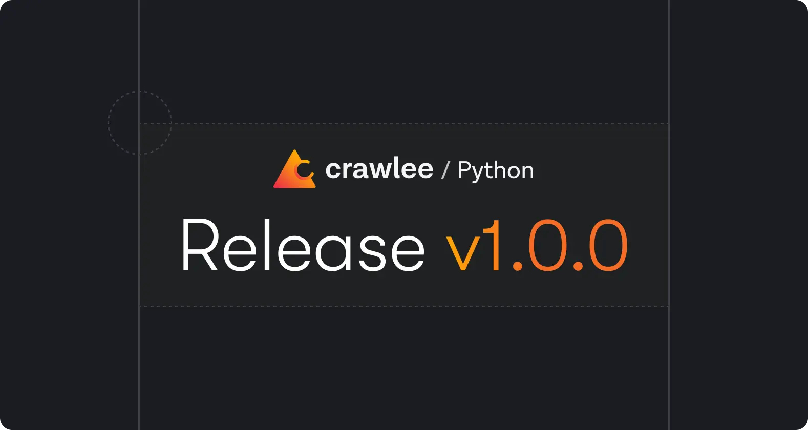

We launched Crawlee for Python in beta mode in [July 2024](https://crawlee.dev/blog/launching-crawlee-python). Over the past year, we received many early adopters, tremendous interest in the library from the Python community, more than 6000 stars on GitHub, a dozen contributors, and many feature requests.

After months of development, polishing, and community feedback, the library is leaving beta and entering a production/stable development status.

**We are happy to announce Crawlee for Python v1.0.0.**

From now on, Crawlee for Python will strictly follow [semantic versioning](https://semver.org/). You can now rely on it as a stable foundation for your crawling and scraping projects, knowing that breaking changes will only occur in major releases.

## What's new in Crawlee for Python v1

- [New storage client system](#new-storage-client-system)
- [Adaptive Playwright crawler](#adaptive-playwright-crawler)
- [Impit HTTP client](#impit-http-client)
- [Sitemap request loader](#sitemap-request-loader)
- [Robots exclusion standard](#robots-exclusion-standard)
- [Fingerprinting](#fingerprinting)
- [Open telemetry](#open-telemetry)



<!-- truncate -->

## Getting started

You can upgrade to the latest version straight from [PyPI](https://www.pypi.org/project/crawlee/):

```shell
pip install --upgrade crawlee
```

Check out the full changelog on our [website](https://www.crawlee.dev/python/docs/changelog#100-2025-09-15) to see all the details. If you are updating from an older version, make sure to follow our [Upgrading to v1](https://crawlee.dev/python/docs/upgrading/upgrading-to-v1) guide.

## New storage client system

One of the biggest architectural changes in Crawlee v1 is the introduction of a new storage client system. Until now, datasets, key–value stores, and request queues were handled in slightly different ways depending on where they were stored. With v1, this has been unified under a single, consistent interface.

This means that whether you're storing data in memory, on the local file system, in a database, on the Apify platform, or even using a custom backend, the API remains the same. The result is less duplication, better extensibility, and a cleaner developer experience. It also opens the door for the community to build and share their own storage client implementations.

For example, here's how to set up a crawler with a file-system–backed storage client, which persists data locally:

```python
from crawlee.configuration import Configuration
from crawlee.crawlers import ParselCrawler
from crawlee.storage_clients import FileSystemStorageClient

# Create a new instance of storage client.
storage_client = FileSystemStorageClient()

# Create a configuration with custom settings.
configuration = Configuration(
    storage_dir='./my_storage',
    purge_on_start=False,
)

# And pass them to the crawler.
crawler = ParselCrawler(
    storage_client=storage_client,
    configuration=configuration,
)
```

And here's an example of using a memory-only storage client, useful for testing or short-lived crawls:

```python
from crawlee.crawlers import ParselCrawler
from crawlee.storage_clients import MemoryStorageClient

# Create a new instance of storage client.
storage_client = MemoryStorageClient()

# And pass it to the crawler.
crawler = ParselCrawler(storage_client=storage_client)
```

With this new design, switching between storage backends is as simple as swapping out a client, without changing your crawling logic. To dive deeper into configuration, advanced usage (e.g. using different storage clients for specific storage instances), and even how to write your own storage client, see the [Storages](https://crawlee.dev/python/docs/guides/storages) and [Storage clients](https://crawlee.dev/python/docs/guides/storage-clients) guides.

## Adaptive Playwright crawler

Some websites can be scraped quickly with plain HTTP requests, while others require the full power of a browser to render dynamic content. Traditionally, you had to decide upfront whether to use one of the lightweight HTTP-based crawlers ([`ParselCrawler`](https://crawlee.dev/python/api/class/ParselCrawler) or [`BeautifulSoupCrawler`](https://crawlee.dev/python/api/class/BeautifulSoupCrawler)) or a browser-based [`PlaywrightCrawler`](https://crawlee.dev/python/api/class/PlaywrightCrawler). Crawlee v1 introduces the [`AdaptivePlaywrightCrawler`](https://crawlee.dev/python/api/class/AdaptivePlaywrightCrawler), which automatically chooses the right approach for each page.

The adaptive crawler starts with a fast HTTP request and only launches a headless browser if it detects that the page requires JavaScript rendering. This makes your crawls faster and cheaper, while still allowing you to reliably handle complex, dynamic websites. In practice, you get the best of both worlds: speed on simple pages and robustness on modern, JavaScript-heavy sites.

Here's a simplified example using the static [Parsel](https://github.com/scrapy/parsel) parser for HTTP responses, and falling back to [Playwright](https://playwright.dev/) only when needed:

```python
import asyncio
from datetime import timedelta

from crawlee.crawlers import AdaptivePlaywrightCrawler, AdaptivePlaywrightCrawlingContext


async def main() -> None:
    crawler = AdaptivePlaywrightCrawler.with_parsel_static_parser()

    @crawler.router.default_handler
    async def request_handler(context: AdaptivePlaywrightCrawlingContext) -> None:
        # Locate element h2 within 5 seconds
        h2 = await context.query_selector_one('h2', timedelta(milliseconds=5000))
        # Do stuff with element found by the selector
        context.log.info(h2)

    await crawler.run(['https://crawlee.dev/'])


if __name__ == '__main__':
    asyncio.run(main())
```

In this example, pages that don't need JavaScript rendering will be processed through the fast HTTP client, while others will be automatically handled with Playwright. You don't need to write two different crawlers or guess in advance which method to use - Crawlee adapts dynamically. For more details and configuration options, see the [Adaptive Playwright crawler](https://crawlee.dev/python/docs/guides/adaptive-playwright-crawler) guide.

## Impit HTTP client

Crawlee v1 introduces a brand-new default HTTP client: [`ImpitHttpClient`](https://crawlee.dev/python/api/class/ImpitHttpClient), powered by the [Impit](https://github.com/apify/impit) library. Written in Rust and exposed to Python through bindings, it delivers better performance, async-first design, HTTP/3 support, and browser impersonation. It can impersonate real browsers out of the box, which makes your crawlers harder to detect and block by common anti-bot systems. This means fewer false positives, more resilient crawls, and less need for complicated workarounds. Impit is also developed as an open-source project by Apify, so you can dive into the internals or contribute improvements yourself.

By default, Crawlee now uses [`ImpitHttpClient`](https://crawlee.dev/python/api/class/ImpitHttpClient) under the hood. But you can also create your own instance, configure it to your needs (e.g. enable HTTP/3 or choose a specific browser profile), and pass it into your crawler.

Here's an example of explicitly using [`ImpitHttpClient`](https://crawlee.dev/python/api/class/ImpitHttpClient) with a [`ParselCrawler`](https://crawlee.dev/python/api/class/ParselCrawler):

```python
import asyncio

from crawlee.crawlers import ParselCrawler, ParselCrawlingContext
from crawlee.http_clients import ImpitHttpClient


async def main() -> None:
    http_client = ImpitHttpClient(
        # Optional additional keyword arguments for `impit.AsyncClient`.
        http3=True,
        browser='firefox',
        verify=True,
    )

    crawler = ParselCrawler(
        http_client=http_client,
        # Limit the crawl to max requests. Remove or increase it for crawling all links.
        max_requests_per_crawl=10,
    )

    # Define the default request handler, which will be called for every request.
    @crawler.router.default_handler
    async def request_handler(context: ParselCrawlingContext) -> None:
        context.log.info(f'Processing {context.request.url} ...')

        # Enqueue all links from the page.
        await context.enqueue_links()

        # Extract data from the page.
        data = {
            'url': context.request.url,
            'title': context.selector.css('title::text').get(),
        }

        # Push the extracted data to the default dataset.
        await context.push_data(data)

    # Run the crawler with the initial list of URLs.
    await crawler.run(['https://crawlee.dev'])


if __name__ == '__main__':
    asyncio.run(main())
```

With the [`ImpitHttpClient`](https://crawlee.dev/python/api/class/ImpitHttpClient), you get stealth without extra dependencies or plugins. Check out the [HTTP clients](https://crawlee.dev/python/docs/guides/http-clients) guide for more details and advanced configuration options.

## Sitemap request loader

Many websites expose their structure through sitemaps. These files provide a clear list of all available URLs, and are often the most efficient way to discover content on a site. In previous Crawlee versions, you had to fetch and parse these XML files manually before feeding them into your crawler. With Crawlee v1, that's no longer necessary.

The new [`SitemapRequestLoader`](https://crawlee.dev/python/api/class/SitemapRequestLoader) lets you load URLs directly from a sitemap into your request queue, with options for filtering and batching. This makes it much easier to start large-scale crawls where sitemaps already provide full coverage of the site.

Here's an example that loads a sitemap, filters out only documentation pages, and processes them with a [`ParselCrawler`](https://crawlee.dev/python/api/class/ParselCrawler):

```python
import asyncio
import re

from crawlee.crawlers import ParselCrawler, ParselCrawlingContext
from crawlee.http_clients import ImpitHttpClient
from crawlee.request_loaders import SitemapRequestLoader


async def main() -> None:
    # Create an HTTP client for fetching the sitemap.
    http_client = ImpitHttpClient()

    # Create a sitemap request loader with filtering rules.
    sitemap_loader = SitemapRequestLoader(
        sitemap_urls=['https://crawlee.dev/sitemap.xml'],
        http_client=http_client,
        include=[re.compile(r'.*docs.*')],  # Only include URLs containing 'docs'.
        max_buffer_size=500,  # Keep up to 500 URLs in memory before processing.
    )

    # Convert the sitemap loader into a request manager linked
    # to the default request queue.
    request_manager = await sitemap_loader.to_tandem()

    # Create a crawler and pass the request manager to it.
    crawler = ParselCrawler(
        request_manager=request_manager,
        max_requests_per_crawl=10,  # Limit the max requests per crawl.
    )

    @crawler.router.default_handler
    async def handler(context: ParselCrawlingContext) -> None:
        context.log.info(f'Processing {context.request.url}')

        # New links will be enqueued directly to the queue.
        await context.enqueue_links()

        # Extract data using Parsel's XPath and CSS selectors.
        data = {
            'url': context.request.url,
            'title': context.selector.xpath('//title/text()').get(),
        }

        # Push extracted data to the dataset.
        await context.push_data(data)

    await crawler.run()


if __name__ == '__main__':
    asyncio.run(main())
```

By connecting the [`SitemapRequestLoader`](https://crawlee.dev/python/api/class/SitemapRequestLoader) directly with a crawler, you can skip the boilerplate of parsing XML and just focus on extracting data. For more details, see the [Request loaders](https://crawlee.dev/python/docs/guides/request-loaders) guide.

## Robots exclusion standard

Respecting [`robots.txt`](https://en.wikipedia.org/wiki/Robots.txt) is an important part of responsible web crawling. This simple file lets website owners declare which parts of their site should not be crawled by automated agents. Crawlee v1 makes it trivial to follow these rules: just set the `respect_robots_txt_file` option on your crawler, and Crawlee will automatically check the file before issuing requests.

This not only helps you build ethical crawlers, but can also save time and bandwidth by skipping disallowed or irrelevant pages. For example, login pages, search results, or admin sections are often excluded in [`robots.txt`](https://en.wikipedia.org/wiki/Robots.txt), and Crawlee will handle that for you automatically.

Here's a minimal example showing how a [`ParselCrawler`](https://crawlee.dev/python/api/class/ParselCrawler) obeys the robots exclusion standard:

```python
import asyncio

from crawlee.crawlers import ParselCrawler, ParselCrawlingContext


async def main() -> None:
    # Create a new crawler instance with robots.txt compliance enabled.
    crawler = ParselCrawler(
        respect_robots_txt_file=True,
    )

    # Define the default request handler.
    @crawler.router.default_handler
    async def request_handler(context: ParselCrawlingContext) -> None:
        context.log.info(f'Processing {context.request.url}')

        # Extract the data from website.
        data = {
            'url': context.request.url,
            'title': context.selector.xpath('//title/text()').get(),
        }

        # Push extracted data to the dataset.
        await context.push_data(data)

    # Run the crawler with the list of start URLs.
    # The crawler will check the robots.txt file before making requests.
    # In this example, "https://news.ycombinator.com/login" will be skipped
    # because it's disallowed in the site's robots.txt file.
    await crawler.run(
        ['https://news.ycombinator.com/', 'https://news.ycombinator.com/login']
    )


if __name__ == '__main__':
    asyncio.run(main())
```

With this option enabled, you don't need to manually check which URLs are allowed. Crawlee will handle it, letting you focus on the crawling logic and data extraction. For a more information, see the [Respect robots.txt file](https://crawlee.dev/python/docs/examples/respect-robots-txt-file) documentation page.

## Fingerprinting

Modern websites often rely on browser fingerprinting to distinguish real users from automated traffic. Instead of just checking the [User-Agent](https://developer.mozilla.org/en-US/docs/Web/HTTP/Reference/Headers/User-Agent) header, they combine dozens of subtle signals - supported fonts, canvas rendering, WebGL features, media devices, screen resolution, and more. Together, these form a unique [device fingerprint](https://en.wikipedia.org/wiki/Device_fingerprint) that can easily expose headless browsers or automation frameworks.

Without fingerprinting, Playwright sessions tend to look identical and are more likely to be flagged by anti-bot systems. Crawlee v1 integrates with the [`FingerprintGenerator`](https://crawlee.dev/python/api/class/FingerprintGenerator) to automatically inject realistic, randomized fingerprints into every [`PlaywrightCrawler`](https://crawlee.dev/python/api/class/PlaywrightCrawler) session. This modifies HTTP headers, browser APIs, and other low-level signals so that each crawler run looks like a real browser on a real device.

Using fingerprinting in Crawlee is straightforward: create a fingerprint generator with your desired options and pass it to the crawler.

```python
import asyncio

from crawlee.crawlers import PlaywrightCrawler, PlaywrightCrawlingContext
from crawlee.fingerprint_suite import (
    DefaultFingerprintGenerator,
    HeaderGeneratorOptions,
    ScreenOptions,
)


async def main() -> None:
    # Use default fingerprint generator with desired fingerprint options.
    # Generator will generate real looking browser fingerprint based on the options.
    # Unspecified fingerprint options will be automatically selected by the generator.
    fingerprint_generator = DefaultFingerprintGenerator(
        header_options=HeaderGeneratorOptions(browsers=['chrome']),
        screen_options=ScreenOptions(min_width=400),
    )

    crawler = PlaywrightCrawler(
        # Limit the crawl to max requests. Remove or increase it for crawling all links.
        max_requests_per_crawl=10,
        # Headless mode, set to False to see the browser in action.
        headless=False,
        # Browser types supported by Playwright.
        browser_type='chromium',
        # Fingerprint generator to be used. By default no fingerprint generation is done.
        fingerprint_generator=fingerprint_generator,
    )

    # Define the default request handler, which will be called for every request.
    @crawler.router.default_handler
    async def request_handler(context: PlaywrightCrawlingContext) -> None:
        context.log.info(f'Processing {context.request.url} ...')

        # Find a link to the next page and enqueue it if it exists.
        await context.enqueue_links(selector='.morelink')

    # Run the crawler with the initial list of URLs.
    await crawler.run(['https://news.ycombinator.com/'])


if __name__ == '__main__':
    asyncio.run(main())
```

In this example, each Playwright instance starts with a unique, realistic fingerprint. From the website’s perspective, the crawler behaves like a real browser session, reducing the chance of detection or blocking. For more details and examples, see the [Avoid getting blocked](https://crawlee.dev/python/docs/guides/avoid-blocking) guide and the [Playwright crawler with fingerprint generator](https://crawlee.dev/python/docs/examples/playwright-crawler-with-fingeprint-generator) documentation page.

## Open telemetry

Running crawlers in production means you often want more than just logs - you need visibility into what the crawler is doing, how it's performing, and where bottlenecks occur. Crawlee v1 adds basic [OpenTelemetry](https://opentelemetry.io/) instrumentation via [`CrawlerInstrumentor`](https://crawlee.dev/python/api/class/CrawlerInstrumentor), giving you a standardized way to collect traces and metrics from your crawlers.

With [OpenTelemetry](https://opentelemetry.io/) enabled, Crawlee automatically records information such as:

- Requests and responses (including timings, retries, and errors).
- Resource usage events (memory, concurrency, system snapshots).
- Lifecycle events from crawlers, routers, and handlers.

These signals can be exported to any OpenTelemetry-compatible backend (e.g. [Jaeger](https://www.jaegertracing.io/), [Prometheus](https://prometheus.io/), or [Grafana](https://grafana.com/)), where you can monitor real-time dashboards or analyze traces to understand crawler performance.

Here's a minimal example:

```python
import asyncio

from opentelemetry.exporter.otlp.proto.grpc.trace_exporter import OTLPSpanExporter
from opentelemetry.sdk.resources import Resource
from opentelemetry.sdk.trace import TracerProvider
from opentelemetry.sdk.trace.export import SimpleSpanProcessor
from opentelemetry.trace import set_tracer_provider

from crawlee.crawlers import BasicCrawlingContext, ParselCrawler, ParselCrawlingContext
from crawlee.otel import CrawlerInstrumentor
from crawlee.storages import Dataset, KeyValueStore, RequestQueue


def instrument_crawler() -> None:
    resource = Resource.create(
        {
            'service.name': 'ExampleCrawler',
            'service.version': '1.0.0',
            'environment': 'development',
        }
    )

    # Set up the OpenTelemetry tracer provider and exporter
    provider = TracerProvider(resource=resource)
    otlp_exporter = OTLPSpanExporter(endpoint='localhost:4317', insecure=True)
    provider.add_span_processor(SimpleSpanProcessor(otlp_exporter))
    set_tracer_provider(provider)
    # Instrument the crawler with OpenTelemetry
    CrawlerInstrumentor(
        instrument_classes=[RequestQueue, KeyValueStore, Dataset]
    ).instrument()


async def main() -> None:
    instrument_crawler()

    crawler = ParselCrawler(max_requests_per_crawl=100)
    kvs = await KeyValueStore.open()

    @crawler.pre_navigation_hook
    async def pre_nav_hook(_: BasicCrawlingContext) -> None:
        # Simulate some pre-navigation processing
        await asyncio.sleep(0.01)

    @crawler.router.default_handler
    async def handler(context: ParselCrawlingContext) -> None:
        await context.push_data({'url': context.request.url})
        await kvs.set_value(key='url', value=context.request.url)
        await context.enqueue_links()

    await crawler.run(['https://crawlee.dev/'])


if __name__ == '__main__':
    asyncio.run(main())
```

Once configured, your traces and metrics can be exported using standard OpenTelemetry exporters (e.g. OTLP, console, or custom backends). This makes it much easier to integrate Crawlee into existing monitoring pipelines. For more details on available options and examples of exporting traces, see the [Trace and monitor crawlers](https://crawlee.dev/python/docs/guides/trace-and-monitor-crawlers) guide.

## A message from the Crawlee team

Last but not least, we want to thank our open-source community members who tried Crawlee for Python in its beta version and helped us improve it for the scraping and automation community.

We would appreciate it if you could check out the latest version and [give us a star on GitHub](https://github.com/apify/crawlee-python/) if you like the new features.

If you have any questions or feedback, please open a [GitHub discussion](https://www.github.com/apify/crawlee-python/discussions) or [join our Discord community](https://apify.com/discord/) to get support or talk to fellow Crawlee users. If you encounter any bugs or have an idea for a new feature, please open a [GitHub issue](https://www.github.com/apify/crawlee-python/issues).
