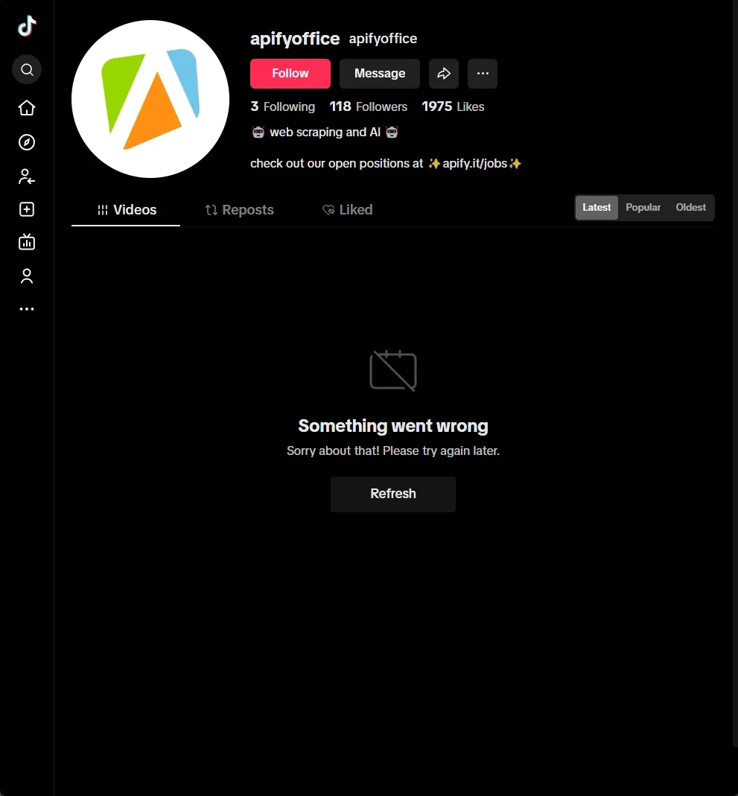
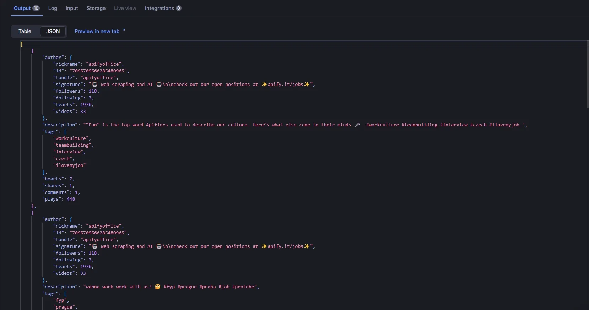

[TikTok](https://www.tiktok.com/) users generate tons of data that are valuable for analysis.

Which hashtags are trending now? What is an influencer's engagement rate? What topics are important for a content creator? You can find answers to these and many other questions by analyzing TikTok data. However, for analysis, you need to extract the data in a convenient format. In this blog, we'll explore how to scrape TikTok using [Crawlee for Python](https://github.com/apify/crawlee-python).

:::note

One of our community members wrote this blog as a contribution to the Crawlee Blog. If you'd like to contribute articles like these, please reach out to us on our [Discord channel](https://apify.com/discord).

:::


Key steps we'll cover:

1. [Project setup](https://www.crawlee.dev/blog/scrape-tiktok-python#1-project-setup)
2. [Analyzing TikTok and determining a scraping strategy](https://www.crawlee.dev/blog/scrape-tiktok-python#2-analyzing-tiktok-and-determining-a-scraping-strategy)
3. [Configuring Crawlee](https://www.crawlee.dev/blog/scrape-tiktok-python#3-configuring-crawlee)
4. [Extracting TikTok data](https://www.crawlee.dev/blog/scrape-tiktok-python#4-extracting-tiktok-data)
5. [Prepare for the Apify platform as an Apify Actor](https://www.crawlee.dev/blog/scrape-tiktok-python#5-prepare-for-the-apify-platform-as-an-apify-actor)
6. [Deploying to Apify](https://www.crawlee.dev/blog/scrape-tiktok-python#6-deploying-to-apify)

<!-- truncate -->

## Prerequisites

- Python 3.9 or higher
- Familiarity with web scraping concepts
- Crawlee for Python `v0.6.8`
- [uv](https://docs.astral.sh/uv/) `v0.6` or higher
- An Apify account

## 1. Project setup

:::note

Before going ahead with the project, I'd like to ask you to star Crawlee for Python on [GitHub](https://github.com/apify/crawlee-python/), it helps us to spread the word to fellow scraper developers.

:::

In this project, we'll use UV for package management and a specific Python version will be installed through UV. UV is a fast and modern package manager written in Rust.

If you don't have UV installed yet, just follow the [guide](https://docs.astral.sh/uv/getting-started/installation/) or use this command:

```bash
curl -LsSf https://astral.sh/uv/install.sh | sh
```

To create the project, run:

```bash
uvx crawlee[cli] create tiktok-crawlee
```

In the `cli` menu that opens, select:

1. `Playwright`
2. `Httpx`
3. `Uv`
4. Leave the default value - `https://crawlee.dev`
5. `y`

Creating the project may take a few minutes. After installation is complete, navigate to the project folder:

```bash
cd tiktok-crawlee
```

## 2. Analyzing TikTok and determining a scraping strategy

TikTok uses quite a lot of JavaScript on its site, both for displaying content and for analyzing user behavior, including detecting and blocking crawlers. Therefore, for crawling TikTok, we'll use a headless browser with [Playwright](https://playwright.dev/python/).

To load new elements on a user's page, TikTok uses infinite scrolling. You may already be familiar with this method from this [article](https://www.crawlee.dev/blog/infinite-scroll-using-python).

Let's look at what happens under the hood when we scroll a TikTok page. I recommend studying network activity in [DevTools](https://developer.chrome.com/docs/devtools) to understand what requests are going to the server.


Let's examine the HTML structure to understand if navigating to elements will be difficult.


Well, this looks quite simple. If using [CSS selectors](https://developer.mozilla.org/en-US/docs/Web/CSS/CSS_selectors), `[data-e2e="user-post-item"] a` is sufficient.

Let's look at what a video page response looks like to see what data we can extract.


It seems that the HTML code contains JSON with all the data we're interested in. Great!

## 3. Configuring Crawlee

Now that we understand our scraping strategy, let's set up Crawlee for scraping TikTok.

Since pages have infinite scrolling, we need to limit the number of elements we want to get. For this, we'll add a `max_items` parameter that will limit the maximum number of elements for each search and pass it in `user_data` when forming a [Request](https://www.crawlee.dev/python/api/class/Request).

We'll limit the intensity of scraping by setting `max_tasks_per_minute` in [`ConcurrencySettings`](https://www.crawlee.dev/python/api/class/ConcurrencySettings). This will help us reduce the likelihood of being blocked by TikTok.

We'll set `browser_type` to `firefox`, as it performed better for TikTok in my tests.
TikTok may request permissions to access device data, so we'll explicitly limit all [permissions](https://playwright.dev/python/docs/api/class-browser#browser-new-context-option-permissions) by passing the appropriate parameter to `browser_new_context_options`.

Scrolling pages can take a long time, so we should increase the time limit for processing a single request using `request_handler_timeout`.

```python
# main.py

from datetime import timedelta

from apify import Actor

from crawlee import ConcurrencySettings, Request
from crawlee.crawlers import PlaywrightCrawler

from .routes import router

async def main() -> None:
    """The crawler entry point."""
    # When creating the template, we confirmed Apify integration.
    # However, this isn't important for us at this stage.
    async with Actor:

        max_items = 20

        # Create a crawler with the necessary settings
        crawler = PlaywrightCrawler(
            # Limit scraping intensity by setting a limit on requests per minute
            concurrency_settings=ConcurrencySettings(max_tasks_per_minute=50),
            # We'll configure the `router` in the next step
            request_handler=router,
            # You can use `False` during development. But for production, it's always `True`
            headless=True,
            max_requests_per_crawl=100,
            # Increase the timeout for the request handling pipeline
            request_handler_timeout=timedelta(seconds=120),
            browser_type='firefox',
            # Limit any permissions to device data
            browser_new_context_options={'permissions': []},
        )

        # Run the crawler to collect data from several user pages
        await crawler.run(
            [
                Request.from_url('https://www.tiktok.com/@apifyoffice', user_data={'limit': max_items}),
                Request.from_url('https://www.tiktok.com/@authorbrandonsanderson', user_data={'limit': max_items}),
            ]
        )
```

Someone might ask, "What about configurations to avoid fingerprint blocking?!!!" My answer is, "Crawlee for Python has already done that for you."

Depending on your deployment environment, you may need to add a proxy. We'll come back to this in the last section.

## 4. Extracting TikTok data

After configuration, let's move on to navigation and data extraction.

For infinite scrolling, we'll use the built-in helper function ['infinite_scroll'](https://www.crawlee.dev/python/api/class/PlaywrightCrawlingContext#infinite_scroll). But instead of waiting for scrolling to complete, which in some cases can take a really long time, we'll use Python's `asyncio` capabilities to make it a background task.

Also, with deeper investigation, you may encounter a TikTok page that doesn't load user videos, but only shows a button and an error message.



It's very important to handle this case.

Also during testing, I discovered that you need to interact with scrolling, otherwise when using `infinite_scroll`, new elements don't load. I think this is a TikTok bug.

Let's start with a simple function to extract video links. It will help avoid code duplication.

```python
# routes.py

import asyncio
import json

from playwright.async_api import Page

from crawlee import Request
from crawlee.crawlers import PlaywrightCrawlingContext
from crawlee.router import Router

router = Router[PlaywrightCrawlingContext]()


# Helper function that extracts all loaded video links
async def extract_video_links(page: Page) -> list[Request]:
    """Extract all loaded video links from the page."""
    links = []
    for post in await page.query_selector_all('[data-e2e="user-post-item"] a'):
        post_link = await post.get_attribute('href')
        if post_link and '/video/' in post_link:
            links.append(Request.from_url(post_link, label='video'))
    return links
```

Now we can move on to the main handler that will process TikTok user pages.

```python
# routes.py

# Main handler used for TikTok user pages
@router.default_handler
async def default_handler(context: PlaywrightCrawlingContext) -> None:
    """Handle request without specific label."""
    context.log.info(f'Processing {context.request.url} ...')

    # Get the limit for video elements from `user_data`
    limit = context.request.user_data.get('limit', 10)
    if not isinstance(limit, int):
        raise TypeError('Limit must be an integer')

    # Wait until the button or at least a video loads, if the connection is slow
    check_locator = context.page.locator('[data-e2e="user-post-item"], main button').first
    await check_locator.wait_for()

    # If the button loaded, click it to initiate video loading
    if button := await context.page.query_selector('main button'):
        await button.click()

    # Perform interaction with scrolling
    await context.page.press('body', 'PageDown')

    # Start `infinite_scroll` as a background task
    scroll_task: asyncio.Task[None] = asyncio.create_task(context.infinite_scroll())

    # Wait until scrolling is completed or until the limit is reached
    while not scroll_task.done():
        requests = await extract_video_links(context.page)
        # If we've already reached the limit, interrupt scrolling and exit the loop
        if len(requests) >= limit:
            scroll_task.cancel()
            break
        # Switch the asynchronous context to allow other tasks to execute
        await asyncio.sleep(0.2)
    else:
        requests = await extract_video_links(context.page)

    # Limit the number of requests to the limit value
    requests = requests[:limit]

    # If the page wasn't properly processed for some reason and didn't find any links,
    # then I want to raise an error for retry
    if not requests:
        raise RuntimeError('No video links found')

    await context.add_requests(requests)
```

The final stage is handling the video page.

```python
# routes.py

@router.handler(label='video')
async def video_handler(context: PlaywrightCrawlingContext) -> None:
    """Handle request with the label 'video'."""
    context.log.info(f'Processing video {context.request.url} ...')

    # Extract the element containing JSON with data
    json_element = await context.page.query_selector('#__UNIVERSAL_DATA_FOR_REHYDRATION__')
    if json_element:
        # Extract JSON and convert it to a dictionary
        text_data = await json_element.text_content()
        json_data = json.loads(text_data)

        data = json_data['__DEFAULT_SCOPE__']['webapp.video-detail']['itemInfo']['itemStruct']

        # Create result item
        result_item = {
            'author': {
                'nickname': data['author']['nickname'],
                'id': data['author']['id'],
                'handle': data['author']['uniqueId'],
                'signature': data['author']['signature'],
                'followers': data['authorStats']['followerCount'],
                'following': data['authorStats']['followingCount'],
                'hearts': data['authorStats']['heart'],
                'videos': data['authorStats']['videoCount'],
            },
            'description': data['desc'],
            'tags': [item['hashtagName'] for item in data['textExtra'] if item['hashtagName']],
            'hearts': data['stats']['diggCount'],
            'shares': data['stats']['shareCount'],
            'comments': data['stats']['commentCount'],
            'plays': data['stats']['playCount'],
        }

        # Save the result to the dataset
        await context.push_data(result_item)
    else:
        # If the data wasn't received, we raise an error for retry
        raise RuntimeError('No JSON data found')
```

The crawler is ready for local launch. To run it, execute the command:

```bash
uv run python -m tiktok_crawlee
```

You can view the saved results in the `dataset` folder, path `./storage/datasets/default/`.

Example record:

```json
{
  "author": {
    "nickname": "apifyoffice",
    "id": "7095709566285480965",
    "handle": "apifyoffice",
    "signature": "🤖 web scraping and AI 🤖\n\ncheck out our open positions at ✨apify.it/jobs✨",
    "followers": 118,
    "following": 3,
    "hearts": 1975,
    "videos": 33
  },
  "description": ""Fun" is the top word Apifiers used to describe our culture. Here's what else came to their minds 🎤  #workculture #teambuilding #interview #czech #ilovemyjob ",
  "tags": [
    "workculture",
    "teambuilding",
    "interview",
    "czech",
    "ilovemyjob"
  ],
  "hearts": 7,
  "shares": 1,
  "comments": 1,
  "plays": 448
}
```

## 5. Prepare for the [Apify platform](https://apify.com/) as an Apify Actor

For deployment, we'll use the [Apify platform](https://apify.com/). It's a simple and effective environment for cloud deployment, allowing efficient interaction with your crawler. Call it via [API](https://docs.apify.com/api/v2/), [schedule tasks](https://docs.apify.com/platform/schedules), [integrate](https://docs.apify.com/platform/integrations) with various services, and much more.

To deploy to the Apify platform, we need to adapt our project for the [Apify Actor](https://apify.com/actors) structure.

Create an `.actor` folder with the necessary files.

```bash
mkdir .actor && touch .actor/{actor.json,input_schema.json}
```

Move the `Dockerfile` from the root folder to `.actor`.

```bash
mv Dockerfile .actor
```

Let's fill in the empty files:

The `actor.json` file contains project metadata for the Apify platform. Follow the [documentation for proper configuration](https://docs.apify.com/platform/actors/development/actor-definition/actor-json):

```json
{
  "actorSpecification": 1,
  "name": "TikTok-Crawlee",
  "title": "TikTok - Crawlee",
  "minMemoryMbytes": 2048,
  "description": "Scrape video elements from TikTok user pages",
  "version": "0.1",
  "meta": {
    "templateId": "tiktok-crawlee"
  },
  "input": "./input_schema.json",
  "dockerfile": "./Dockerfile"
}
```

Actor input parameters are defined using `input_schema.json`, which is specified [here](https://docs.apify.com/platform/actors/development/actor-definition/input-schema/specification/v1).

Let's define input parameters for our crawler:

- `maxItems` - this should be an externally configurable parameter.
- `urls` - these are links to TikTok user pages, the starting points for our crawler's scraping
- `proxySettings` - proxy settings, since without a proxy you'll be using the datacenter IP that Apify uses.

```json
{
    "title": "TikTok Crawlee",
    "type": "object",
    "schemaVersion": 1,
    "properties": {
        "urls": {
            "title": "List URLs",
            "type": "array",
            "description": "Direct URLs to pages TikTok profiles.",
            "editor": "stringList",
            "prefill": ["https://www.tiktok.com/@apifyoffice"]
        },
        "maxItems": {
            "type": "integer",
            "editor": "number",
            "title": "Limit search results",
            "description": "Limits the maximum number of results, applies to each search separately.",
            "default": 10
        },
        "proxySettings": {
            "title": "Proxy configuration",
            "type": "object",
            "description": "Select proxies to be used by your scraper.",
            "prefill": { "useApifyProxy": true },
            "editor": "proxy"
        }
    },
    "required": ["urls"]
}
```

Let's update the code to accept input parameters.

```python
# main.py

from datetime import timedelta

from apify import Actor
from crawlee.crawlers import PlaywrightCrawler
from crawlee import ConcurrencySettings
from crawlee import Request

from .routes import router

async def main() -> None:
    """The crawler entry point."""
    async with Actor:
        # highlight-start
        # Accept input parameters passed when starting the Actor
        actor_input = await Actor.get_input()

        max_items = actor_input.get('maxItems', 0)
        requests = [Request.from_url(url, user_data={'limit': max_items}) for url in actor_input.get('urls', [])]
        proxy = await Actor.create_proxy_configuration(actor_proxy_input=actor_input.get('proxySettings'))
        # highlight-end
    
        crawler = PlaywrightCrawler(
            concurrency_settings=ConcurrencySettings(max_tasks_per_minute=50),
            proxy_configuration=proxy,
            request_handler=router,
            headless=True,
            request_handler_timeout=timedelta(seconds=120),
            browser_type='firefox',
            browser_new_context_options={'permissions': []}
        )

        await crawler.run(requests)
```

That's it, the project is ready for deployment.

## 6. Deploying to Apify

Use the official [Apify CLI](https://docs.apify.com/cli/) to upload your code:

Authenticate using your API token from [Apify Console](https://console.apify.com/settings/integrations):

```bash
apify login
```

Choose "Enter API token manually" and paste your token.

Push the project to the platform:

```bash
apify push
```

Now you can configure runs on the Apify platform.

Let's perform a test run:

Fill in the input parameters:


Check that logging works correctly:


View results in the dataset:



If you want to make your Actor public and provide access to other users, potentially to earn income from it, follow this [publishing guide](https://docs.apify.com/platform/actors/publishing) for [Apify Store](https://apify.com/store).

## Conclusion

We've created a good foundation for crawling TikTok using Crawlee for Python and Playwright. If you want to improve the project, I would recommend adding error handling and handling cases when you get a CAPTCHA to reduce the likelihood of being blocked by TikTok. However, this is a good foundation to start working with TikTok. It allows you to get data right now.

You can find the complete code in the [repository](https://github.com/Mantisus/tiktok-crawlee)

If you enjoyed this blog, feel free to support Crawlee for Python by starring the [repository](https://github.com/apify/crawlee-python) or joining the maintainer team.

Have questions or want to discuss implementation details? Join our [Discord](https://discord.com/invite/jyEM2PRvMU) - our community of 10,000+ developers is there to help.
