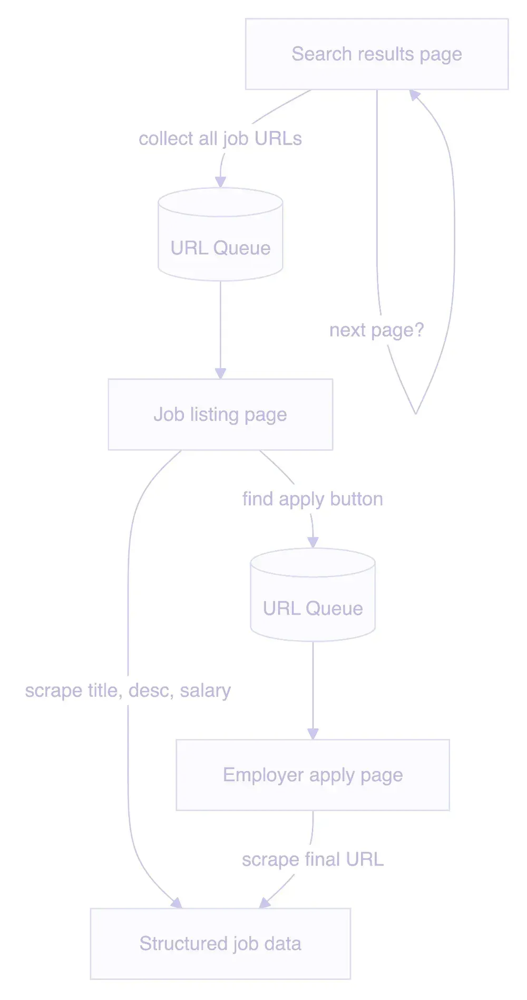
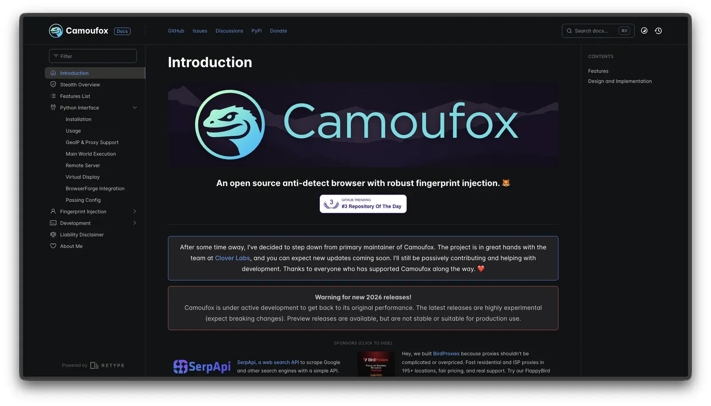
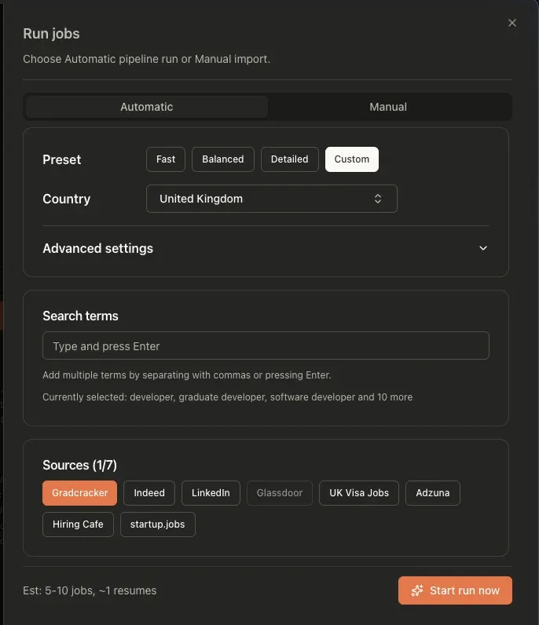

> 👉 This article was written by [Shaheer Sarfaraz](https://www.linkedin.com/in/ssarfaraz30/) as part of [Write for Apify](https://apify.com/resources/write-for-apify) - a program for developers sharing original articles about what they've built with Crawlee.

I spent three days debugging a scraper that I really expected to have knocked out in an afternoon. At one point I had four different AI models open simultaneously, all confidently giving me solutions that did absolutely nothing. I fixed it eventually. By thinking. Like an animal.

## What JobOps does

[JobOps](https://jobops.app/) is a self-hosted job search pipeline I built because I was tired of manually checking job boards that quietly delete listings the moment they expire. It scrapes eight international and UK-specific job sources (like LinkedIn, Indeed), normalizes the results, and stores them so I can search historical data instead of whatever happens to be live today. It's got over 2,700 stars on [GitHub](https://github.com/dakheera47/job-ops/), which I think means other people had the same problem.

Most of the sources were relatively easy to add. A couple took an afternoon. One took the better part of a week and is still the scraper I trust least. That one is [Gradcracker](https://www.gradcracker.com/), the main UK graduate job board for engineering and tech, and the source that taught me more about [Crawlee](https://crawlee.dev) than everything else in JobOps combined.

This is that story.

<!-- truncate -->

## Why I used Crawlee for this scraper

Gradcracker is serious about bot detection. Like, genuinely serious. A basic requests setup gets you nowhere. You need a full browser, and you need it to behave like a real one.

I'd used Crawlee before and liked it, so it was a natural pick. The part that sold me originally was the [queuing system](https://crawlee.dev/js/api/core/class/RequestQueue) – it's one of those things that just clicks mentally. You're not fighting it to do what you want, you're just describing what you want and it handles the rest.

This was good, because the crawl itself has a few moving parts. The flow for Gradcracker looks like this:

1. Hit a search results page, collect all the job listing links and queue them
2. Scrape each job page for the actual content
3. Find the "Apply Online" button, queue that URL
4. Scrape the application URL (usually the employer's own site)
5. Go back, hit the next paginated page, repeat



In plain [Playwright](http://playwright.dev/), none of this is impossible. It's just more state to manage yourself. I'd need to track which search pages I'd seen, which job URLs were already queued, which application links had already been resolved, and how to hand results between those stages without turning the scraper into a pile of ad hoc bookkeeping. Crawlee gave me that structure up front.

On paper, this was the right tool for the job. And for the crawler part, it was. The problems came from Gradcracker itself.

## The first version that almost worked

Getting the basics working was actually fine. [Crawlee's PlaywrightCrawler](https://crawlee.dev/js/api/playwright-crawler/class/PlaywrightCrawler) got me up and running quickly, and the router setup clicked immediately. You define handlers, you [label your requests](https://crawlee.dev/js/api/core/class/Request#label), and the queue just... does what you'd expect from a queue.

The URL structure for Gradcracker is predictable, which helped. I generate start URLs by combining locations and roles:

```typescript
const gradcrackerUrls = locations.flatMap((location) => {
  return roles.map((role) => ({
    url: `https://www.gradcracker.com/search/computing-technology/${role}-graduate-jobs-in-${location}?order=dateAdded`,
    role,
  }));
});
```

Each one gets labeled as a `gradcracker-list-page` and fed into the crawler. From there, the router takes over – list pages [enqueue](https://crawlee.dev/js/api/core/function/enqueueLinks) individual job pages, job pages scrape content and handle the apply button. Clean handoffs, no manual state management. This is the part where Crawlee genuinely earns its keep.

It worked. The first run pulled real data. I was happy.

Then Gradcracker started pushing back.

## How Gradcracker's bot detection broke the scraper

The initial version had no real bot avoidance beyond what Playwright gives you out of the box. That wasn't enough. Gradcracker would let the first few requests through, then challenge the crawler – sometimes a CAPTCHA, sometimes just a blank page, sometimes a silent block that looked like success but wasn't. Completely unpredictable.

The fix was swapping in [Camoufox](https://camoufox.com/), a Firefox-based browser built specifically for anti-detection. Instead of Chromium doing a bad impression of a real user, you get an actual Firefox instance with humanized behavior, randomized fingerprints, and geolocation baked in:



```typescript
launchContext: {
  launcher: firefox,
  launchOptions: await launchOptions({
    headless: true,
    humanize: true,
    geoip: true,
  }),
},
```

Combined with dropping concurrency to a max of 2 and adding delays between requests, the flakiness mostly went away. Mostly.

The lesson here wasn't that Camoufox is magic. It was that a full browser still fails if the site can fingerprint it as obviously automated.

There was still one problem. And it was a weird one.

## Solving the delayed redirect problem

The apply button on Gradcracker doesn't navigate in the tab you're already on. It opens a new one. Fine, [Playwright handles popups](https://github.com/microsoft/playwright/issues/21666). Except the website didn't open a popup reliably.

The button also has a randomized delay before anything happens. So you click it, and then... you wait. Could be half a second, could be longer. And then a new tab spawns, bounces through several URL changes, and eventually lands on the actual application page, i.e., the employer's own site.

The problem was that "several" is doing a lot of work in that sentence. It's not a fixed number. Sometimes two redirects. Sometimes four. Sometimes more. Completely variable.

Every AI suggestion I tried made the same assumption: that the navigation had a predictable shape. Wait for one URL change. Wait for two. Wait for `domcontentloaded`. Wait for `networkidle`. None of it worked because none of it accounted for the fact that the number of redirects was different every single time. I had Claude, ChatGPT, and a couple others all giving me variations of the same wrong answer with increasing confidence. Two days of this, on and off.

The fix, when I finally worked it out myself, was embarrassingly simple.

Stop trying to predict when navigation is done. Instead, just poll the URL every 100ms and wait until it hasn't changed for three consecutive checks, and isn't still on Gradcracker:

```typescript
const waitForUrlStable = async (
  targetPage: typeof page,
  maxWaitMs = 10000,
  checkIntervalMs = 100,
  requiredStableChecks = 3,
) => {
  let lastUrl = targetPage.url();
  let stableCount = 0;
  const startTime = Date.now();

  while (Date.now() - startTime < maxWaitMs) {
    await targetPage.waitForTimeout(checkIntervalMs);
    const currentUrl = targetPage.url();
    if (currentUrl === lastUrl && !currentUrl.includes("gradcracker")) {
      stableCount++;
      if (stableCount >= requiredStableChecks) return currentUrl;
    } else {
      stableCount = 1;
      lastUrl = currentUrl;
    }
  }
  return lastUrl;
};
```

No assumptions about how many redirects there are. No Playwright navigation events. Just "is it done moving?" That's it. That's the whole fix. I stared at this problem for two days and the solution was a while loop and a counter. Navigation events are the wrong abstraction when you don't know how many redirects there are. I kept trying to describe the shape of the navigation instead of just asking "has it stopped?" The moment I reframed the question, the solution was obvious.

## Trade-offs: slow, fragile, but usable

The scraper works. It runs, it pulls real data, and the redirect bug is solved.



But it's slow. Genuinely, frustratingly slow. And that's not really a Crawlee problem or even a me problem, it's Gradcracker. Every list page needs `waitForSelector` to confirm the job cards have actually rendered before you start scraping them. Every request needs breathing room or you get challenged. Concurrency is capped at 2. There are delays baked in everywhere.

It's also the one I trust the least. Every other scraper either works or fails loudly. Gradcracker occasionally just... quietly underperforms. A run comes back with fewer jobs than expected and I'm never entirely sure if that's the site, the bot detection kicking in softly, or something else entirely. It's opaque in a way the others aren't.

It works. I just don't love it. Slow and reliable beats fast and blocked. Every delay I baked in was time I was giving Gradcracker to not challenge me. It's not elegant, but it works more often than the alternative.

## What I'd change next

If I rebuilt this tomorrow, I'd keep Crawlee. That's not a diplomatic answer, it's just the truth. Two days of pain, and none of it was Crawlee's fault. The framework did exactly what I asked. The website was the problem. When your tool isn't the bottleneck, you don't replace the tool.

The one thing I'd actually change is proxy rotation. Right now the concurrency cap and the delays are doing the heavy lifting for rate limiting, which works but is fragile. A proper rotating proxy setup would make the scraper faster and more resilient. I just don't have the budget for it right now, so instead I have a slow scraper that I run and hope for the best.

## Conclusion

The main takeaway from all of this is pretty simple: scraping frameworks rarely cause the worst pain. Websites do. Crawlee handled the structural complexity cleanly enough that almost all my time went on Gradcracker's actual quirks, the bot detection, the delayed popups, the unstable redirects. You don't want magic from a framework. Just less wasted engineering effort on the extra bits, so you can focus on the actual problem.

The actual problem, in this case, was a while loop I should have written on day one.

The code is open source if you want to dig in:
- JobOps repo: [github.com/DaKheera47/job-ops](http://github.com/DaKheera47/job-ops)
- Gradcracker extractor: [github.com/DaKheera47/job-ops/tree/main/extractors/gradcracker](http://github.com/DaKheera47/job-ops/tree/main/extractors/gradcracker)

---

**About [Shaheer Sarfaraz](https://www.linkedin.com/in/ssarfaraz30/):** I build scraping and automation systems, including JobOps, a self-hosted job search pipeline that aggregates and stores listings across multiple sources. I've worked on production React/TypeScript systems at Autodesk, and most of my time goes into making brittle systems reliable enough to actually run. Find me at [dakheera47.com](http://dakheera47.com), [LinkedIn](https://www.linkedin.com/in/ssarfaraz30/), and [GitHub](https://github.com/dakheera47/).
