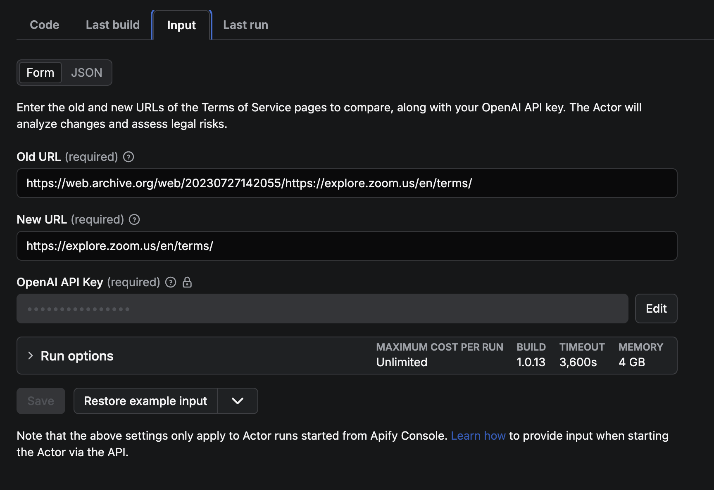
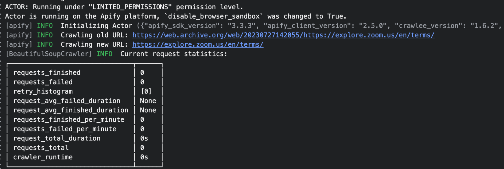
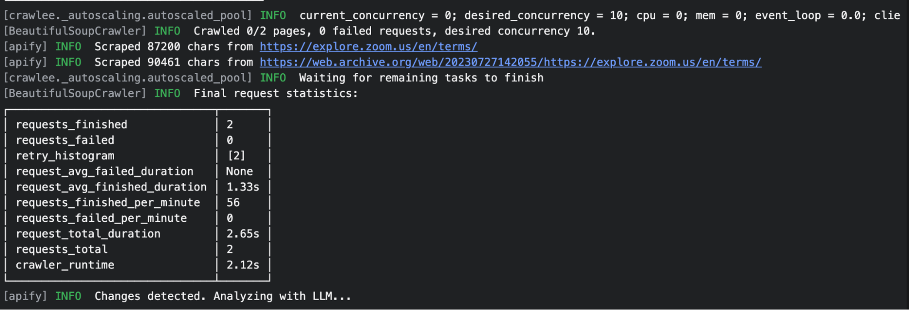
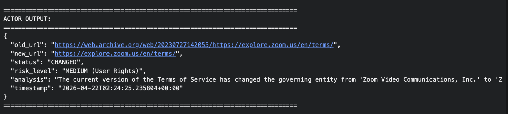

> 👉 This article was written by [Olasile Abolade](https://www.linkedin.com/in/olasile-abolade/) as part of [Write for Apify](https://apify.com/resources/write-for-apify), a program for developers sharing original articles about what they've built with Apify.

Software services update their terms quietly. When a major cloud provider tweaked its data retention policy, most users didn't notice until it was too late. Olasile Abolade built ToS Watchdog, an Apify Actor that monitors legal pages, detects semantic changes, and uses an LLM to flag what's important.

---

It's always a given that software services update their legal Terms of Service on a frequent basis. When they do, how do you know if there are no new clauses that impact your rights as a consumer? New clauses can be added or amended to legal documents: fee or pricing adjustments, data privacy, confidentiality, age restrictions, and so on. These can sometimes be made without explicit communication.

As a consumer of these services, it's important to read and understand the implications of any changes to your rights. So how do you efficiently and reliably monitor such legal contracts manually?

I built a Terms of Service (ToS) watchdog on [Apify](https://apify.com/) to avoid the kind of [Adobe](https://www.pcmag.com/news/adobe-sparks-backlash-over-ai-terms-that-let-it-access-view-your-content) fiasco that sparked public backlash following a controversial update to its Terms of Service. The [ToS Watchdog](https://apify.com/woundless_vehicle/tos-watchdog) is an Actor that monitors legal pages of software services and performs a one-time comparison between the old and new page. If semantic differences are detected, it delegates legal risk analysis to an LLM via LangChain. Results are then persisted in the Apify dataset as structured JSON.

## Overview of the Actor: Terms of Service (ToS) Watchdog

Automating compliance monitoring relies on having a tool that doesn't just track websites but can also handle the unstructured and messy patterns of web data. The Apify platform has several features capable of performing a range of web scraping techniques, including rendering JavaScript-heavy policies. The platform can also be configured for proactive monitoring by setting the Actor to run on a schedule appropriate for your needs and use cases.

The Actor executes a direct comparison between two URLs and uses AI to assess the legal risk of changes. The main features include:

- **Proactive monitoring:** constantly monitors Terms of Service pages of vendors for changes or updates
- **Crawlee-powered fetching:** uses `BeautifulSoupCrawler` with built-in retries and request management
- **Direct comparison:** compares two URLs side-by-side (old vs. new)
- **One-time analysis:** no stateful storage, perfect for ad-hoc comparisons
- **Change detection:** identifies differences between versions
- **LLM analysis:** uses GPT-4o-mini to identify high-risk changes
- **Structured output:** saves results to the Apify dataset in JSON format

## Actor implementation

ToS Watchdog is built with Python 3.12+. The [Apify SDK](https://docs.apify.com/sdk/python/docs/overview) provides the Actor framework and dataset storage. The implementation uses [Crawlee's BeautifulSoupCrawler](https://crawlee.dev/python/api/class/BeautifulSoupCrawler) for web crawling with automatic retries and request management. Clean text is extracted from HTML pages using [BeautifulSoup](https://apify.com/templates/python-beautifulsoup), while LangChain OpenAI handles LLM orchestration and legal risk analysis.

| Layer | Technology | Purpose |
|---|---|---|
| Runtime | Python 3.12+ | Core language |
| Actor framework | Apify SDK (apify >= 1.0.0) | Actor lifecycle, input/output, dataset storage |
| Web crawler | Crawlee >= 1.0.0 (BeautifulSoupCrawler) | URL fetching with automatic retries and request management |
| HTML parsing | BeautifulSoup4 + lxml | Extract clean text from ToS pages |
| LLM orchestration | LangChain >= 0.1.0 | Prompt templating, model invocation |
| LLM provider | OpenAI GPT-4o-mini | Structured legal analysis of ToS diffs |
| Containerization | Docker (apify/actor-python:3.12) | Deployment image for the Apify platform |

### Entry point (src/main.py)

The `main()` coroutine opens the Actor context, reads input, validates required fields, then creates a `BeautifulSoupCrawler` and registers a default request handler. Both URLs are crawled concurrently. After crawling, the texts are compared and, if different, sent to the LLM for structured analysis.

```python
"""
Main entry point for the ToS Watchdog Actor.
Uses Crawlee's BeautifulSoupCrawler to fetch and compare two ToS URLs.
"""

import asyncio
import json
import sys
from datetime import datetime, timezone
from pathlib import Path

sys.path.insert(0, str(Path(__file__).parent.parent))

from apify import Actor
from crawlee.crawlers import BeautifulSoupCrawler, BeautifulSoupCrawlingContext

from src.analysis import analyze_changes


async def main():
    async with Actor:
        input_data = await Actor.get_input() or {}
        old_url = input_data.get('old_url')
        new_url = input_data.get('new_url')
        openai_api_key = input_data.get('openai_api_key')

        if not old_url:
            Actor.log.error('old_url is required. Exiting.')
            return
        if not new_url:
            Actor.log.error('new_url is required. Exiting.')
            return
        if not openai_api_key:
            Actor.log.error('OpenAI API key is required.')
            return

        # Store scraped texts keyed by URL
        scraped_texts: dict[str, str] = {}

        crawler = BeautifulSoupCrawler(
            max_request_retries=3,
        )

        @crawler.router.default_handler
        async def handle_request(context: BeautifulSoupCrawlingContext) -> None:
            soup = context.soup
            # Remove non-content elements
            for tag in soup(["script", "style", "nav", "header", "footer"]):
                tag.decompose()

            text = soup.get_text()
            lines = (line.strip() for line in text.splitlines())
            chunks = (phrase.strip() for line in lines for phrase in line.split("  "))
            cleaned = ' '.join(chunk for chunk in chunks if chunk)

            scraped_texts[context.request.url] = cleaned
            Actor.log.info(f'Scraped {len(cleaned)} chars from {context.request.url}')

        Actor.log.info(f'Crawling old URL: {old_url}')
        Actor.log.info(f'Crawling new URL: {new_url}')
        await crawler.run([old_url, new_url])

        old_text = scraped_texts.get(old_url, '')
        new_text = scraped_texts.get(new_url, '')

        if not old_text:
            Actor.log.error(f'Failed to scrape old URL: {old_url}')
        if not new_text:
            Actor.log.error(f'Failed to scrape new URL: {new_url}')

        if not old_text or not new_text:
            result = {
                'old_url': old_url,
                'new_url': new_url,
                'status': 'ERROR',
                'risk_level': 'UNKNOWN',
                'analysis': 'Failed to fetch one or both URLs.',
                'timestamp': datetime.now(timezone.utc).isoformat(),
            }
            await Actor.push_data(result)
            return

        if old_text == new_text:
            Actor.log.info('No changes detected - texts are identical')
            result = {
                'old_url': old_url,
                'new_url': new_url,
                'status': 'UNCHANGED',
                'risk_level': 'NONE',
                'analysis': 'No changes detected between the two versions.',
                'timestamp': datetime.now(timezone.utc).isoformat(),
            }
            await Actor.push_data(result)
            return
```

### LLM analysis with structured JSON output (src/analysis.py)

This step uses LangChain `ChatOpenAI` with a system prompt that instructs GPT-4o-mini to act as a legal analyst and return strict JSON. The response is parsed and validated. Both ToS versions are truncated to 15,000 characters to stay within token limits.

The LLM returns:

```json
{
  "status": "CHANGED | UNCHANGED",
  "risk_level": "<LEVEL> (<Category>)",
  "analysis": "<detailed analysis text>"
}
```

- **Risk levels:** HIGH, MEDIUM, LOW, NONE
- **Categories:** Data Privacy, AI/ML Rights, Billing, User Rights, Dispute Resolution, Liability, General

### Dataset output (src/main.py)

Results are stored in JSON with `status`, `risk_level` (severity + category), and `analysis` fields. Splitting risk level from the full analysis text means the Apify dataset table view can display Status and Risk Level as distinct, scannable columns rather than burying that information in a free-text blob.

```python
# Changes detected - analyze with LLM
Actor.log.info('Changes detected. Analyzing with LLM...')
try:
    analysis_result = await analyze_changes(old_text, new_text, openai_api_key)
    result = {
        'old_url': old_url,
        'new_url': new_url,
        'status': analysis_result['status'],
        'risk_level': analysis_result['risk_level'],
        'analysis': analysis_result['analysis'],
        'timestamp': datetime.now(timezone.utc).isoformat(),
    }
except Exception as e:
    Actor.log.error(f'Error during analysis: {e}')
    result = {
        'old_url': old_url,
        'new_url': new_url,
        'status': 'CHANGED',
        'risk_level': 'UNKNOWN',
        'analysis': f'Error during LLM analysis: {e}',
        'timestamp': datetime.now(timezone.utc).isoformat(),
    }

await Actor.push_data(result)
Actor.log.info('Comparison completed successfully.')


if __name__ == '__main__':
    asyncio.run(main())
```

### Deployment

The Actor is containerized using a Dockerfile based on `apify/actor-python:3.12`. Dependencies are installed at build time via `requirements.txt`. The entry point is `python3 src/main.py`. On the Apify platform, the build and deployment process is fully automated.

```docker
FROM apify/actor-python:3.12
COPY requirements.txt ./
RUN pip install --no-cache-dir -r requirements.txt
COPY . ./
CMD ["python3", "src/main.py"]
```

The following demonstrates an example run as a three-stage pipeline executed within the Apify Actor context manager.

**Stage 1 — Input validation:** the Actor reads input (`old_url`, `new_url`, `openai_api_key`) from the Apify key-value store and validates that all required fields are present.



**Stage 2 — Crawling and text extraction:** both URLs are added to the `BeautifulSoupCrawler`'s request queue. The crawler fetches them with automatic retry handling (3 attempts). The default request handler strips `script`/`style`/`nav`/`header`/`footer` tags and normalizes whitespace to produce clean text. Scraped texts are stored in a dict keyed by URL.





**Stage 3 — Analysis and output:** if the texts differ, both are sent (truncated to 15,000 chars) to GPT-4o-mini via LangChain. The LLM returns a JSON object with three fields: `status` (CHANGED/UNCHANGED), `risk_level` (e.g. "HIGH (Data Privacy)"), and `analysis` (a plain-language explanation). The structured result is pushed to the Apify dataset.



## The demo

To use the Actor, the run above shows the exact inputs you need to provide on Apify. For local development or testing, see the instructions on [GitHub](https://github.com/oabolade/tos-watchdog).

[Watch the demo](https://drive.google.com/file/d/1ETFTbiVIzdqkVUazY6peH-MQtG_GAyNn/view?usp=drive_link)

## Key lessons and takeaways

For my personal projects, the impact of this Actor has been immediate and meaningful. I've been able to shift from a reactive stance to proactive, automated monitoring, where I can discover policy changes affecting my rights as a consumer.

During a routine test, the Watchdog caught a sneaky update in a major cloud provider's data retention policy that would have compromised my own data privacy. By flagging that change during the test, I saved myself countless hours of digging through legal jargon and, more importantly, kept my personal information secure. It effectively turned a high-stakes, manual task into an automated routine, giving me peace of mind I wouldn't have achieved the old way.

The biggest takeaway from building this tool is the realization that powerful automation doesn't just have to be about speed. It can make impossible, confusing tasks more manageable. Before building this, keeping track of all the legal documentation pages for the software services I use felt like an uphill battle. Now, by letting [Apify](https://apify.com/) handle the 'messy web' of different website formats and using an LLM to read the fine print, I'm able to handle complex workflows. Managing data is stressful until you have an automated tool to scan everything and point out risks to your rights, and then the complexity becomes easy to handle.

If you're feeling anxious every time a major service updates its rules, you don't have to wait for the next privacy or data breach scandal to take action. Start monitoring the critical services you rely on by checking out the [ToS Watchdog Actor](https://apify.com/woundless_vehicle/tos-watchdog) on [Apify Store](https://apify.com/store). I'm excited to see how you use this tool, or even how you use this architecture as a blueprint to build your own custom automations on Apify.
