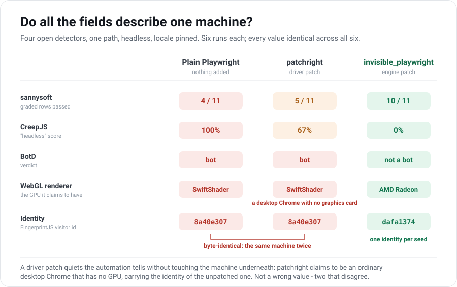

> 👉 This article was written by [feder-cr](https://github.com/feder-cr) as part of [Write for Apify](https://apify.com/resources/write-for-apify) - a program for developers sharing original articles about what they built with Crawlee. I maintain invisible_playwright, one of the tools measured below, so every number here comes from an open detector you can re-run yourself.

You open the page by hand and it loads. You open the same page with a Playwright script and it does not - a challenge, a block, a polite empty room where the content should be. Same laptop, same network, same URL, one second apart. The only thing that changed is who is holding the browser, and the site could tell.

That gap is the subject here, and the useful way to think about it is not the one most people start with. The question is not *which field did I get wrong*. It is *do all my fields describe one machine*.

Everything below is measured against detectors you can open in a tab right now - [CreepJS](https://abrahamjuliot.github.io/creepjs/), [BotD](https://github.com/fingerprintjs/BotD), the open-source [FingerprintJS](https://github.com/fingerprintjs/fingerprintjs) agent, and [bot.sannysoft.com](https://bot.sannysoft.com/) - so you can re-run any of it against me. No commercial protection service is named or targeted: this is a fingerprinting story, and the fingerprint is the more interesting subject anyway.



<!-- truncate -->

## What a detector is actually looking for

A detector rarely has a correct answer to compare you against. It has no way to know what your GPU *should* be. What it has is a few hundred fields, read in one pass, and a question that needs no ground truth at all: **can all of these be true of the same machine at the same time?**

That reframing matters, because it explains why fixes that look complete keep failing. A proxy is the clearest case. It changes exactly one layer: the connection now leaves from Frankfurt, while the browser inside it still says its clock is in Rome and its language is Italian. Nothing there is a *wrong* value. Each field is individually plausible. Together they describe no one.

Plain Playwright, at least, is honest. A page reads it on two independent layers, and both agree that this is a script.

The first layer is the **automation driver** - the browser is being driven, and it announces it:

- `navigator.webdriver` is `true`.
- There is no `window.chrome` object a real Chrome carries, the plugin array is empty, and the permissions state contradicts itself.
- On the wire between your script and the browser, the `Runtime.enable` CDP call leaves a trace a page can provoke.
- In headless mode the User-Agent still says `HeadlessChrome`.

The second layer is the **fingerprint** - the machine underneath, described in values any page can read without asking: the WebGL vendor and renderer strings, `hardwareConcurrency`, `deviceMemory`, the timezone and language list, the installed fonts as measured through text metrics, the pixels a canvas draw produces, the frequency data of an offline audio graph. Hash those together and you have an id that outlives cookie deletion.

On the bench, default Playwright fails every open detector we ran. BotD returns **bot**. CreepJS reads it **100% headless**. sannysoft passes only **4 of its 11 color-graded rows**, failing the other seven - `WebDriver (New)`, `Chrome (New)`, `Permissions (New)`, `Plugins Length (Old)`, `Plugins is of type PluginArray`, `User Agent (Old)` and `WebGL Renderer`. (sannysoft colors 11 rows and renders 46 more neutral; "4/11" counts the graded ones, not a pass rate over everything the page probes.)

Two layers, both leaking, and the first request is enough.

## The driver patch, and the contradiction it introduces

The first layer has a clean, popular fix. **patchright** is a drop-in replacement for the Playwright driver on Chromium: you change an import, not your crawler. It targets the automation tells directly - it avoids the `Runtime.enable` leak, drops `--enable-automation`, corrects `navigator.webdriver` and the `window.chrome` gap - and it rides upstream Playwright's own release line, so you are not stuck on an old browser.

It does that job, measurably. patchright moves sannysoft from **4/11 to 5/11**, and the row it fixes is exactly `WebDriver (New)`, the one default Playwright fails. CreepJS "headless" drops from **100% to 67%**. The driver layer is quieter.

Now look at what the same browser says about its hardware. On both plain Playwright and patchright, sannysoft's `WebGL Renderer` row reads:

```
ANGLE (Google, Vulkan 1.3.0 (SwiftShader Device (Subzero) (0x0000C0DE)))
```

SwiftShader is a software rasterizer. That string is the browser stating, in the one field that describes its graphics hardware, that it **has no graphics hardware**.

Put the two halves together. After the patch, the browser presents itself as an ordinary desktop Chrome: no `webdriver` flag, a normal user agent, the automation tells gone. And that ordinary desktop Chrome is running without a GPU. Both statements are on the page, and they cannot both be true of one machine.

The patch did not remove a tell. It removed the *honest* one and left the story inconsistent.

The fingerprint says the same thing a second way. I expected patchright to move it at least a little. I set its FingerprintJS visitor id next to plain Playwright's, ready to write down the difference - and there was none to write down. The same thirty-two-character string, `8a40e307...`, in both. Then the canvas signature, `5DF90EE5...` - identical again.

| Detector / field | Plain Playwright | patchright |
|---|---|---|
| sannysoft (graded rows passed) | 4/11 | 5/11 |
| CreepJS headless / like / stealth % | 100 / 88 / 0 | 67 / 88 / 0 |
| BotD verdict | bot (`headless_chrome`) | bot (`headless_chrome`) |
| WebGL renderer | SwiftShader | SwiftShader |
| FingerprintJS visitor id | `8a40e307...` | `8a40e307...` |
| Canvas signature | `5DF90EE5...` | `5DF90EE5...` |

The driver had gone quiet, and the machine underneath had not moved a pixel. BotD, which weighs the fingerprint rather than just the driver, still returned **bot**.

*(One honest caveat from the dataset: whether that identical fingerprint is a property of patchright or an artifact of how this bench launches it is not determinable from these runs. Treat the collision as a caveat, not a verdict. The SwiftShader row does not depend on it.)*

If your problem was only *"the page can tell this is automated"* on a crawl or two, this is the fix, and it is cheap. Past that, patching the driver has not made your browser coherent. It has given it something new to disagree with itself about.

## Coherence has to be derived, not invented

If the target is a machine whose fields agree, then the fields cannot be written one at a time. Something has to derive them from a single source, and the two sources that matter sit on opposite sides of the browser.

**Inside the process, one value per fact.** Take `hardwareConcurrency`. There is the property, the same property inside a Web Worker on another thread, and inside an iframe with its own realm. A page-script shim has to find and override every route before the page's own script runs, and make each overridden getter's `toString()` read native. Miss one and you have not published a wrong value - you have published *two different values for the same fact in one process*, which is a far stronger signal than any single odd field. Changing it below JavaScript, in the browser's own source, means every route reads the same variable. The value cannot disagree with itself, and that is not discipline, it is arithmetic.

That is what invisible_playwright does: a Firefox build patched at the C++ level so that a few hundred fingerprint fields are derived from an integer **seed** and delivered through preferences - GPU and WebGL strings, canvas and audio, fonts, screen, hardware.

**Outside the process, the declarations follow the egress.** This is the half a proxy alone gets wrong. The session discovers the address the connection actually leaves from - through the proxy when one is set - in a single round-trip, and reuses that one fact for the timezone (mapped to an IANA zone from an offline database), for the locale, and for the public address WebRTC will report. The network stops being a separate layer with its own opinion, because nothing is invented: it is all read off the same exit point.

The most telling part is the failure path, and you can read it in the shipped code. Behind a proxy, if the timezone lookup fails, the launch **raises** rather than falling back to the host's zone, on the stated grounds that a foreign proxy paired with the host timezone is precisely the mismatch signal. If the locale lookup fails behind a proxy it returns a neutral `en-US` rather than the home country's language, because the home language next to the proxy's timezone would be, in the comment's own words, a contradiction between two fields. A system built this way would rather not start than start incoherent.

I ran into this from the other direction, and it is worth telling because it is the principle showing up uninvited. This bench runs without a proxy, from a home connection in Italy. With its default `locale="auto"`, invisible_playwright declared **it-IT**: it had followed the egress, correctly. Plain Playwright and patchright declared **en-US**, as they do wherever the connection leaves from, because nothing connects the two layers for them. To compare the three fairly I had to pin all of them to `en-US`.

I deliberately did **not** pin the timezone. Forcing an American zone onto a European exit address would have manufactured exactly the contradiction this article is about, inside the measurement itself. Each run records what it presented: `navigator.language` en-US, timezone Europe/Rome.

*(Labeling, because it matters: the locale behavior above is measured. The proxy half - egress discovery through the proxy, the WebRTC override, the loud failure - is read from the shipped code, not measured here, because this bench ran without a proxy.)*

One boundary, since this whole section is about layers. Everything measured in this article is the JavaScript layer. The transport underneath it - the TLS handshake a site can fingerprint as JA3 or JA4, HTTP/2 frame ordering, the reputation of the address itself - is a separate surface that this bench does not read at all. It is not a footnote so much as the same argument one floor down: a browser whose JavaScript story is flawless and whose TLS signature matches no shipping browser has not solved the contradiction, it has moved it somewhere the page cannot see but the server can.

One practical note before the code, and it belongs to the same argument. `headless=True` here does not mean what it means in Chromium. Headless Chromium renders through a different path, and on this bench that path is what reported `SwiftShader` in the table above. This engine does not take it: it keeps the ordinary rendering pipeline and hides the window instead, on a virtual display. The GPU string stays a real one because the rendering that produces it is real.

That costs one package on Linux, where the virtual display is `Xvfb`. Without it the launch stops and tells you: `invisible_playwright headless=True requires Xvfb. Install it: sudo apt install xvfb`. On Windows the browser hides its own window and nothing extra is needed.

It stays an ordinary Playwright `Browser`, so it drops into a Crawlee run through the same plugin seam the docs already show for other engines:

```python
from crawlee.browsers import PlaywrightBrowserPlugin, PlaywrightBrowserController
from invisible_playwright.async_api import InvisiblePlaywright


class InvisiblePlaywrightPlugin(PlaywrightBrowserPlugin):
    def __init__(self, *, seed: int, headless: bool = True, **kwargs):
        super().__init__(browser_type='firefox', **kwargs)
        self._seed, self._headless, self._wrappers = seed, headless, []

    async def new_browser(self) -> PlaywrightBrowserController:
        # headless=True hides a real window on a virtual display, so on Linux
        # this needs Xvfb: sudo apt install xvfb. Nothing extra on Windows.
        wrapper = InvisiblePlaywright(seed=self._seed, headless=self._headless)
        browser = await wrapper.__aenter__()          # a real Playwright Browser
        self._wrappers.append(wrapper)
        return PlaywrightBrowserController(
            browser,
            header_generator=None,                     # the engine owns the fingerprint
            max_open_pages_per_browser=1,
        )
```

`header_generator=None` is the line that matters most, and it is the same principle one layer up: leave it out and Crawlee paints its own `User-Agent` and `sec-ch-ua*` over the fingerprint the engine derived. That is two fingerprint sources disagreeing inside one process, which is worse than either alone.

## How you check it: diffs, not verdicts

Some of what a detector asks, you answer. The rest you have to measure, and the instrument matters more than it looks.

A pass/fail verdict is the wrong instrument, and the clearest proof is a row that reads as a failure. invisible_playwright scores **10 of 11** on sannysoft. The single red row is `Chrome (New)`, which tests for the `window.chrome` object. A real Firefox does not carry that object either. Scored, it is a failure; read, it is the browser being correct about what it is.

The same trap runs the other way, and it flatters the tool I maintain. Parts of BotD and CreepJS are gated to Chrome and never execute against a Firefox engine at all. So a clean verdict on Firefox and a clean verdict on Chromium were graded on different exams, and comparing the two scores compares the exams as much as the browsers. Before trusting a green row on any tool, open the detector's source, find the checks gated to a browser family you are not running, subtract them, and read what is left.

Which is why the table below reports fields rather than scores. What the bench says about the engine-level spoof, field by field:

- **CreepJS: 0% headless, 0% like-headless, 0% stealth** - the only arm reading zero on all three.
- **BotD: not a bot.**
- **WebGL renderer: `ANGLE (AMD, Radeon HD 3200 Graphics Direct3D11 vs_5_0 ps_5_0)`** - a consumer GPU, and the row sannysoft marks green where the other two are red. The hardware story and the driver story now agree.
- **FingerprintJS: one visitor id across all six launches** with the same seed (`dafa1374...`), and a different one from a different seed.

## At scale the constraint changes

There is a second problem waiting past the first, and it only appears when you run more than one browser.

A driver patch leaves you with the host machine's fingerprint. That is not one problem, it is one *identity*: the same on the next launch, the next worker, the next thousand runs. A thousand crawlers behind it are a thousand copies of one machine, and a site that fingerprints does not need to catch any single one of them. It needs to notice they are all the same.

The obvious repair is to spoof the fingerprint. Done naively, it fails the same way with extra steps: one carefully built identity, deployed everywhere, is still one identity. **Uniformity is itself a fingerprint.** A fleet where every browser reports the same immaculate machine is easier to correlate than a fleet of ordinary mismatched ones, because real populations are not uniform.

So the requirement is not one good machine. It is many *different* coherent machines, which is harder to build than either half alone: each one has to be internally consistent, and they have to differ from each other the way a real population differs.

That is what the seed is for. It is the identity, not a random tweak: pass the same integer and you get the same browser back, on any machine, with no state kept anywhere - measured here as one visitor id across all six launches at one seed, and a different one at another. Ten thousand identities come from ten thousand integers, each stable, each different, none of them your real machine, all rebuildable by a stateless worker from a number in a queue.

Which reframes what the ceiling on a crawling fleet actually is. It is not how fast the runtime starts. It is how many distinct, coherent identities you can hold, and no amount of driver patching raises that number above one.

## The three, side by side

| Setup | Layer it fixes | Fingerprint | Distinct identities | Do the fields agree? |
|---|---|---|---|---|
| Plain Playwright | none | host machine | one | yes, and consistently a bot |
| patchright | driver (CDP) | host machine (unchanged) | one | no: clean driver, no GPU, same id as unpatched |
| invisible_playwright | fingerprint (engine), declarations follow egress | chosen, seed-derived | N (one per seed) | by construction |

Read it as a progression, not a leaderboard. Each step fixes something the one before it left open, and the right stopping point is the one that matches your job.

- **You need to not look automated on a crawl or two.** A driver patch like patchright is the whole answer, for the cost of an import. Your own machine is a perfectly plausible one to be, once.
- **You need many sessions a site cannot connect, each reproducible on a stateless worker.** No amount of driver patching gets you there. The fingerprint has to change per identity, and it has to stay coherent while it does.
- **You are choosing between engine-patch tools.** This article only spoofs with invisible_playwright; it is not the only one (Camoufox and CloakBrowser are in the same category), and a fair fight between them deserves its own bench, ideally run by someone who ships none of them.

## Back to the two tabs

The page that loads by hand and blocks your script is not detecting your intent. It is reading a few hundred fields and noticing they do not add up to a machine.

That is the whole of it, and it closes at a different depth for different jobs. For one crawl, a driver patch shuts it: the automation stops showing, and your own machine, whatever it is, is a real one that genuinely exists. For many sessions that must not add up to one machine, it stays open until the fields are derived instead of written - inside the process from one seed, outside it from the address the connection actually leaves from.

Pick the shallowest step that reaches your job. Going deeper buys you nothing you need, and going shallower gets you the empty room.
